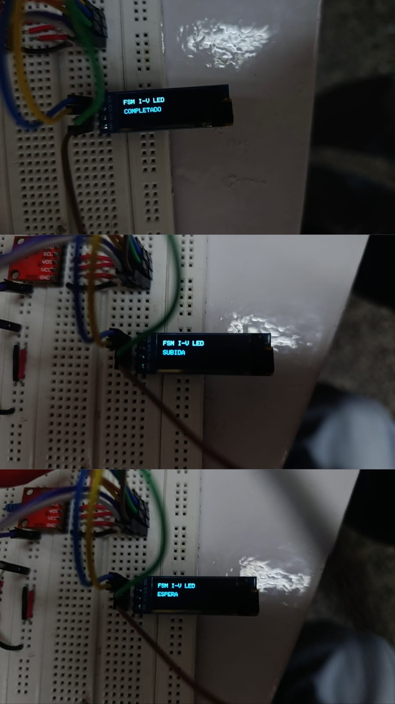
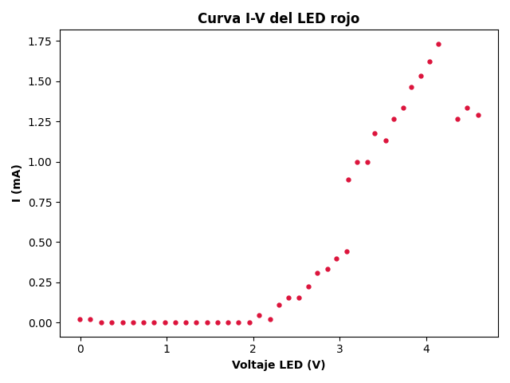
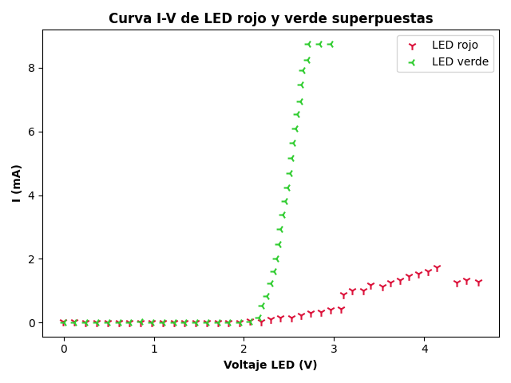

# Informe de Laboratorio — Sesión 9: Generación de Señales y Sistema Integrado

---

**Universidad Nacional de Colombia**
**Electrónica Digital — 2016684 — 2026-1**
**Prof. Ricardo Amézquita Orozco**

---

| Campo | |
|-------|--|
| **Integrantes** | 1. Felipe Lizcano Quimbaya |
| | 2. Sergio Andrés Poveda Pérez  |
| | 3. Sara Romero Chaves|
| | 4. Simon Gabriel Sandoval Palma|
|
| **Grupo** | 3|
| **Fecha de la práctica** | Miércoles 27 de mayo, 2026 |
| **Fecha de entrega** | Viernes 25 de Abril, 2026 |

---

## 1. Resultados

### 1.1 Reto 1 — Generador de Señales con MCP4725

#### Captura 1: Forma de onda periódica

Coloque aquí una captura del osciloscopio mostrando una forma de onda periódica
(diente de sierra, triangular o senoidal) con amplitud ~0–5 V.


#### Capturas 2–4: Tres formas de onda

Coloque aquí tres capturas del osciloscopio, una por cada forma de onda implementada.


#### Captura 5: Control de frecuencia

Coloque aquí dos capturas del osciloscopio mostrando las dos condiciones extremas
del potenciómetro: frecuencia mínima (~0.5 Hz) y frecuencia máxima (~15 Hz).


---

### 1.2 Reto 2 — Caracterización I-V de LEDs con FSM

#### Tabla 1 — Datos I-V de muestra

Incluya las primeras 10 filas y las últimas 10 filas de uno de sus archivos CSV.
Las últimas 10 filas deben incluir la fila con el valor máximo de V_DAC (5.00 V).

**Primeras 10 filas:**

| V_DAC (V) | V_A1 (V) | V_LED (V) | I (mA) |
|:---------:|:--------:|:---------:|:------:|
|0.0000 |0.0049 |-0.0049 |0.0222 |
|0.1221 |0.0049 |0.1172 |0.0222 |
|0.2442 |0 |0.2442 |0 |
|0.3663 |0 |0.3663 |0 |
|0.4884 |0 |0.4884 |0 |
|0.6105 |0 |0.6105 |0 |
|0.7326 |0 |0.7326 |0 |
|0.8547 |0 |0.8547 |0 |
|0.9768 |0 |0.9768 |0 |
|1.099  |0 |1.0989 |0 |

**Últimas 10 filas:**

| V_DAC (V) | V_A1 (V) | V_LED (V) | I (mA) |
|:---------:|:--------:|:---------:|:------:|
|3.7851 |0.2493 |3.5358 |1.1330 |
|3.9072 |0.2786 |3.6286 |1.2663 |
|4.0293 |0.2933 |3.7370 |1.3330 |
|4.1514 |0.3226 |3.8288 |1.4663 |
|4.2735 |0.3372 |3.9363 |1.5329 |
|4.3956 |0.3568 |4.0388 |1.6218 |
|4.5177 |0.3812 |4.1365 |1.7329 |
|4.6398 |0.2786 |4.3612 |1.2663 |
| 4.7619|0.2933 |4.4686 |1.3330 |
|4.8840 |0.2835 |4.6005 |1.2885 |
#### Captura: Estados de la FSM en el OLED

Coloque aquí una foto del OLED mostrando cada uno de los tres estados de la FSM
(ESPERA, SUBIDA, COMPLETADO) durante la operación del Reto 2.



---

## 2. Visualización

### Gráfica 1 — Curva I-V del LED rojo

Graficar todos los datos del barrido completo del LED rojo (≥ 50 filas del CSV).

**Eje X:** V_LED (V)
**Eje Y:** I (mA)



**Interpretación:**

 Como se aprecia en la gráfica, el oltaje umbral del LED rojo es en el punto 2.0659. La curva empieza como una constante, cuando el voltaje no ha superado la barrera interna de material, luego crece exponencialmente en el momento que supera los 2.0V; según la teoría, un pequeño aumento en el voltaje a partir de este punto produce un incremento drástico en la cantidad de portadores que cruzan la unión, lo que se traduce matemáticamente en un aumento de corriente de naturaleza exponencial. Sin embargo, el crecimiento de la corriente tiende a seguir más una linea recta que una curva exponencial, esto se debe a que el LED tiene una resistencia interna que limita el crecimiento de la corriente. 

---

### Gráfica 2 — Comparación I-V: LED rojo vs LED verde

Superponer las curvas I-V del LED rojo y del LED verde en un mismo gráfico.

**Eje X:** V_LED (V)
**Eje Y:** I (mA)



**Interpretación:**

El color rojo tiene una longitud de onda mayor (aprox. 620-750 nm) que el color verde (aprox. 495-570 nm). Al tener una longitud de onda mayor, la energía requerida para emitir un fotón rojo es menor. Por lo tanto, el semiconductor utilizado para fabricar el LED rojo tiene un bandgap más pequeño, lo que se traduce directamente en que necesita un voltaje umbral ($V_{th}$) más bajo para empezar a conducir y emitir luz (alrededor de 1.8 V).Por el contrario, el fotón verde requiere más energía, por lo que su semiconductor exige un bandgap mayor, necesitando un voltaje umbral más alto (alrededor de 2.1 V) para encenderse, tal como se comprueba en las curvas experimentales.

---

## 3. Análisis

**Pregunta 1 (Reto 1):** Deduzca la fórmula que relaciona la frecuencia de la señal
senoidal con el número de puntos N de la LUT y el tiempo entre puntos controlado
por el potenciómetro. Con N = 64, ¿cuál es el tiempo entre puntos necesario para
obtener 1 Hz? ¿Y para 15 Hz?

> [Para generar una onda senoidal utilizando una Lookup Table (LUT), el código precalcula un arreglo de valores y luego lo recorre cíclicamente enviando cada valor al DAC.  Si observamos el patrón de implementación, el arreglo tiene un número de puntos $N$. El tiempo total que tarda el programa en recorrer y enviar los $N$ puntos completos al DAC constituye exactamente un ciclo completo de la onda, es decir, su período ($T$).  Si definimos $t_{step}$ como el "tiempo entre puntos" (el retardo controlado por el potenciómetro en cada iteración del ciclo), el período total de la señal será la suma de todos esos pequeños tiempos:$T = N \cdot t_{step}$. Sabiendo que la frecuencia ($f$) es el inverso del período ($f = \frac{1}{T}$), podemos sustituir $T$ para encontrar la relación directa: $f = \frac{1}{N \cdot t_{step}}$ Al despejar el tiempo entre puntos ($t_{step}$), la ecuación queda de la siguiente manera:$t_{step} = \frac{1}{f \cdot N}$. Ahora calculando para $N = 64$. Aplicando la fórmula que acabamos de deducir:  Para obtener una frecuencia de 1 Hz:  $f = 1$ Hz$; N = 64$; $t_{step} = \frac{1}{1 \cdot 64}$ segundos. Resultado: 15.625 ms de espera entre cada envío de datos al DAC.Para obtener una frecuencia de 15 Hz:  $f = 15$ Hz$; N = 64$; $t_{step} = \frac{1}{15 \cdot 64}= \frac{1}{960}$ segundos.]

---

**Pregunta 2 (Reto 2):** ¿Por qué la corriente no crece linealmente con el voltaje
en el LED? Relacione la forma de la curva I-V con el modelo físico de una unión p-n.

> La corriente no crece linealmente con el voltaje en un LED porque, a diferencia de una resistencia común que obedece la Ley de Ohm, el diodo es un componente semiconductor basado en una unión p-n, cuyo comportamiento está regido por la ecuación del diodo de Shockley, $I = I_s \left( e^{\frac{qV}{nkT}} - 1 \right)$. Físicamente, la interfaz de esta unión crea una zona de agotamiento que actúa como una barrera de potencial eléctrico; cuando se aplican voltajes bajos, los portadores de carga (electrones y huecos) no poseen la energía suficiente para atravesarla, manteniendo la corriente en un valor casi nulo. Sin embargo, a medida que el voltaje directo aumenta y supera el umbral de energía dictado por el bandgap del material, la barrera colapsa y la probabilidad termodinámica de que los electrones crucen la unión se dispara exponencialmente. Es esta superación probabilística de una barrera de energía cuántica, y no el simple flujo a través de un medio con resistencia constante, lo que provoca que un pequeño incremento de voltaje resulte en un crecimiento exponencial de la corriente.

---

**Pregunta 3:** Compare los dos métodos de generación de ondas periódicas que usó
en el Reto 1: barrido lineal (diente de sierra y triangular) versus Lookup Table
precalculada (senoidal). ¿En qué situaciones es preferible una LUT sobre un cálculo
en tiempo real, y viceversa? Fundamente con base en la precisión temporal, el uso
de memoria y la flexibilidad de cambiar parámetros.

Al comparar los métodos de generación de ondas periódicas, el cálculo en tiempo real mediante barrido lineal (usado para ondas triangulares o diente de sierra) y la Lookup Table (LUT) precalculada (para ondas senoidales) presentan ventajas opuestas según los recursos del microcontrolador. El cálculo en tiempo real es altamente eficiente en el uso de memoria, ya que solo requiere unas pocas variables dinámicas, y ofrece gran flexibilidad para modificar parámetros como la amplitud o los límites de la onda sobre la marcha; además, mantiene una excelente precisión temporal en señales geométricas al usar únicamente operaciones aritméticas simples (sumas y restas). Por el contrario, intentar calcular funciones trigonométricas en tiempo real generaría una carga computacional excesiva y retardos (*jitter*), por lo que en estos casos se recurre a una LUT. La LUT garantiza un tiempo de ejecución mínimo, constante y determinista para formas de onda complejas al limitarse a leer valores ya calculados, pero lo hace a costa de un consumo significativo de memoria estática (Flash o ROM) y de una menor flexibilidad, ya que alterar la amplitud implicaría operaciones de multiplicación adicionales que restan velocidad. En conclusión, es preferible emplear una LUT cuando se requiere generar funciones matemáticas no lineales (como senos o audio) a altas frecuencias en sistemas con suficiente memoria pero capacidad de procesamiento limitada; en cambio, el cálculo en tiempo real es el método ideal para señales lineales simples donde se necesita máxima flexibilidad para ajustes dinámicos o donde el espacio de almacenamiento es un recurso muy restringido.

---

**Pregunta 4:** En el Reto 2, la transición SUBIDA → FIN es automática (DAC == 4095),
mientras que ESPERA → SUBIDA y FIN → ESPERA dependen del botón. ¿Qué propiedad de
la FSM demuestra esta diferencia en los tipos de transición? ¿Cómo se modificaría
el diseño si todas las transiciones dependieran del botón — qué funcionalidad se perdería?

> [La diferencia en los disparadores de las transiciones del Reto 2 demuestra que la Máquina de Estados Finitos (FSM) posee transiciones cualitativamente distintas según el tipo de estímulo que las activa. Por un lado, las transiciones desde ESPERA hacia SUBIDA y de FIN hacia ESPERA son dirigidas por eventos externos, dependiendo por completo de una acción asíncrona del entorno físico como lo es la pulsación del botón por parte del usuario. En cambio, la transición de SUBIDA hacia FIN está dirigida por una condición de guarda interna, lo que significa que el sistema se autoevalúa y cambia de estado de manera autónoma en el instante exacto en que la variable algorítmica del DAC alcanza su límite máximo de 4095, sin requerir la intervención humana. Si el diseño se modificara para que todas las transiciones dependieran exclusivamente del botón, la lógica interna en el estado de SUBIDA tendría que cambiar radicalmente. Se tendría que eliminar la condición de parada automática (DAC == 4095) y, en su lugar, obligar al microcontrolador a realizar un escaneo constante o polling de la entrada digital D2 mientras se ejecuta el incremento de voltaje. De esta forma, la FSM se quedaría estancada en el bucle de subida de voltaje de manera indefinida, esperando a que el operador presione físicamente el componente para forzar el cambio de estado de forma manual. Esta modificación provocaría que se perdiera por completo la automatización del proceso, la cual es el objetivo central del Reto 2 para lograr que la caracterización corriente-voltaje (I-V) del LED ocurra de forma autónoma. También se perdería la protección del hardware, ya que en el diseño original el sistema reduce el voltaje a 0 V al pasar a FIN; si dependiera del botón, el DAC continuaría entregando su voltaje máximo de forma indefinida, exponiendo al LED y a la resistencia de 220 Ω a un estrés térmico innecesario hasta recibir la interacción humana. Finalmente, se vería afectada la integridad y la consistencia de los datos, dado que el flujo continuo de registros por el puerto serial no se detendría con precisión en el punto de corte ideal, generando un archivo CSV lleno de líneas redundantes y lecturas duplicadas en el valor máximo.]

---

## 4. Código Documentado

Incluya SOLO el código que usted modificó o escribió. No incluya el código base
original ni el I2C Scanner. Comente cada bloque funcional.

### Reto 1 — Generador de Señales (lab-09-generacion-senales.ino)

```cpp
// ========================================================
// LAB 09 - ACTIVIDAD 2
// GENERADOR DE SEÑALES MULTIMODO
//
// El programa genera tres tipos de señales utilizando un
// convertidor Digital-Analógico (MCP4725):
//
// 0 -> Diente de sierra
// 1 -> Triangular
// 2 -> Senoidal (mediante una tabla LUT)
//
// Un botón permite cambiar entre los modos y un
// potenciómetro controla la velocidad (frecuencia)
// de generación de la señal.
//
// La pantalla OLED muestra la forma de onda activa.
// ========================================================


// ========================================================
// LIBRERÍAS
// ========================================================

// Comunicación I2C
#include <Wire.h>

// Librería para controlar el DAC MCP4725
#include <Adafruit_MCP4725.h>

// Librerías para la pantalla OLED
#include <Adafruit_SSD1306.h>
#include <Adafruit_GFX.h>


// ========================================================
// CREACIÓN DE OBJETOS
// ========================================================

// Objeto del DAC
Adafruit_MCP4725 dac;

// Dimensiones de la pantalla OLED
#define SCREEN_WIDTH 128
#define SCREEN_HEIGHT 32

// Objeto de la pantalla OLED
Adafruit_SSD1306 display(SCREEN_WIDTH, SCREEN_HEIGHT, &Wire, -1);


// ========================================================
// DEFINICIÓN DE PINES
// ========================================================

// Botón para cambiar de modo
const int boton = 2;

// Potenciómetro para controlar la frecuencia
const int pot = A0;


// ========================================================
// VARIABLES DE LA MÁQUINA DE ESTADOS (FSM)
// ========================================================

// Modo actual de funcionamiento
// 0 = Sierra
// 1 = Triangular
// 2 = Senoidal
int modo = 0;

// Guarda el estado anterior del botón
// Se utiliza para detectar únicamente el flanco de bajada
bool ultimoBoton = HIGH;


// ========================================================
// TABLA DE BÚSQUEDA (LOOK-UP TABLE)
// PARA LA ONDA SENOIDAL
// ========================================================

// Número de muestras de la señal senoidal
const int N = 64;

// Arreglo donde se almacenan los valores de la senoide
uint16_t lutSeno[N];


// ========================================================
// CONTROL DE ACTUALIZACIÓN DE LA OLED
// ========================================================

// Evita actualizar continuamente la pantalla para reducir
// el parpadeo.
unsigned long ultimoOLED = 0;


// ========================================================
// SETUP
// ========================================================

void setup() {

  // Inicializa comunicación serial
  Serial.begin(115200);

  // Inicializa el bus I2C
  Wire.begin();

  // Configura el botón con resistencia Pull-Up interna
  pinMode(boton, INPUT_PULLUP);

  // Inicializa el DAC
  // Cambiar la dirección si el escáner I2C detecta 0x62
  dac.begin(0x60);

  // Inicializa la pantalla OLED
  display.begin(SSD1306_SWITCHCAPVCC, 0x3C);

  display.clearDisplay();

  display.setTextSize(1);

  display.setTextColor(SSD1306_WHITE);

  display.setCursor(0,0);

  display.println("LAB 09");

  display.display();


  // =====================================================
  // CONSTRUCCIÓN DE LA TABLA LUT
  // =====================================================
  //
  // Se calcula una única vez la senoide para evitar
  // llamar continuamente a la función sin(), lo cual
  // hace el programa más eficiente.
  //

  for(int i=0; i<N; i++) {

    // Ángulo correspondiente a cada muestra
    float angulo = 2.0 * PI * i / N;

    // Escalamiento al rango del DAC (0-4095)
    lutSeno[i] = 2048 + 2047 * sin(angulo);
  }
}


// ========================================================
// LOOP PRINCIPAL
// ========================================================

void loop() {

  // =====================================================
  // LECTURA DEL BOTÓN
  // =====================================================

  bool lectura = digitalRead(boton);

  // Detecta únicamente cuando el botón pasa
  // de no presionado a presionado
  if(ultimoBoton == HIGH && lectura == LOW) {

    // Cambia al siguiente modo
    modo++;

    // Si supera el último modo vuelve al primero
    if(modo > 2)
      modo = 0;

    // Pequeño debounce
    delay(50);
  }

  // Guarda el estado actual para la siguiente iteración
  ultimoBoton = lectura;


  // =====================================================
  // LECTURA DEL POTENCIÓMETRO
  // =====================================================

  int valorPot = analogRead(pot);

  // Convierte el valor del potenciómetro
  // en el tiempo entre muestras.
  //
  // Pot al mínimo -> señal lenta (20 ms)
  // Pot al máximo -> señal rápida (1 ms)
  int tiempo = map(valorPot, 0, 1023, 20, 1);


  // =====================================================
  // MÁQUINA DE ESTADOS
  // =====================================================

  switch(modo) {

    // Genera una onda de diente de sierra
    case 0:
      ondaSierra(tiempo);
      break;

    // Genera una onda triangular
    case 1:
      ondaTriangular(tiempo);
      break;

    // Genera una onda senoidal
    case 2:
      ondaSenoidal(tiempo);
      break;
  }
}


// ========================================================
// ACTUALIZACIÓN DE LA PANTALLA OLED
// ========================================================

void actualizarOLED(String texto) {

  // Sólo actualiza la pantalla cada 50 ms
  // para evitar parpadeos.
  if(millis() - ultimoOLED > 50) {

    ultimoOLED = millis();

    display.clearDisplay();

    display.setCursor(0,0);

    display.println("Forma de onda:");

    display.setCursor(0,15);

    // Muestra el nombre de la señal activa
    display.println(texto);

    display.display();
  }
}


// ========================================================
// GENERACIÓN DE ONDA DIENTE DE SIERRA
// ========================================================

void ondaSierra(int t) {

  // Actualiza el texto de la OLED
  actualizarOLED("SIERRA");

  // Incrementa el valor del DAC desde 0 hasta 4095
  // produciendo una rampa ascendente.
  for(int i=0; i<4096; i+=50) {

    // Envía el valor al DAC
    dac.setVoltage(i, false);

    // Controla la frecuencia
    delay(t);
  }
}


// ========================================================
// GENERACIÓN DE ONDA TRIANGULAR
// ========================================================

void ondaTriangular(int t) {

  actualizarOLED("TRIANGULAR");

  // -----------------------------
  // RAMPA ASCENDENTE
  // -----------------------------
  for(int i=0; i<4096; i+=50) {

    dac.setVoltage(i, false);

    delay(t);
  }

  // -----------------------------
  // RAMPA DESCENDENTE
  // -----------------------------
  for(int i=4095; i>=0; i-=50) {

    dac.setVoltage(i, false);

    delay(t);
  }
}


// ========================================================
// GENERACIÓN DE ONDA SENOIDAL
// ========================================================

void ondaSenoidal(int t) {

  actualizarOLED("SENOIDAL");

  // Recorre toda la tabla de búsqueda (LUT)
  // previamente calculada en el setup().
  for(int i=0; i<N; i++) {

    // Envía cada muestra de la senoide al DAC
    dac.setVoltage(lutSeno[i], false);

    // Controla la velocidad de reproducción
    delay(t);
  }
}
```

### Reto 2 — Caracterización I-V con FSM (lab-09-iv-led.ino)

```cpp
// ========================================================
// LAB 09 - ACTIVIDAD 3
// RETO 2 - CARACTERIZACIÓN I-V DE LEDs
//
// Este programa realiza automáticamente la caracterización
// corriente-voltaje (I-V) de un LED utilizando:
//
// • DAC MCP4725 para generar un voltaje creciente.
// • ADC del Arduino para medir el voltaje en la resistencia.
// • Pantalla OLED para indicar el estado del sistema.
// • Máquina de Estados Finitos (FSM).
// • Comunicación Serial en formato CSV para posteriormente
//   graficar la curva I-V en Python, Excel o Matlab.
//
// Estados de la FSM:
//   ESPERA
//   SUBIDA
//   COMPLETADO
// ========================================================


// ========================================================
// LIBRERÍAS
// ========================================================

// Comunicación I2C
#include <Wire.h>

// Librería del DAC MCP4725
#include <Adafruit_MCP4725.h>

// Librerías para la pantalla OLED
#include <Adafruit_SSD1306.h>
#include <Adafruit_GFX.h>


// ========================================================
// OBJETOS
// ========================================================

// Objeto para controlar el DAC
Adafruit_MCP4725 dac;

// Tamaño de la pantalla OLED
#define SCREEN_WIDTH 128
#define SCREEN_HEIGHT 32

// Objeto de la pantalla OLED
Adafruit_SSD1306 display(SCREEN_WIDTH, SCREEN_HEIGHT, &Wire, -1);


// ========================================================
// DEFINICIÓN DE LA MÁQUINA DE ESTADOS (FSM)
// ========================================================

// Enumeración con los tres estados posibles
enum Estado {

  // Espera a que el usuario presione el botón
  ESPERA,

  // Realiza el barrido de voltaje
  SUBIDA,

  // Finaliza el experimento
  COMPLETADO
};

// Estado inicial
Estado estado = ESPERA;


// ========================================================
// DEFINICIÓN DE PINES
// ========================================================

// Botón para iniciar y reiniciar la prueba
const int boton = 2;


// ========================================================
// VARIABLES GLOBALES
// ========================================================

// Guarda el estado anterior del botón para detectar
// únicamente una pulsación
bool ultimoBoton = HIGH;

// Valor enviado al DAC
int dacValue = 0;


// ========================================================
// SETUP
// ========================================================

void setup() {

  // Inicializa el puerto serial
  Serial.begin(115200);

  // Inicializa el bus I2C
  Wire.begin();

  // Configura el botón utilizando Pull-Up interno
  pinMode(boton, INPUT_PULLUP);

  // Inicializa el DAC
  // Cambiar la dirección a 0x62 si es necesario
  dac.begin(0x60);

  // Inicializa la pantalla OLED
  display.begin(SSD1306_SWITCHCAPVCC, 0x3C);

  display.clearDisplay();

  display.setTextSize(1);

  display.setTextColor(SSD1306_WHITE);

  // Mensaje inicial
  mostrarEstado("INICIANDO");

  delay(1000);
}


// ========================================================
// LOOP PRINCIPAL
// ========================================================

void loop() {

  // Lee el estado del botón
  bool lectura = digitalRead(boton);

  // Ejecuta el estado correspondiente de la FSM
  switch(estado) {

    // ====================================================
    // ESTADO ESPERA
    // ====================================================

    case ESPERA:

      // Mantiene el DAC en 0 V
      dac.setVoltage(0, false);

      // Muestra el estado actual
      mostrarEstado("ESPERA");

      // Si el botón fue presionado
      if(ultimoBoton == HIGH && lectura == LOW) {

        // Envía la cabecera del archivo CSV
        Serial.println("V_DAC_V,V_A1_V,V_LED_V,I_mA");

        // Reinicia el valor del DAC
        dacValue = 0;

        // Cambia al estado de medición
        estado = SUBIDA;

        // Pequeño debounce
        delay(50);
      }

      break;


    // ====================================================
    // ESTADO SUBIDA
    // ====================================================

    case SUBIDA:

      // Indica el estado actual en la OLED
      mostrarEstado("SUBIDA");

      // Envía el valor actual al DAC
      dac.setVoltage(dacValue, false);


      // ================================================
      // CÁLCULO DEL VOLTAJE DEL DAC
      // ================================================

      // Convierte el valor digital (0-4095)
      // al voltaje correspondiente (0-5 V)
      float vDAC = (dacValue / 4095.0) * 5.0;


      // ================================================
      // LECTURA DEL ADC
      // ================================================

      // Lee el voltaje presente en el pin A1
      int adc = analogRead(A1);

      // Convierte la lectura ADC a voltios
      float vA1 = (adc / 1023.0) * 5.0;


      // ================================================
      // VOLTAJE EN EL LED
      // ================================================

      // El voltaje del LED corresponde a la diferencia
      // entre el voltaje generado por el DAC y el voltaje
      // medido en la resistencia.
      float vLED = vDAC - vA1;


      // ================================================
      // CÁLCULO DE LA CORRIENTE
      // ================================================

      // Aplicando la Ley de Ohm:
      //
      // I = V/R
      //
      // La resistencia utilizada es de 220 Ω.
      //
      // Se multiplica por 1000 para expresar
      // la corriente en miliamperios.
      float corriente = (vA1 / 220.0) * 1000.0;


      // ================================================
      // ENVÍO DE DATOS EN FORMATO CSV
      // ================================================

      // Cada línea contiene:
      //
      // Voltaje DAC
      // Voltaje resistencia
      // Voltaje LED
      // Corriente
      //
      // separados por comas para facilitar
      // la importación en Excel o Python.

      Serial.print(vDAC, 4);
      Serial.print(",");

      Serial.print(vA1, 4);
      Serial.print(",");

      Serial.print(vLED, 4);
      Serial.print(",");

      Serial.println(corriente, 4);


      // ================================================
      // SIGUIENTE PASO DEL BARRIDO
      // ================================================

      // Incrementa el valor del DAC para aumentar
      // progresivamente el voltaje aplicado.
      dacValue += 20;


      // Si se alcanza el máximo del DAC,
      // termina el experimento.
      if(dacValue >= 4095) {

        estado = COMPLETADO;
      }

      // Tiempo entre mediciones
      delay(10);

      break;


    // ====================================================
    // ESTADO COMPLETADO
    // ====================================================

    case COMPLETADO:

      // Apaga la salida del DAC
      dac.setVoltage(0, false);

      // Indica que el experimento terminó
      mostrarEstado("COMPLETADO");

      // Espera que el usuario presione nuevamente
      // el botón para volver al estado inicial.
      if(ultimoBoton == HIGH && lectura == LOW) {

        estado = ESPERA;

        delay(50);
      }

      break;
  }

  // Guarda el estado actual del botón
  // para detectar el siguiente flanco.
  ultimoBoton = lectura;
}


// ========================================================
// FUNCIÓN PARA MOSTRAR EL ESTADO EN LA OLED
// ========================================================

void mostrarEstado(String texto) {

  // Borra la pantalla
  display.clearDisplay();

  // Escribe el título
  display.setCursor(0,0);

  display.println("FSM I-V LED");

  // Escribe el estado actual
  display.setCursor(0,15);

  display.println(texto);

  // Actualiza la pantalla
  display.display();
}
```

---

## 5. Dificultades Encontradas y Soluciones Aplicadas

### Dificultad 1

- **Síntoma observado:**La señal presentaba pequeños escalones o zonas casi constantes debido al número limitado de muestras de la tabla de búsqueda (LUT) y a la velocidad de actualización del DAC.
- **Causa identificada:** Este fenómeno se conoce técnicamente como el efecto de escalera o efecto de retención de orden cero (Zero-Order Hold o ZOH), y es una característica inherente a cualquier sistema de conversión digital a analógico (DAC).
- **Solución aplicada:** Se colocó un filtro de reconstrucción a la salida del DAC. Este filtro se encarga de atenuar las altas frecuencias que generan los bordes afilados de los escalones, "suavizando" la señal para que recupere la forma curva y continua de la onda original.
- **Lección aprendida:** Muchas veces los errores se llegan a ver en dispositivo equivocado, por lo que es importante revisar hasta la raiz del software y hardware para poder encontrar la causa del error. En este caso, el error se veía en el osciloscopio, pero la causa era el DAC y su efecto ZOH.

### Dificultad 2

- **Síntoma observado:**
- **Causa identificada:**
- **Solución aplicada:**
- **Lección aprendida:**

---

## 6. Pregunta Abierta

**Pregunta:** Proponga una extensión del sistema integrado (Reto 1 + Reto 2) que
utilice simultáneamente las capacidades de generación de señales y de caracterización
I-V. Por ejemplo: usar el generador para excitar un LED con una señal triangular y
medir la respuesta I-V resultante sin necesidad de un barrido por software paso a
paso. Describa qué modificaciones requerirían el hardware y el código, y qué ventaja
ofrecería este enfoque frente a la implementación actual.

La integración de los módulos de generación de señales y caracterización permite crear un trazador de curvas dinámico en tiempo real, donde se utiliza una señal triangular continua generada por el DAC para excitar el LED mientras el ADC lee simultáneamente el voltaje y la corriente a alta velocidad. Para implementar esta extensión en el hardware, es necesario añadir un amplificador operacional como seguidor de voltaje a la salida del DAC, el cual proporcionará la corriente requerida para encender el LED, además de utilizar dos canales del ADC: uno para medir el voltaje directo del semiconductor y otro para calcular indirectamente la corriente leyendo la caída de voltaje sobre una resistencia limitadora.
A nivel de código, se debe eliminar el bucle de barrido con retardos bloqueantes y reemplazarlo por temporizadores de hardware (Timers) y acceso directo a memoria (DMA); esto posibilita actualizar el DAC y capturar los datos del ADC de forma sincronizada y determinista sin saturar el procesador, enviando un flujo continuo de datos a Python para su graficación . Este enfoque ofrece muchas ventajas frente a la implementación estática actual, ya que reduce el tiempo de caracterización a fracciones de segundo, minimiza la deriva térmica que podría alterar el voltaje umbral del semiconductor durante un barrido lento, y permite analizar efectos dinámicos, como la capacitancia parásita de la unión p-n, al comparar posibles histéresis entre los ciclos de subida y bajada de la onda.
