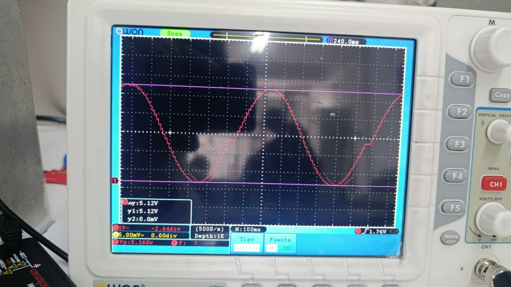
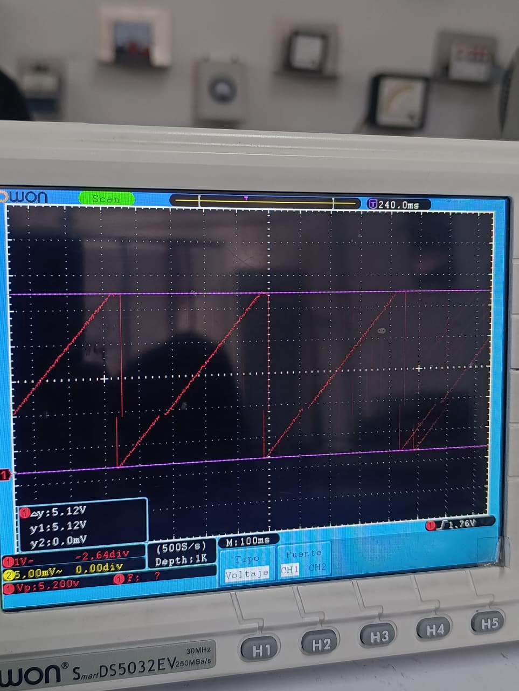
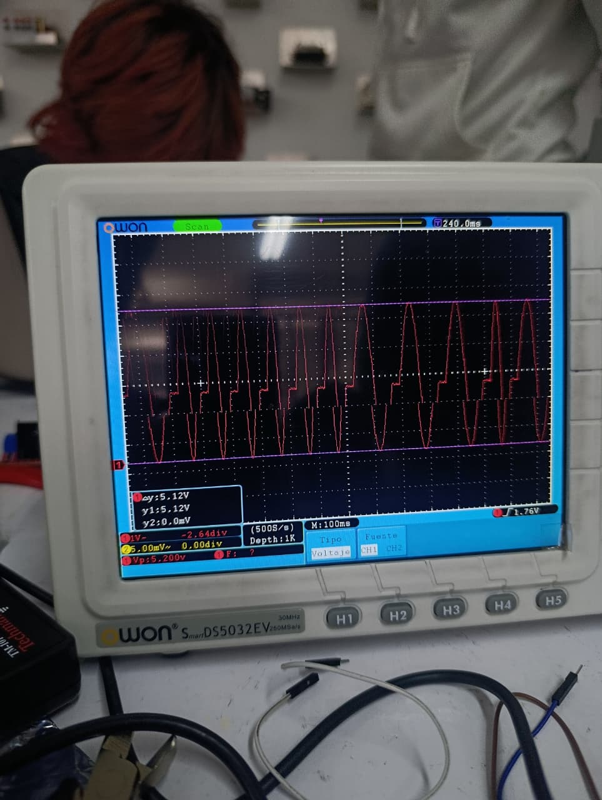
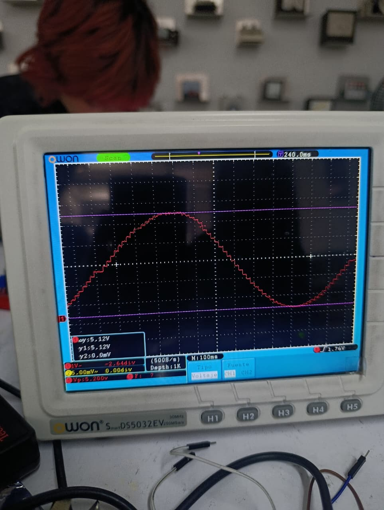

# Informe de Laboratorio — Sesión 9: Generación de Señales y Sistema Integrado

---

**Universidad Nacional de Colombia**
**Electrónica Digital — 2016684 — 2026-1**
**Prof. Ricardo Amézquita Orozco**

---

| Campo | |
|-------|--|
| **Integrantes** | 1. Felipe Lizcano Quimbaya |
| | 2. Sergio Andrés Poveda Pérez  |
| | 3. Sara Romero Chaves|
| | 4. Simon Gabriel Sandoval Palma|
|
| **Grupo** | 3|
| **Fecha de la práctica** | Miércoles 27 de mayo, 2026 |
| **Fecha de entrega** | Viernes 25 de Abril, 2026 |

---

## 1. Resultados

### 1.1 Reto 1 — Generador de Señales con MCP4725

#### Captura 1: Forma de onda periódica

Coloque aquí una captura del osciloscopio mostrando una forma de onda periódica
(diente de sierra, triangular o senoidal) con amplitud ~0–5 V.



#### Capturas 2–4: Tres formas de onda

Coloque aquí tres capturas del osciloscopio, una por cada forma de onda implementada.




#### Captura 5: Control de frecuencia

Coloque aquí dos capturas del osciloscopio mostrando las dos condiciones extremas
del potenciómetro: frecuencia mínima (~0.5 Hz) y frecuencia máxima (~15 Hz).





---

### 1.2 Reto 2 — Caracterización I-V de LEDs con FSM

#### Tabla 1 — Datos I-V de muestra

Incluya las primeras 10 filas y las últimas 10 filas de uno de sus archivos CSV.
Las últimas 10 filas deben incluir la fila con el valor máximo de V_DAC (5.00 V).

**Primeras 10 filas:**

| V_DAC (V) | V_A1 (V) | V_LED (V) | I (mA) |
|:---------:|:--------:|:---------:|:------:|
|0.0000 |0.0049 |-0.0049 |0.0222 |
|0.1221 |0.0049 |0.1172 |0.0222 |
|0.2442 |0 |0.2442 |0 |
|0.3663 |0 |0.3663 |0 |
|0.4884 |0 |0.4884 |0 |
|0.6105 |0 |0.6105 |0 |
|0.7326 |0 |0.7326 |0 |
|0.8547 |0 |0.8547 |0 |
|0.9768 |0 |0.9768 |0 |
|1.099  |0 |1.0989 |0 |

**Últimas 10 filas:**

| V_DAC (V) | V_A1 (V) | V_LED (V) | I (mA) |
|:---------:|:--------:|:---------:|:------:|
|3.7851 |0.2493 |3.5358 |1.1330 |
|3.9072 |0.2786 |3.6286 |1.2663 |
|4.0293 |0.2933 |3.7370 |1.3330 |
|4.1514 |0.3226 |3.8288 |1.4663 |
|4.2735 |0.3372 |3.9363 |1.5329 |
|4.3956 |0.3568 |4.0388 |1.6218 |
|4.5177 |0.3812 |4.1365 |1.7329 |
|4.6398 |0.2786 |4.3612 |1.2663 |
| 4.7619|0.2933 |4.4686 |1.3330 |
|4.8840 |0.2835 |4.6005 |1.2885 |
#### Captura: Estados de la FSM en el OLED

Coloque aquí una foto del OLED mostrando cada uno de los tres estados de la FSM
(ESPERA, SUBIDA, COMPLETADO) durante la operación del Reto 2.


---

## 2. Visualización

### Gráfica 1 — Curva I-V del LED rojo

Graficar todos los datos del barrido completo del LED rojo (≥ 50 filas del CSV).

**Eje X:** V_LED (V)
**Eje Y:** I (mA)


**Interpretación:**

> [Identifique el voltaje umbral (V_th) donde la corriente comienza a crecer
> apreciablemente. Describa la forma de la curva y por qué es consistente con
> el comportamiento exponencial de una unión p-n.]

---

### Gráfica 2 — Comparación I-V: LED rojo vs LED verde

Superponer las curvas I-V del LED rojo y del LED verde en un mismo gráfico.

**Eje X:** V_LED (V)
**Eje Y:** I (mA)


**Interpretación:**

> [Identifique los voltajes umbral (V_th) para cada color (~1.8 V rojo, ~2.1 V
> verde). Explique por qué la diferencia de voltaje umbral es consistente con
> la relación entre el color (longitud de onda) y el bandgap del semiconductor.]

---

## 3. Análisis

**Pregunta 1 (Reto 1):** Deduzca la fórmula que relaciona la frecuencia de la señal
senoidal con el número de puntos N de la LUT y el tiempo entre puntos controlado
por el potenciómetro. Con N = 64, ¿cuál es el tiempo entre puntos necesario para
obtener 1 Hz? ¿Y para 15 Hz?

> [Para generar una onda senoidal utilizando una Lookup Table (LUT), el código precalcula un arreglo de valores y luego lo recorre cíclicamente enviando cada valor al DAC.  Si observamos el patrón de implementación, el arreglo tiene un número de puntos $N$. El tiempo total que tarda el programa en recorrer y enviar los $N$ puntos completos al DAC constituye exactamente un ciclo completo de la onda, es decir, su período ($T$).  Si definimos $t_{step}$ como el "tiempo entre puntos" (el retardo controlado por el potenciómetro en cada iteración del ciclo), el período total de la señal será la suma de todos esos pequeños tiempos:$T = N \cdot t_{step}$. Sabiendo que la frecuencia ($f$) es el inverso del período ($f = \frac{1}{T}$), podemos sustituir $T$ para encontrar la relación directa: $f = \frac{1}{N \cdot t_{step}}$ Al despejar el tiempo entre puntos ($t_{step}$), la ecuación queda de la siguiente manera:$t_{step} = \frac{1}{f \cdot N}$. Ahora calculando para $N = 64$. Aplicando la fórmula que acabamos de deducir:  Para obtener una frecuencia de 1 Hz:  $f = 1$ Hz$; N = 64$; $t_{step} = \frac{1}{1 \cdot 64}$ segundos. Resultado: 15.625 ms de espera entre cada envío de datos al DAC.Para obtener una frecuencia de 15 Hz:  $f = 15$ Hz$; N = 64$; $t_{step} = \frac{1}{15 \cdot 64}= \frac{1}{960}$ segundos.]

---

**Pregunta 2 (Reto 2):** ¿Por qué la corriente no crece linealmente con el voltaje
en el LED? Relacione la forma de la curva I-V con el modelo físico de una unión p-n.

> [Respuesta aquí]

---

**Pregunta 3:** Compare los dos métodos de generación de ondas periódicas que usó
en el Reto 1: barrido lineal (diente de sierra y triangular) versus Lookup Table
precalculada (senoidal). ¿En qué situaciones es preferible una LUT sobre un cálculo
en tiempo real, y viceversa? Fundamente con base en la precisión temporal, el uso
de memoria y la flexibilidad de cambiar parámetros.

> [Respuesta aquí]

---

**Pregunta 4:** En el Reto 2, la transición SUBIDA → FIN es automática (DAC == 4095),
mientras que ESPERA → SUBIDA y FIN → ESPERA dependen del botón. ¿Qué propiedad de
la FSM demuestra esta diferencia en los tipos de transición? ¿Cómo se modificaría
el diseño si todas las transiciones dependieran del botón — qué funcionalidad se perdería?

> [La diferencia en los disparadores de las transiciones del Reto 2 demuestra que la Máquina de Estados Finitos (FSM) posee transiciones cualitativamente distintas según el tipo de estímulo que las activa. Por un lado, las transiciones desde ESPERA hacia SUBIDA y de FIN hacia ESPERA son dirigidas por eventos externos, dependiendo por completo de una acción asíncrona del entorno físico como lo es la pulsación del botón por parte del usuario. En cambio, la transición de SUBIDA hacia FIN está dirigida por una condición de guarda interna, lo que significa que el sistema se autoevalúa y cambia de estado de manera autónoma en el instante exacto en que la variable algorítmica del DAC alcanza su límite máximo de 4095, sin requerir la intervención humana. Si el diseño se modificara para que todas las transiciones dependieran exclusivamente del botón, la lógica interna en el estado de SUBIDA tendría que cambiar radicalmente. Se tendría que eliminar la condición de parada automática (DAC == 4095) y, en su lugar, obligar al microcontrolador a realizar un escaneo constante o polling de la entrada digital D2 mientras se ejecuta el incremento de voltaje. De esta forma, la FSM se quedaría estancada en el bucle de subida de voltaje de manera indefinida, esperando a que el operador presione físicamente el componente para forzar el cambio de estado de forma manual. Esta modificación provocaría que se perdiera por completo la automatización del proceso, la cual es el objetivo central del Reto 2 para lograr que la caracterización corriente-voltaje (I-V) del LED ocurra de forma autónoma. También se perdería la protección del hardware, ya que en el diseño original el sistema reduce el voltaje a 0 V al pasar a FIN; si dependiera del botón, el DAC continuaría entregando su voltaje máximo de forma indefinida, exponiendo al LED y a la resistencia de 220 Ω a un estrés térmico innecesario hasta recibir la interacción humana. Finalmente, se vería afectada la integridad y la consistencia de los datos, dado que el flujo continuo de registros por el puerto serial no se detendría con precisión en el punto de corte ideal, generando un archivo CSV lleno de líneas redundantes y lecturas duplicadas en el valor máximo.]

---

## 4. Código Documentado

Incluya SOLO el código que usted modificó o escribió. No incluya el código base
original ni el I2C Scanner. Comente cada bloque funcional.

### Reto 1 — Generador de Señales (lab-09-generacion-senales.ino)

```cpp
// Pegar aquí el código final del generador, con comentarios explicando:
//   - Cómo se implementó cada forma de onda
//   - Cómo funciona la FSM de selección
//   - Cómo se conecta el potenciómetro al control de frecuencia
```

### Reto 2 — Caracterización I-V con FSM (lab-09-iv-led.ino)

```cpp
// Pegar aquí el código completo del Reto 2, con comentarios explicando:
//   - La lógica de cada estado de la FSM
//   - Las condiciones de transición entre estados
//   - El cálculo de V_DAC, V_A1, V_LED e I
//   - El formato de salida CSV
```

---

## 5. Dificultades Encontradas y Soluciones Aplicadas

### Dificultad 1

- **Síntoma observado:**
- **Causa identificada:**
- **Solución aplicada:**
- **Lección aprendida:**

### Dificultad 2

- **Síntoma observado:**
- **Causa identificada:**
- **Solución aplicada:**
- **Lección aprendida:**

---

## 6. Pregunta Abierta

**Pregunta:** Proponga una extensión del sistema integrado (Reto 1 + Reto 2) que
utilice simultáneamente las capacidades de generación de señales y de caracterización
I-V. Por ejemplo: usar el generador para excitar un LED con una señal triangular y
medir la respuesta I-V resultante sin necesidad de un barrido por software paso a
paso. Describa qué modificaciones requerirían el hardware y el código, y qué ventaja
ofrecería este enfoque frente a la implementación actual.

> [Respuesta aquí]
