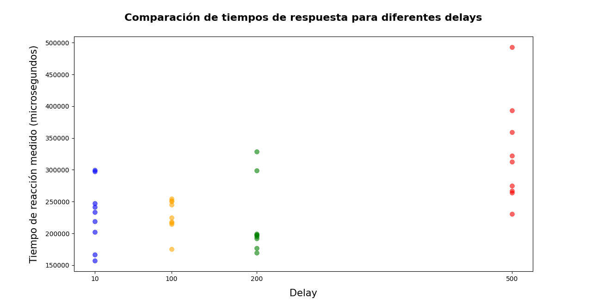
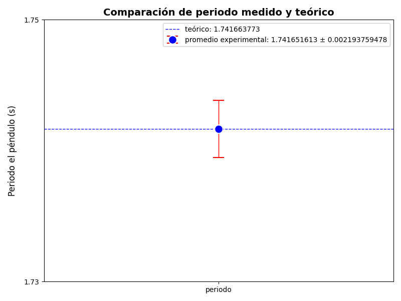
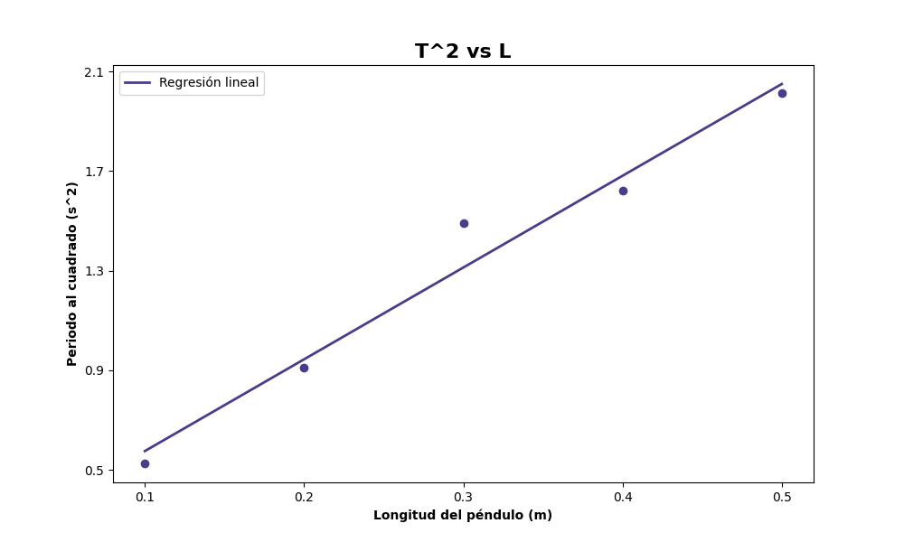

<<<<<<< HEAD:informe 1/informe lab #1.md
# Informe de Laboratorio — Sesión 2: Tiempo y Eventos — Mediciones Precisas con Arduino

---

**Universidad Nacional de Colombia**
**Electrónica Digital — 2016684 — 2026-1**
**Prof. Ricardo Amézquita Orozco**

---

| Campo | |
|-------|--|
| **Integrantes** |  Felipe Lizcano Quimbaya|
| |  Sergio Andrés Poveda Pérez |
| |  Sara Romero Chaves|
| |  Simon Gabriel Sandoval Palma|
| **Grupo** |#3|
| **Fecha de la práctica** | Miércoles 11 de Febrero, 2026 |
| **Fecha de entrega** | Miércoles 11 de Marzo, 2026 (Informe Bloque 1) |

---

## 1. Resultados

<!-- CRITERIO DE RÚBRICA: Resultados
     Nivel 2: Resultados completos y organizados
     Nivel 3: Con análisis estadístico o comparativo cuando aplique
     (Sesión de medición: tablas con N≥10, promedio, desv. estándar) -->

### Parte 1: Tiempo de Reacción (Polling)

| Medición | Tiempo millis() [ms] | Tiempo micros() [μs] | Diferencia [μs] |
|----------|----------------------|----------------------|------------------|
| 1 |217|215636|1364|
| 2 |227|227960|960|
| 3 |286|285284|716|
| 4 |199|198768|232|
| 5 |220|219660|340|
| 6 |180|179904|96|
| 7 |177|177352|352|
| 8 |269|268740|260|
| 9 |226|225208|792|
| 10 |166|166724|724|
| **Promedio** |216,7|216523,6|583,6|
| **Desv. Est.** |38,8|38502,6|395,9|

### Parte 2: Tiempo de Reacción (Interrupciones) + Bouncing

| Medición | Tiempo de reacción [μs] | contadorISR | Bouncing (sí/no) |
|----------|-------------------------|-------------|-------------------|
| 1 |202520|2|SI|
| 2 |202568|1|NO|
| 3 |247496|1|NO|
| 4 |166800|4|SI|
| 5 |299292|1|SI|
| 6 |156928|1|NO|
| 7 |297328|2|SI|
| 8 |241324|1|NO|
| 9 |233588|1|NO |
| 10 |218928|1|NO|
| **Promedio** |2266772| — | — |

### Parte 2: Experimento del Delay

| Valor del delay [ms] | Tiempo de reacción medido [μs] | Observaciones|
|-----------------------|-------------------------------|--------------|
| 10 (original) |2266772| | 
| 100 |2247896| | se prese|
| 200 |2114972| |
| 500 |319246| |

### Parte 3: Período del Péndulo (Sensor IR)

**Longitud de cuerda L = 0,753 m**

| #  | T(μs)   | T(ms)   | T(s)   |
|----|---------|---------|--------|
| 1  | 1742904 | 1742,90 | 1,7429 |
| 2  | 1744624 | 1744,62 | 1,7446 |
| 3  | 1743656 | 1743,66 | 1,7437 |
| 4  | 1741776 | 1741,78 | 1,7418 |
| 5  | 1742328 | 1742,33 | 1,7423 |
| 6  | 1741504 | 1741,50 | 1,7415 |
| 7  | 1743392 | 1743,39 | 1,7434 |
| 8  | 1743756 | 1743,76 | 1,7438 |
| 9  | 1741860 | 1741,86 | 1,7419 |
| 10 | 1742452 | 1742,45 | 1,7425 |
| 11 | 1741264 | 1741,26 | 1,7413 |
| 12 | 1741756 | 1741,76 | 1,7418 |
| 13 | 1741812 | 1741,81 | 1,7418 |
| 14 | 1746608 | 1746,61 | 1,7466 |
| 15 | 1744544 | 1744,54 | 1,7445 |
| 16 | 1733788 | 1733,79 | 1,7338 |
| 17 | 1740812 | 1740,81 | 1,7408 |
| 18 | 1741832 | 1741,83 | 1,7418 |
| 19 | 1740316 | 1740,32 | 1,7403 |
| 20 | 1741508 | 1741,51 | 1,7415 |
| 21 | 1741624 | 1741,62 | 1,7416 |
| 22 | 1741776 | 1741,78 | 1,7418 |
| 23 | 1742396 | 1742,40 | 1,7424 |
| 24 | 1741064 | 1741,06 | 1,7411 |
| 25 | 1740968 | 1740,97 | 1,7410 |
| 26 | 1740628 | 1740,63 | 1,7406 |
| 27 | 1741000 | 1741,00 | 1,7410 |
| 28 | 1740664 | 1740,66 | 1,7407 |
| 29 | 1740164 | 1740,16 | 1,7402 |
| 30 | 1740660 | 1740,66 | 1,7407 |
| 31 | 1737452 | 1737,45 | 1,7375 |
| **Promedio** |1741641,548 | 1741,64129 | 1,741651613 |
| **Desv. Est.** | 2200,112646 | 2,200078395 | 0,002193759478 |

$T_{teórico} = 2\pi\sqrt{L/g}$ = 1,741663773 s

Error porcentual: 0,0006982168077 %


---

## 2. Visualización

<!-- CRITERIO DE RÚBRICA: Visualización
     Nivel 2: Figuras claras, rotuladas y referenciadas en el texto
     Nivel 3: Con interpretación cuantitativa o comparación con teoría -->

### Gráfica 1: Efecto del Delay sobre el Tiempo de Reacción (Interrupciones)

**Eje X:** Valor del delay en `loop()` (ms)
**Eje Y:** Tiempo de reacción medido (μs)

Diagrama de barras o puntos con los datos de la Tabla 3 (delay de 10, 100, 200 y 500 ms). Si el tiempo de reacción no cambia con el delay, eso demuestra que la ISR captura el evento independientemente de lo que haga el programa principal.



**Interpretación:** ¿El tiempo de reacción depende del valor del delay? ¿Qué demuestra esto sobre cómo funcionan las interrupciones?

> [El tiempo de reacción no depende del valor del delay, ya que los datos obtenidos para los diferentes retardos son bastante cercanos entre sí. El caso del delay de 500, que presenta una medición más alejada que las demás, se atribuye a errores experimentales asociados al pulsador utilizado, este no registraba correctamente algunas pulsaciones, lo que ocasionó que se midieran tiempos de reacción mayores a los reales. Las interrupciones permiten capturar eventos de forma asíncrona y con alta precisión temporal, ya que el instante de ocurrencia del evento es registrado por hardware en el momento exacto, independientemente de que el programa principal se encuentre ejecutando un delay u otra tarea. Esto garantiza que la medición del tiempo de reacción no dependa del flujo del programa, a diferencia del método por polling.]

### Gráfica 2: T experimental vs T teórico (Péndulo)

Representar el valor medido de T (promedio ± desviación estándar) junto con el valor teórico $T = 2\pi\sqrt{L/g}$ para la longitud utilizada. Puede ser un diagrama de barras o un punto con barra de error y una línea horizontal para el valor teórico.



### Gráfica 3 (solo si se realizó el Reto 3): T² vs L

*Aplica únicamente si se midió el péndulo con ≥5 longitudes diferentes.*

**Eje X:** Longitud L (m)
**Eje Y:** Período al cuadrado T² (s²)



**Ecuación de ajuste lineal:** T² = 3,96· L + 0,21

**Pendiente experimental:** 3,96 s²/m

**Pendiente teórica ($4\pi^2/g$):** 4,02s²/m

**Valor de $g$ obtenido:** 10,96 m/s²

---

## 3. Análisis

<!-- CRITERIO DE RÚBRICA: Análisis (preguntas obligatorias)
     Nivel 2: Respuesta correcta respaldada por resultados propios
     Nivel 3: Con insight adicional o comparación cuantitativa -->

**Pregunta 1:** ¿Cuál es la diferencia promedio entre las mediciones de `millis()` y `micros()` en la Tabla 1? ¿Es consistente con la resolución de 1 ms de `millis()`?

> [La diferencia promedio entre las mediciones realizadas con millis() y micros() es de 583,6 µs. Este valor es consistente con la resolución de 1 ms de millis(), ya que dicha función solo mide el tiempo en intervalos enteros de milisegundos, mientras que micros() tiene una resolución mucho mayor. Por ello, es esperable que exista una diferencia menor a 1 ms entre ambas mediciones]

**Pregunta 2:** ¿Qué porcentaje de las pulsaciones en la Tabla 2 presentaron bouncing (`contadorISR > 1`)? ¿Cuál fue el valor máximo de `contadorISR` observado?

> [El 40% de las pulsaciones presentaron bouncing, el valor maximo observado fue de 4   ]

**Pregunta 3:** Analiza los resultados de la Tabla 3: ¿el delay afectó el tiempo de reacción reportado? Explica por qué o por qué no, en términos del mecanismo de la ISR.

> [El tiempo de reacción no depende del delay para valores pequeños, ya que la medición se realiza en el instante de la primera interrupción. El delay dentro de la ISR solo actúa como un mecanismo de antirrebote bloqueando interrupciones posteriores. Sin emabargo, para delays muy grandes (500), aparentemente la duración excesiva de la ISR introduce latencias en el sistema y aumenta artificialmente el tiempo de reacción promedio.]

---

## 4. Código Documentado

<!-- CRITERIO DE RÚBRICA: Código documentado
     Nivel 2: Código con comentarios básicos
     Nivel 3: Código limpio, bien comentado, explica la lógica -->

*Pegar el código completo de la Parte 3 con los 3 TODOs resueltos. Comentar cada bloque explicando la lógica implementada.*

### lab-02-parte3-pendulo.ino (TODOs completados)

```cpp
// // ============================================================================
// Lab 02 - Parte 3: Medición de Período de Péndulo con Sensor IR
// ============================================================================

// Pin digital donde está conectado el sensor IR
const int pinSensorIR = 2;    

//  VARIABLES COMPARTIDAS CON LA ISR 
// Se declaran como volatile porque las variables se modifican dentro de la interrupcion y se leen en el loop principal
volatile unsigned int contadorDetecciones = 0;
// Cuenta cuántas veces el péndulo ha pasado por el sensor IR.
volatile unsigned long tiempoPrimeraDeteccion = 0;
// Tiempo (en microsegundos) del primer paso del pendulo por el sensor (inicio del período)
volatile unsigned long tiempoSegundaDeteccion = 0;
// Tiempo del segundo paso del pendulo por el sensor (medio período)
volatile unsigned long tiempoTerceraDeteccion = 0;
// Tiempo del tercer paso del pendulo por el sensor (periodo completo)
volatile bool medicionLista = false;
// Indica que ya se puede calcular el período.
volatile unsigned long ultimoTiempo = 0;
// Guarda el tiempo de la última detección válida.
int numMedicion = 0;
// Variable para numerar las mediciones mostradas en pantalla

// ----------INTERRUPCIÓN---------- 

//Se ejecuta automáticamente cada vez que el sensor detecta el paso del péndulo
void isrSensorIR() {
  // micros() devuelve el tiempo desde que inició el Arduino en microsegundos
  unsigned long tiempoActual = micros();
  // -----FILTRO ANTI-REBOTE----- 
  // Si el sensor detecta otra señal antes de 200 ms, se ignora.
  // Esto evita errores por:
  // Vibraciones del péndulo
  // Múltiples lecturas en un solo paso ya que el pendulo no es una masa puntual
  if (tiempoActual - ultimoTiempo < 200000) {
    return;
  }
  // Se actualiza el tiempo de la última detección válida
  ultimoTiempo = tiempoActual;
  // Se incrementa el número de pasos del pendulo detectados
  contadorDetecciones++;

  // ----------REGISTRO DE LOS TIEMPOS---------

  if (contadorDetecciones == 1) {
    // Primer paso del péndulo por el sensor
    // Marca el inicio del período
    tiempoPrimeraDeteccion = tiempoActual;
  }
  else if (contadorDetecciones == 2) {
    // Segundo paso
    // El péndulo viene de regreso (medio período)
    tiempoSegundaDeteccion = tiempoActual;
  }
  else if (contadorDetecciones == 3) {
    // Tercer paso
    // El péndulo vuelve al mismo punto y en el mismo sentido
    // Se completa un período completo
    tiempoTerceraDeteccion = tiempoActual;
    // Se activa la bandera para que el loop procese el cálculo
    medicionLista = true;
  }
}

// ---------- CONFIGURACIÓN INICIAL ----------

void setup() {
  // Se configura el pin del sensor como entrada digital
  pinMode(pinSensorIR, INPUT);
  // Se coloca para poder implementar el monitor serial
  Serial.begin(9600);
  delay(2000);
  // Tabla de resultados
  Serial.println("===============================================");
  Serial.println("Medicion de periodo completo del pendulo");
  Serial.println("===============================================");
  Serial.println("#\tT(us)\t\tT(ms)\t\tT(s)");
  // Se activa la interrupción externa en el pin del sensor
  // FALLING significa que se ejecuta cuando la señal pasa de HIGH a LOW (cuando el péndulo bloquea el haz generado por el sensor)
  attachInterrupt(digitalPinToInterrupt(pinSensorIR), isrSensorIR, FALLING);
}

// ---------- LOOP PRINCIPAL ----------

void loop() {
  // En este punto ya se detectaron los 3 cruces
  if (medicionLista) {
    // ---------------------- CÁLCULO DEL PERÍODO ----------------------
    // Se calcula como: T = t3 - t1
    unsigned long T_us = tiempoTerceraDeteccion - tiempoPrimeraDeteccion;
    // Conversión de unidades
    float T_ms = T_us / 1000.0;       // De microsegundos a milisegundos
    float T_s  = T_us / 1000000.0;    //  De microsegundos a segundos

    // Se incrementa el número de medición
    numMedicion++;

    // ---------- RESULTADOS (monitor serial) ----------

    Serial.print(numMedicion);   // Número de medición
    Serial.print("\t");
    Serial.print(T_us);          // Período en microsegundos
    Serial.print("\t\t");
    Serial.print(T_ms, 2);       // Período en milisegundos (2 decimales)
    Serial.print("\t\t");
    Serial.println(T_s, 4);      // Período en segundos (4 decimales)

    // ---------- REINICIO DE VARIABLES (para la siguiente medicion) ----------

    contadorDetecciones = 0;  // Reinicia el contador de cruces
    medicionLista = false;    // Baja la bandera para esperar otra medición
  }
}
```
---

## 5. Dificultades Encontradas y Soluciones Aplicadas

<!-- CRITERIO DE RÚBRICA: Dificultades y soluciones
     Nivel 2: Describe problemas y cómo los resolvieron
     Nivel 3: Análisis de causa raíz + lección aprendida -->

### Dificultad 1: [El uso de cables inadecuados generó lecturas inestables y fallas en el funcionamiento del circuitobreve]

- **Síntoma observado:El circuito presentaba lecturas inestables y variaciones inesperadas en los valores medidos**
- **Causa identificada: Se utilizaron cables que estaban en mal estado**
- **Solución aplicada: Se reemplazaron los cables por otros de mejor calidad**
- **Lección aprendida: La calidad de los componentes puede afectar significativamente el rendimiento del circuito**

### Dificultad 2: [El sensor detectaba múltiples señales por oscilación debido al tamaño del péndulo, lo que producía datos incorrectos]
   
- **Síntoma observado:El sensor registraba tiempos irregulares y, en algunos casos, detectaba más de un paso por oscilación.**
- **Causa identificada:El péndulo no se comportaba como una masa puntual. Debido a esto, el sensor detectaba diferentes partes del objeto en momentos distintos, generando múltiples señales o lecturas incorrectas.**
- **Solución aplicada:Se modificó el código para implementar un mecanismo de eliminación de bouncing (debounce), ignorando las señales que ocurrían dentro de un intervalo de tiempo muy corto después de una detección válida. De esta forma, solo se registró un evento por cada cruce real del péndulo..**
- **Lección aprendida:En experimentos reales, los sistemas no siempre cumplen las idealizaciones teóricas. Es importante adaptar el montaje experimental a las condiciones reales del objeto para obtener mediciones confiables.**

---

## 6. Pregunta Abierta

<!-- CRITERIO DE RÚBRICA: Pregunta abierta
     Nivel 2: Propuesta viable y justificada
     Nivel 3: Propuesta creativa con análisis cuantitativo -->

**Pregunta:** Propón un experimento de física que podrías automatizar usando interrupciones y un sensor (IR, ultrasonido, u otro). Describe: qué mediría, qué sensor usaría, qué tipo de interrupción (RISING/FALLING/CHANGE), y qué ventaja tendría sobre una medición manual.


> [Respuesta del estudiante aquí]

# 🧪 Experimento: Medición de la Velocidad del Sonido

## 🎯 Objetivo

Determinar experimentalmente la velocidad del sonido en el aire midiendo el tiempo que tarda una onda ultrasónica en recorrer una distancia conocida y regresar al sensor.

La relación utilizada es:

v = 2d / t

donde:

- d = distancia al obstáculo  
- t = tiempo de ida y vuelta  

---

## ⚙️ Fundamento físico

El sonido es una onda mecánica que se propaga en el aire.  
Cuando una onda sonora encuentra una superficie rígida, se refleja (eco).

En este experimento:

1. El sensor emite un pulso ultrasónico (~40 kHz).
2. La onda viaja hasta una pared.
3. Rebota.
4. Regresa al sensor.

Midiendo el tiempo total del recorrido se puede calcular la velocidad.

---

## 📡 Sensor utilizado

**HC-SR04 (sensor ultrasónico)**

Pines:

- VCC → 5V  
- GND → GND  
- TRIG → Pin digital  
- ECHO → Pin digital con interrupción  

Funcionamiento:

- Se envía un pulso de 10 μs al pin TRIG.
- El sensor emite la onda ultrasónica.
- El pin ECHO se pone en HIGH mientras la onda viaja y regresa.
- La duración del pulso HIGH corresponde al tiempo total del recorrido.

---

## ⚡ Uso de interrupciones

Se utiliza una interrupción externa en el pin ECHO configurada en:

**CHANGE**

Esto permite:

- Detectar el flanco RISING (inicio del pulso).
- Detectar el flanco FALLING (fin del pulso).

El tiempo se calcula como:

t = t_final − t_inicial

usando micros() para obtener precisión en microsegundos.

---

## 🧠 Procedimiento experimental

### 1️⃣ Montaje

- Colocar el sensor frente a una pared.
- Medir la distancia d con una regla (en metros).

---

### 2️⃣ Generación del pulso

- Arduino envía pulso de 10 μs al TRIG.
- Se activa la medición mediante interrupción.

---

### 3️⃣ Medición del tiempo

- Al detectar RISING → guardar tiempo inicial.
- Al detectar FALLING → guardar tiempo final.
- Calcular duración del pulso.

---

### 4️⃣ Cálculo de la velocidad

v = 2d / t

Convertir:

- d en metros  
- t en segundos  

---

## 📊 Análisis adicional

Se puede comparar con el valor teórico dependiente de la temperatura:

v ≈ 331 + 0.6T

donde T es la temperatura en °C.

También puede analizarse la relación termodinámica:

v = √(γRT / M)

---

## 🚀 Ventajas sobre medición manual

- Precisión del orden de microsegundos.
- Eliminación del error humano.
- Imposible medir manualmente tiempos tan pequeños.
- Permite múltiples mediciones y promedio estadístico.

---

## 🎓 Conclusión

El uso de interrupciones permite medir con alta precisión el tiempo de propagación del sonido, validando experimentalmente la teoría de ondas y mostrando la relación entre velocidad del sonido y condiciones físicas del medio.


=======
# Informe de Laboratorio — Sesión 2: Tiempo y Eventos — Mediciones Precisas con Arduino

---

**Universidad Nacional de Colombia**
**Electrónica Digital — 2016684 — 2026-1**
**Prof. Ricardo Amézquita Orozco**

---

| Campo | |
|-------|--|
| **Integrantes** |  Felipe Lizcano Quimbaya|
| |  Sergio Andrés Poveda Pérez |
| |  Sara Romero Chaves|
| |  Simon Gabriel Sandoval Palma|
| **Grupo** |#3|
| **Fecha de la práctica** | Miércoles 11 de Febrero, 2026 |
| **Fecha de entrega** | Miércoles 11 de Marzo, 2026 (Informe Bloque 1) |

---

## 1. Resultados

<!-- CRITERIO DE RÚBRICA: Resultados
     Nivel 2: Resultados completos y organizados
     Nivel 3: Con análisis estadístico o comparativo cuando aplique
     (Sesión de medición: tablas con N≥10, promedio, desv. estándar) -->

### Parte 1: Tiempo de Reacción (Polling)

| Medición | Tiempo millis() [ms] | Tiempo micros() [μs] | Diferencia [μs] |
|----------|----------------------|----------------------|------------------|
| 1 |217|215636|1364|
| 2 |227|227960|960|
| 3 |286|285284|716|
| 4 |199|198768|232|
| 5 |220|219660|340|
| 6 |180|179904|96|
| 7 |177|177352|352|
| 8 |269|268740|260|
| 9 |226|225208|792|
| 10 |166|166724|724|
| **Promedio** |216,7|216523,6|583,6|
| **Desv. Est.** |38,8|38502,6|395,9|

### Parte 2: Tiempo de Reacción (Interrupciones) + Bouncing

| Medición | Tiempo de reacción [μs] | contadorISR | Bouncing (sí/no) |
|----------|-------------------------|-------------|-------------------|
| 1 |202520|2|SI|
| 2 |202568|1|NO|
| 3 |247496|1|NO|
| 4 |166800|4|SI|
| 5 |299292|1|SI|
| 6 |156928|1|NO|
| 7 |297328|2|SI|
| 8 |241324|1|NO|
| 9 |233588|1|NO |
| 10 |218928|1|NO|
| **Promedio** |2266772| — | — |

### Parte 2: Experimento del Delay

| Valor del delay [ms] | Tiempo de reacción medido [μs] | Observaciones|
|-----------------------|-------------------------------|--------------|
| 10 (original) |2266772| | 
| 100 |2247896| | se prese|
| 200 |2114972| |
| 500 |319246| |

### Parte 3: Período del Péndulo (Sensor IR)

**Longitud de cuerda L = 0,753 m**

| #  | T(μs)   | T(ms)   | T(s)   |
|----|---------|---------|--------|
| 1  | 1742904 | 1742,90 | 1,7429 |
| 2  | 1744624 | 1744,62 | 1,7446 |
| 3  | 1743656 | 1743,66 | 1,7437 |
| 4  | 1741776 | 1741,78 | 1,7418 |
| 5  | 1742328 | 1742,33 | 1,7423 |
| 6  | 1741504 | 1741,50 | 1,7415 |
| 7  | 1743392 | 1743,39 | 1,7434 |
| 8  | 1743756 | 1743,76 | 1,7438 |
| 9  | 1741860 | 1741,86 | 1,7419 |
| 10 | 1742452 | 1742,45 | 1,7425 |
| 11 | 1741264 | 1741,26 | 1,7413 |
| 12 | 1741756 | 1741,76 | 1,7418 |
| 13 | 1741812 | 1741,81 | 1,7418 |
| 14 | 1746608 | 1746,61 | 1,7466 |
| 15 | 1744544 | 1744,54 | 1,7445 |
| 16 | 1733788 | 1733,79 | 1,7338 |
| 17 | 1740812 | 1740,81 | 1,7408 |
| 18 | 1741832 | 1741,83 | 1,7418 |
| 19 | 1740316 | 1740,32 | 1,7403 |
| 20 | 1741508 | 1741,51 | 1,7415 |
| 21 | 1741624 | 1741,62 | 1,7416 |
| 22 | 1741776 | 1741,78 | 1,7418 |
| 23 | 1742396 | 1742,40 | 1,7424 |
| 24 | 1741064 | 1741,06 | 1,7411 |
| 25 | 1740968 | 1740,97 | 1,7410 |
| 26 | 1740628 | 1740,63 | 1,7406 |
| 27 | 1741000 | 1741,00 | 1,7410 |
| 28 | 1740664 | 1740,66 | 1,7407 |
| 29 | 1740164 | 1740,16 | 1,7402 |
| 30 | 1740660 | 1740,66 | 1,7407 |
| 31 | 1737452 | 1737,45 | 1,7375 |
| **Promedio** |1741641,548 | 1741,64129 | 1,741651613 |
| **Desv. Est.** | 2200,112646 | 2,200078395 | 0,002193759478 |

$T_{teórico} = 2\pi\sqrt{L/g}$ = 1,741663773 s

Error porcentual: 0,0006982168077 %


---

## 2. Visualización

<!-- CRITERIO DE RÚBRICA: Visualización
     Nivel 2: Figuras claras, rotuladas y referenciadas en el texto
     Nivel 3: Con interpretación cuantitativa o comparación con teoría -->

### Gráfica 1: Efecto del Delay sobre el Tiempo de Reacción (Interrupciones)

**Eje X:** Valor del delay en `loop()` (ms)
**Eje Y:** Tiempo de reacción medido (μs)

Diagrama de barras o puntos con los datos de la Tabla 3 (delay de 10, 100, 200 y 500 ms). Si el tiempo de reacción no cambia con el delay, eso demuestra que la ISR captura el evento independientemente de lo que haga el programa principal.


**Interpretación:** ¿El tiempo de reacción depende del valor del delay? ¿Qué demuestra esto sobre cómo funcionan las interrupciones?

> [El tiempo de reacción no depende del valor del delay, ya que los datos obtenidos para los diferentes retardos son bastante cercanos entre sí. El caso del delay de 500, que presenta una medición más alejada que las demás, se atribuye a errores experimentales asociados al pulsador utilizado, este no registraba correctamente algunas pulsaciones, lo que ocasionó que se midieran tiempos de reacción mayores a los reales. Las interrupciones permiten capturar eventos de forma asíncrona y con alta precisión temporal, ya que el instante de ocurrencia del evento es registrado por hardware en el momento exacto, independientemente de que el programa principal se encuentre ejecutando un delay u otra tarea. Esto garantiza que la medición del tiempo de reacción no dependa del flujo del programa, a diferencia del método por polling.]

### Gráfica 2: T experimental vs T teórico (Péndulo)

Representar el valor medido de T (promedio ± desviación estándar) junto con el valor teórico $T = 2\pi\sqrt{L/g}$ para la longitud utilizada. Puede ser un diagrama de barras o un punto con barra de error y una línea horizontal para el valor teórico.


### Gráfica 3 (solo si se realizó el Reto 3): T² vs L

*Aplica únicamente si se midió el péndulo con ≥5 longitudes diferentes.*

**Eje X:** Longitud L (m)
**Eje Y:** Período al cuadrado T² (s²)


**Ecuación de ajuste lineal:** T² = 3,96· L + 0,21

**Pendiente experimental:** 3,96 s²/m

**Pendiente teórica ($4\pi^2/g$):** 4,02s²/m

**Valor de $g$ obtenido:** 10,96 m/s²

---

## 3. Análisis

<!-- CRITERIO DE RÚBRICA: Análisis (preguntas obligatorias)
     Nivel 2: Respuesta correcta respaldada por resultados propios
     Nivel 3: Con insight adicional o comparación cuantitativa -->

**Pregunta 1:** ¿Cuál es la diferencia promedio entre las mediciones de `millis()` y `micros()` en la Tabla 1? ¿Es consistente con la resolución de 1 ms de `millis()`?

> [La diferencia promedio entre las mediciones realizadas con millis() y micros() es de 583,6 µs. Este valor es consistente con la resolución de 1 ms de millis(), ya que dicha función solo mide el tiempo en intervalos enteros de milisegundos, mientras que micros() tiene una resolución mucho mayor. Por ello, es esperable que exista una diferencia menor a 1 ms entre ambas mediciones]

**Pregunta 2:** ¿Qué porcentaje de las pulsaciones en la Tabla 2 presentaron bouncing (`contadorISR > 1`)? ¿Cuál fue el valor máximo de `contadorISR` observado?

> [El 40% de las pulsaciones presentaron bouncing, el valor maximo observado fue de 4   ]

**Pregunta 3:** Analiza los resultados de la Tabla 3: ¿el delay afectó el tiempo de reacción reportado? Explica por qué o por qué no, en términos del mecanismo de la ISR.

> [El tiempo de reacción no depende del delay para valores pequeños, ya que la medición se realiza en el instante de la primera interrupción. El delay dentro de la ISR solo actúa como un mecanismo de antirrebote bloqueando interrupciones posteriores. Sin emabargo, para delays muy grandes (500), aparentemente la duración excesiva de la ISR introduce latencias en el sistema y aumenta artificialmente el tiempo de reacción promedio.]

---

## 4. Código Documentado

<!-- CRITERIO DE RÚBRICA: Código documentado
     Nivel 2: Código con comentarios básicos
     Nivel 3: Código limpio, bien comentado, explica la lógica -->

*Pegar el código completo de la Parte 3 con los 3 TODOs resueltos. Comentar cada bloque explicando la lógica implementada.*

### lab-02-parte3-pendulo.ino (TODOs completados)

```cpp
// // ============================================================================
// Lab 02 - Parte 3: Medición de Período de Péndulo con Sensor IR
// ============================================================================

// Pin digital donde está conectado el sensor IR
const int pinSensorIR = 2;    

//  VARIABLES COMPARTIDAS CON LA ISR 
// Se declaran como volatile porque las variables se modifican dentro de la interrupcion y se leen en el loop principal
volatile unsigned int contadorDetecciones = 0;
// Cuenta cuántas veces el péndulo ha pasado por el sensor IR.
volatile unsigned long tiempoPrimeraDeteccion = 0;
// Tiempo (en microsegundos) del primer paso del pendulo por el sensor (inicio del período)
volatile unsigned long tiempoSegundaDeteccion = 0;
// Tiempo del segundo paso del pendulo por el sensor (medio período)
volatile unsigned long tiempoTerceraDeteccion = 0;
// Tiempo del tercer paso del pendulo por el sensor (periodo completo)
volatile bool medicionLista = false;
// Indica que ya se puede calcular el período.
volatile unsigned long ultimoTiempo = 0;
// Guarda el tiempo de la última detección válida.
int numMedicion = 0;
// Variable para numerar las mediciones mostradas en pantalla

// ----------INTERRUPCIÓN---------- 

//Se ejecuta automáticamente cada vez que el sensor detecta el paso del péndulo
void isrSensorIR() {
  // micros() devuelve el tiempo desde que inició el Arduino en microsegundos
  unsigned long tiempoActual = micros();
  // -----FILTRO ANTI-REBOTE----- 
  // Si el sensor detecta otra señal antes de 200 ms, se ignora.
  // Esto evita errores por:
  // Vibraciones del péndulo
  // Múltiples lecturas en un solo paso ya que el pendulo no es una masa puntual
  if (tiempoActual - ultimoTiempo < 200000) {
    return;
  }
  // Se actualiza el tiempo de la última detección válida
  ultimoTiempo = tiempoActual;
  // Se incrementa el número de pasos del pendulo detectados
  contadorDetecciones++;

  // ----------REGISTRO DE LOS TIEMPOS---------

  if (contadorDetecciones == 1) {
    // Primer paso del péndulo por el sensor
    // Marca el inicio del período
    tiempoPrimeraDeteccion = tiempoActual;
  }
  else if (contadorDetecciones == 2) {
    // Segundo paso
    // El péndulo viene de regreso (medio período)
    tiempoSegundaDeteccion = tiempoActual;
  }
  else if (contadorDetecciones == 3) {
    // Tercer paso
    // El péndulo vuelve al mismo punto y en el mismo sentido
    // Se completa un período completo
    tiempoTerceraDeteccion = tiempoActual;
    // Se activa la bandera para que el loop procese el cálculo
    medicionLista = true;
  }
}

// ---------- CONFIGURACIÓN INICIAL ----------

void setup() {
  // Se configura el pin del sensor como entrada digital
  pinMode(pinSensorIR, INPUT);
  // Se coloca para poder implementar el monitor serial
  Serial.begin(9600);
  delay(2000);
  // Tabla de resultados
  Serial.println("===============================================");
  Serial.println("Medicion de periodo completo del pendulo");
  Serial.println("===============================================");
  Serial.println("#\tT(us)\t\tT(ms)\t\tT(s)");
  // Se activa la interrupción externa en el pin del sensor
  // FALLING significa que se ejecuta cuando la señal pasa de HIGH a LOW (cuando el péndulo bloquea el haz generado por el sensor)
  attachInterrupt(digitalPinToInterrupt(pinSensorIR), isrSensorIR, FALLING);
}

// ---------- LOOP PRINCIPAL ----------

void loop() {
  // En este punto ya se detectaron los 3 cruces
  if (medicionLista) {
    // ---------------------- CÁLCULO DEL PERÍODO ----------------------
    // Se calcula como: T = t3 - t1
    unsigned long T_us = tiempoTerceraDeteccion - tiempoPrimeraDeteccion;
    // Conversión de unidades
    float T_ms = T_us / 1000.0;       // De microsegundos a milisegundos
    float T_s  = T_us / 1000000.0;    //  De microsegundos a segundos

    // Se incrementa el número de medición
    numMedicion++;

    // ---------- RESULTADOS (monitor serial) ----------

    Serial.print(numMedicion);   // Número de medición
    Serial.print("\t");
    Serial.print(T_us);          // Período en microsegundos
    Serial.print("\t\t");
    Serial.print(T_ms, 2);       // Período en milisegundos (2 decimales)
    Serial.print("\t\t");
    Serial.println(T_s, 4);      // Período en segundos (4 decimales)

    // ---------- REINICIO DE VARIABLES (para la siguiente medicion) ----------

    contadorDetecciones = 0;  // Reinicia el contador de cruces
    medicionLista = false;    // Baja la bandera para esperar otra medición
  }
}
```
---

## 5. Dificultades Encontradas y Soluciones Aplicadas

<!-- CRITERIO DE RÚBRICA: Dificultades y soluciones
     Nivel 2: Describe problemas y cómo los resolvieron
     Nivel 3: Análisis de causa raíz + lección aprendida -->

### Dificultad 1: [El uso de cables inadecuados generó lecturas inestables y fallas en el funcionamiento del circuitobreve]

- **Síntoma observado:El circuito presentaba lecturas inestables y variaciones inesperadas en los valores medidos**
- **Causa identificada: Se utilizaron cables que estaban en mal estado**
- **Solución aplicada: Se reemplazaron los cables por otros de mejor calidad**
- **Lección aprendida: La calidad de los componentes puede afectar significativamente el rendimiento del circuito**

### Dificultad 2: [El sensor detectaba múltiples señales por oscilación debido al tamaño del péndulo, lo que producía datos incorrectos]
   
- **Síntoma observado:El sensor registraba tiempos irregulares y, en algunos casos, detectaba más de un paso por oscilación.**
- **Causa identificada:El péndulo no se comportaba como una masa puntual. Debido a esto, el sensor detectaba diferentes partes del objeto en momentos distintos, generando múltiples señales o lecturas incorrectas.**
- **Solución aplicada:Se modificó el código para implementar un mecanismo de eliminación de bouncing (debounce), ignorando las señales que ocurrían dentro de un intervalo de tiempo muy corto después de una detección válida. De esta forma, solo se registró un evento por cada cruce real del péndulo..**
- **Lección aprendida:En experimentos reales, los sistemas no siempre cumplen las idealizaciones teóricas. Es importante adaptar el montaje experimental a las condiciones reales del objeto para obtener mediciones confiables.**

---

## 6. Pregunta Abierta

<!-- CRITERIO DE RÚBRICA: Pregunta abierta
     Nivel 2: Propuesta viable y justificada
     Nivel 3: Propuesta creativa con análisis cuantitativo -->

**Pregunta:** Propón un experimento de física que podrías automatizar usando interrupciones y un sensor (IR, ultrasonido, u otro). Describe: qué mediría, qué sensor usaría, qué tipo de interrupción (RISING/FALLING/CHANGE), y qué ventaja tendría sobre una medición manual.


> 

# 🧪 Experimento: Medición de la Velocidad del Sonido

## 🎯 Objetivo

Determinar experimentalmente la velocidad del sonido en el aire midiendo el tiempo que tarda una onda ultrasónica en recorrer una distancia conocida y regresar al sensor.

La relación utilizada es:

v = 2d / t

donde:

- d = distancia al obstáculo  
- t = tiempo de ida y vuelta  

---

## ⚙️ Fundamento físico

El sonido es una onda mecánica que se propaga en el aire.  
Cuando una onda sonora encuentra una superficie rígida, se refleja (eco).

En este experimento:

1. El sensor emite un pulso ultrasónico (~40 kHz).
2. La onda viaja hasta una pared.
3. Rebota.
4. Regresa al sensor.

Midiendo el tiempo total del recorrido se puede calcular la velocidad.

---

## 📡 Sensor utilizado

**HC-SR04 (sensor ultrasónico)**

Pines:

- VCC → 5V  
- GND → GND  
- TRIG → Pin digital  
- ECHO → Pin digital con interrupción  

Funcionamiento:

- Se envía un pulso de 10 μs al pin TRIG.
- El sensor emite la onda ultrasónica.
- El pin ECHO se pone en HIGH mientras la onda viaja y regresa.
- La duración del pulso HIGH corresponde al tiempo total del recorrido.

---

## ⚡ Uso de interrupciones

Se utiliza una interrupción externa en el pin ECHO configurada en:

**CHANGE**

Esto permite:

- Detectar el flanco RISING (inicio del pulso).
- Detectar el flanco FALLING (fin del pulso).

El tiempo se calcula como:

t = t_final − t_inicial

usando micros() para obtener precisión en microsegundos.

---

## 🧠 Procedimiento experimental

### 1️⃣ Montaje

- Colocar el sensor frente a una pared.
- Medir la distancia d con una regla (en metros).

---

### 2️⃣ Generación del pulso

- Arduino envía pulso de 10 μs al TRIG.
- Se activa la medición mediante interrupción.

---

### 3️⃣ Medición del tiempo

- Al detectar RISING → guardar tiempo inicial.
- Al detectar FALLING → guardar tiempo final.
- Calcular duración del pulso.

---

### 4️⃣ Cálculo de la velocidad

v = 2d / t

Convertir:

- d en metros  
- t en segundos  

---

## 📊 Análisis adicional

Se puede comparar con el valor teórico dependiente de la temperatura:

v ≈ 331 + 0.6T

donde T es la temperatura en °C.

También puede analizarse la relación termodinámica:

v = √(γRT / M)

---

## 🚀 Ventajas sobre medición manual

- Precisión del orden de microsegundos.
- Eliminación del error humano.
- Imposible medir manualmente tiempos tan pequeños.
- Permite múltiples mediciones y promedio estadístico.

---

## 🎓 Conclusión

El uso de interrupciones permite medir con alta precisión el tiempo de propagación del sonido, validando experimentalmente la teoría de ondas y mostrando la relación entre velocidad del sonido y condiciones físicas del medio.


>>>>>>> fb985c51e19d1b2dd6e88e47935f64c7caa7d4bd:informe lab #1.md
