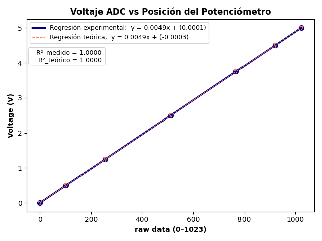
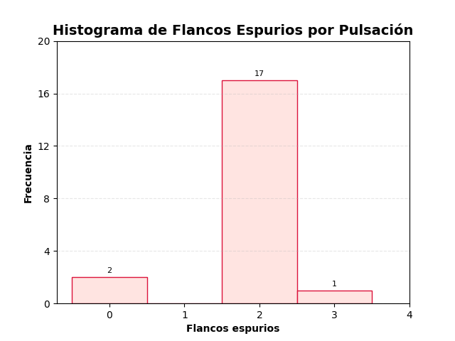

# Informe de Laboratorio — Sesión 3: Sensores — Entradas Digitales y Analógicas

---

**Universidad Nacional de Colombia**
**Electrónica Digital — 2016684 — 2026-1**
**Prof. Ricardo Amézquita Orozco**

---

| Campo | |
|-------|--|
| **Integrantes** | 1. Felipe Lizcano Quimbaya |
| | 2. Sergio Andres Poveda Perez|
| | 3. Sara Romero Chaves|
| | 4. Simon Gabriel Sandoval Palma |
| **Grupo** |3|
| **Fecha de la práctica** | Miércoles 25 de Febrero, 2026 |
| **Fecha de entrega** | Miércoles 11 de Marzo, 2026, 23:59 (Informe Bloque 1) |

---

## 1. Resultados

<!-- CRITERIO DE RÚBRICA: Resultados
     Nivel 2: Resultados completos y organizados — todas las tablas con datos reales
     Nivel 3: Con análisis estadístico cuando aplique (promedio, desv. estándar, rango) -->

### Tabla 1: Debouncing por Software — Contador Bruto vs Contador Debounce (Parte 1, Fase A)

| Pulsación | contadorBruto | contadorDebounce | Flancos espurios (bruto − debounce) |
|-----------|--------------|-----------------|--------------------------------------|
| 1  |0 | 0| 0|
| 2  |0 |0 | 0|
| 3  | 3| 1| 2|
| 4  | 3|1 | 2|
| 5  |3 | 1| 2|
| 6  | 4| 2| 2|
| 7  | 4| 2| 2|
| 8  | 5| 3| 2|
| 9  | 5| 3| 2|
| 10 | 6| 4| 2|
| 11 | 6| 4| 2|
| 12 | 7| 5| 2|
| 13 | 7| 5| 2|
| 14 | 7| 5| 2|
| 15 | 8| 6| 2|
| 16 | 8| 6| 2|
| 17 | 9| 6| 3|
| 18 | 9| 7| 2|
| 19 | 10| 7| 2|
| 20 | 10| 7| 2|
| **Promedio flancos espurios** |-|-| 1.86 |
| **Máximo flancos espurios**   |-|-| 3 |

### Tabla 2: Debouncing por Hardware — contadorISR con Capacitor 100 nF (Parte 1, Fase B)

| Pulsación | contadorISR (con 100 nF) | ¿Bouncing? (ISR > 1) |
|-----------|------------------------|----------------------|
| 1  |1|NO|
| 2  |1|NO|
| 3  |1|NO|
| 4  |1|NO|
| 5  |3|SI|
| 6  |2|SI|
| 7  |1|NO|
| 8  |1|NO|
| 9  |1|NO|
| 10 |1|NO|
| **Promedio contadorISR** |1,3| — |

**Para comparación:** Promedio de contadorISR SIN capacitor (dato de trabajo autónomo S2): EL promedio del contador ISR sin capacitor fue de 1,5 lo que muestra que al utilizar este se reduce el bouncing sin embargo no se elimina

### Tabla 3: ADC Potenciómetro — Verificación de Linealidad (Parte 2)

| Posición del potenciómetro | raw (0–1023) | Voltaje medido [V] | Voltaje teórico [V] | Error [mV] |
|----------------------------|-------------|-------------------|---------------------|-----------|
| GND total       | ~0   |0 | 0.000 | 0|
| ~10%            | ~102 | 0.498| 0.498 | 1000|
| ~25%            | ~256 | 1.251| 1.251 | 0|
| ~50%            | ~512 | 2.502| 2.502 | 0|
| ~75%            | ~768 | 3.753| 3.754 | 1000|
| ~90%            | ~921 | 4.501| 4.501 | 0|
| VCC total       | ~1023| 5.000| 5.000 | 0|

*(Ajusta las posiciones según los valores raw que obtengas; registra al menos 7 puntos distribuidos.)*

### Tabla 4: Temperaturas LM35 — Canal Directo (A2) vs Canal Amplificado (A3) (Partes 4 y 5)

| Condición | raw\_A2 | T\_directa [°C] | raw\_A3 | T\_amplificada [°C] | ΔT = \|T\_dir − T\_amp\| |
|-----------|--------|----------------|--------|--------------------|--------------------------|
| Temperatura ambiente estable          |39 |19.06 |257 |21.47 |2.41 |
| LM35 cubierto con mano (30 s)         |58 |28.35 | 330|27.57 |0.78 |
| LM35 cubierto con mano (60 s)         |65 | 31.77|399 |33.34 |1.57 |
| Enfriando con aire (ventilador/soplido)|33 |16.13 |233 | 19.47|3.34|
| Posición en equilibrio térmico        |37 | 18.08|243 |20.3 |2.22 |

**Estadísticas — condición de equilibrio térmico (N ≥ 10 lecturas consecutivas):**

| Estadística | T\_directa [°C] | T\_amplificada [°C] |
|-------------|----------------|-------------------|
| Promedio    | 15.80| 17.20 |
| Desv. estándar |0.91 |0.10 |
| Rango (max − min) | 2.93|0.5 |

### Tabla 5: LDR — Tres Condiciones de Iluminación (Parte 3)

| Condición | raw (0–1023) | Voltaje [V] | Comportamiento esperado |
|-----------|-------------|-------------|------------------------|
| Oscuridad total (LDR tapado con mano) |523|2.556| raw bajo → V bajo |
| Iluminación ambiente (sin intervención) |730|3.568| valor intermedio |
| Luz directa de linterna cercana |1021|4.990 | raw alto → V alto |

### Tabla 6: Termostato — Comportamiento del Umbral de Control (Parte 6)

| Condición del ensayo | raw\_umbral (A0) | Temp\_umbral [°C] | raw\_temp (A2) | Temp\_actual [°C] | Estado LED |
|----------------------|----------------|-----------------|--------------|-----------------|-----------|
| Umbral mayor que temperatura ambiente    | 1023.00| 500.00| 43.00| 21.02| APAGADO |
| Umbral igual a temperatura ambiente (frontera) | 41.00| 20.04| 41.00| 20.04| APAGADO |
| LM35 calentado con mano (temp > umbral) | 18.00| 8.80| 41.00| 20.04| ENCENDIDO |

**Verificación:** Para al menos una fila, "Temp\_umbral" y "Temp\_actual" deben diferir en ≥ 2°C para demostrar control efectivo. Esto se cumple en la tercera fila y en la primera fila, por lo que se concluye que si se logró el control eficaz del termostato con umbral ajustable.

---

## 2. Visualización

<!-- CRITERIO DE RÚBRICA: Visualización
     Nivel 2: Figuras claras, rotuladas y referenciadas en el texto
     Nivel 3: Con interpretación cuantitativa o comparación directa con la predicción teórica -->

### Gráfica 1: Voltaje ADC vs Posición del Potenciómetro — Linealidad (Tabla 3)

**Eje X:** raw (0–1023)
**Eje Y:** Voltaje [V]

Puntos experimentales como diagrama de dispersión. Superponer la recta teórica $V = \text{raw} \times (5{,}000\,\text{V} / 1023)$. Incluir la ecuación del ajuste lineal y el coeficiente $R^2$.



**Interpretación:** ¿Los datos experimentales confirman la linealidad del ADC? ¿Cuál es el mayor error observado y en qué punto del rango ocurre?

> [Respuesta del estudiante aquí]

### Gráfica 2: Temperatura LM35 vs Tiempo — Canal Directo y Amplificado (Tabla 4)

**Eje X:** Tiempo [s]
**Eje Y:** Temperatura [°C]

Dos curvas superpuestas: T\_directa (A2) y T\_amplificada (A3), con colores o estilos de línea diferenciados. El gráfico debe mostrar la secuencia de condiciones térmicas aplicadas (ambient → mano 30 s → mano 60 s → enfriamiento → equilibrio).


**Interpretación:** ¿Las dos curvas siguen la misma tendencia? ¿La diferencia ΔT es consistente con la predicción de la resolución por bit de cada canal?

> [Respuesta del estudiante aquí]

### Gráfica 3: Histograma de Flancos Espurios por Pulsación (Tabla 1)

**Eje X:** Número de flancos espurios (valores enteros ≥ 0)
**Eje Y:** Frecuencia (número de pulsaciones que generaron esa cantidad de espurios)

Diagrama de barras con los datos de la columna "Flancos espurios" de la Tabla 1 (20 pulsaciones).



**Interpretación:** ¿El bouncing es un fenómeno ocasional o sistemático para el botón utilizado? ¿En qué rango de valores se concentra la distribución?

> [Respuesta del estudiante aquí]

---

## 3. Análisis

<!-- CRITERIO DE RÚBRICA: Análisis
     Nivel 2: Respuesta correcta respaldada por los resultados propios de las tablas
     Nivel 3: Con cálculo cuantitativo explícito y justificación técnica -->

**Pregunta 1:** Con los datos de las Tablas 1 y 2: ¿qué porcentaje de las 20 pulsaciones generaron al menos un flanco espurio sin debouncing? ¿Cuánto redujo el capacitor de 100 nF el número de eventos espurios en comparación con el contadorISR de S2? Expresa ambos resultados cuantitativamente.

> [El 90% de las pulsaciones generaron al menos un flanco espurio sin debouncing (18 de 20). Con el capacitor de 100 nF, el número de eventos espurios se redujo a un 10% (2 de 20), lo que representa una reducción del 80% en la cantidad de eventos espurios.]

**Pregunta 2:** Un experimento requiere detectar variaciones de temperatura de 0,2 °C. Con los datos estadísticos de la Tabla 4 (condición de equilibrio): ¿qué canal (directo A2 o amplificado A3) es más adecuado? Justifica con la resolución en °C/bit de cada canal ($0{,}49\,°C/\text{bit}$ para A2; $0{,}098\,°C/\text{bit}$ para A3) y con los valores de desviación estándar medidos.

> [El canal amplificado A3 es más adecuado para detectar variaciones de temperatura de 0,2 °C, ya que su resolución de 0,098 °C/bit es menor que la variación que se desea detectar. Además, la desviación estándar del canal amplificado (0,10 °C) es significativamente menor que la del canal directo (0,91 °C), lo que indica que el canal amplificado tiene un nivel de ruido más bajo y es más preciso para medir pequeñas variaciones de temperatura.]

**Pregunta 3:** El LDR sigue una ley de potencias $R_\text{LDR} = A \cdot E^{-\gamma}$ en su respuesta a la iluminancia.

**(a)** Con los valores de la Tabla 5: ¿el rango de variación del raw entre oscuridad total y luz directa fue ≥ 200 cuentas? ¿En qué extremo de la escala (raw bajo o raw alto) se espera mayor sensibilidad a pequeños cambios de iluminación? Justifica con base en la forma de la curva $R_\text{LDR}$ vs $E$ y la región donde la pendiente $|dR/dE|$ es mayor.

> [si.El rango fue de 498 cuentas (1021 − 523). Se espera mayor sensibilidad a pequeños cambios de iluminación en el extremo de raw bajo (oscuridad total) porque en esa región la curva $R_\text{LDR}$ vs $E$ es más empinada, lo que significa que la pendiente $|dR/dE|$ es mayor. Esto implica que pequeñas variaciones en la iluminancia $E$ producirán cambios más significativos en la resistencia del LDR, y por ende en el raw medido.]

**(b)** En el Experimento 1 (trabajo autónomo — ley del inverso cuadrado): si la curva raw vs distancia no sigue exactamente $V \propto 1/d^2$, identifica al menos dos factores — además de la no linealidad del LDR — que contribuyen a la desviación. ¿Cómo podrías minimizar cada uno?

> [La luz ambiente puede afectar la medición, especialmente a distancias largas donde la señal del LDR es más débil. Para minimizar este factor, se podría realizar la calibración y las mediciones en un entorno controlado con iluminación constante o utilizando una caja opaca para eliminar la luz ambiental. La alineación entre la fuente de luz y el LDR también puede influir, ya que una mala alineación puede reducir la cantidad de luz que incide sobre el sensor. Para minimizar este factor, se podría utilizar un soporte fijo para mantener la fuente de luz y el LDR alineados durante todas las mediciones.]

---

## 4. Código Documentado

<!-- CRITERIO DE RÚBRICA: Código documentado
     Nivel 2: Código con comentarios que explican la lógica de cada bloque
     Nivel 3: Código limpio, bien estructurado, con identificación del autor de cada sección (TODOs resueltos) -->

*Pegar el código de las Partes 3, 4, 5 y 6 (escritas de forma autónoma durante la sesión) con comentarios explicando la lógica implementada. No incluir el código de referencia de las Partes 1 y 2.*

### Parte 3: Lectura del LDR con Divisor de Voltaje (A1)

```cpp
// Pegar aquí el código de la Parte 3 con comentarios
```

### Parte 4: Lectura del LM35 — Canal Directo (A2)

```cpp
// Pegar aquí el código de la Parte 4 con comentarios
```

### Parte 5: Lectura del LM35 — Canal Amplificado con LM324 (A3)

```cpp
// Pegar aquí el código de la Parte 5 con comentarios
```

### Parte 6: Termostato con Umbral Ajustable (A0 + A2 + D13)

```cpp
// Pegar aquí el código de la Parte 6 con comentarios
```

---

## 5. Dificultades Encontradas y Soluciones Aplicadas

<!-- CRITERIO DE RÚBRICA: Dificultades y soluciones
     Nivel 2: Describe el problema observado y cómo fue resuelto
     Nivel 3: Análisis de causa raíz + lección transferible a futuros laboratorios -->

### Dificultad 1: [Descripción breve]

- **Síntoma observado:**
- **Causa identificada:**
- **Solución aplicada:**
- **Lección aprendida:**

### Dificultad 2: [Descripción breve]

- **Síntoma observado:**
- **Causa identificada:**
- **Solución aplicada:**
- **Lección aprendida:**

*(Agregar más dificultades si aplica)*

---

## 6. Pregunta Abierta

<!-- CRITERIO DE RÚBRICA: Pregunta abierta
     Nivel 2: Propuesta viable, correctamente formulada y justificada
     Nivel 3: Con análisis cuantitativo usando datos reales de la Tabla 4 -->

**Pregunta:** El termostato de la Parte 6 activa un LED cuando `temp > umbral`. En instrumentación real, este comportamiento produce "chattering" (encendido/apagado rápido) cuando la temperatura oscila alrededor del umbral. Propone una modificación al algoritmo que incorpore un umbral de histéresis para eliminar el chattering. Describe: qué parámetros agregarías, cómo cambiaría la lógica del `if`, y qué valor de histéresis (en °C) sería apropiado dado el ruido de medición observado en la Tabla 4 (estadísticas de equilibrio).

> [Se podrian definir 2 parametros adicionales umbral_on y umbral_off ,donde la diferencia entre ambos define la histéresis. La lógica del if se modificaría para encender el LED solo si temp > umbral_on y apagarlo solo si temp < umbral_off. Dado el ruido de medición observado en la Tabla 4, una histéresis de al menos 0,5 °C podría ser apropiada para evitar el chattering, ya que es mayor que la desviación estándar del canal amplificado (0,10 °C) y proporciona un margen suficiente para las fluctuaciones de temperatura.]

---

## Anexo: Trabajo Autónomo

<!-- Los tres experimentos son OBLIGATORIOS y sus datos se incluyen en este informe -->

### Experimento 1: Medidor de Distancia con LDR — Calibración Empírica (OBLIGATORIO)

#### Fase 1 y 2: Tabla de Calibración y Parámetros del Ajuste Log-Log

| $d$ [cm] | raw | $R_\text{LDR}$ [kΩ] $= 10 \times (1023 - \text{raw})/\text{raw}$ |
|----------|-----|-------------------------------------------------------------------|
| 5  | | |
| 8  | | |
| 12 | | |
| 16 | | |
| 20 | | |
| 25 | | |
| 30 | | |
| 40 | | |
| 50 | | |
| 60 | | |

**Constantes de calibración obtenidas por regresión lineal en escala log-log:**

$$A = \text{\_\_\_\_\_}\,\Omega \qquad \alpha = \text{\_\_\_\_\_} \qquad R^2 = \text{\_\_\_\_\_}$$

**Gráfica:** $\log_{10}(R_\text{LDR})$ vs $\log_{10}(d)$ con recta de regresión y valor de $R^2$.


#### Fase 4: Validación del Medidor (5 distancias fuera del rango de calibración)

| $d_\text{real}$ [cm] | $d_\text{est}$ [cm] | Error [%] |
|----------------------|---------------------|----------|
| | | |
| | | |
| | | |
| | | |
| | | |

**Preguntas de análisis del Experimento 1:**

**P1:** ¿El ajuste log-log dio una recta? ¿Cuál fue el valor de $R^2$? ¿En qué extremo del rango (distancias cortas o largas) se observa mayor desviación de la recta?

> [Respuesta del estudiante aquí]

**P2:** ¿Los errores de validación son mayores en distancias dentro del rango de calibración o fuera de él? ¿Por qué se espera ese comportamiento (interpolación vs extrapolación)?

> [Respuesta del estudiante aquí]

**P3:** Si cambias la lámpara por otra de diferente potencia y repites la validación sin recalibrar, ¿qué le pasará a $d_\text{est}$? ¿Qué parámetro del modelo ($A$ o $\alpha$) cambia y cuál permanece igual?

> [Respuesta del estudiante aquí]

---

### Experimento 2: Enfriamiento de Newton — LM35 (OBLIGATORIO)

**Longitud de calentamiento:** LM35 cubierto con mano durante 2 minutos  
**Intervalo de muestreo:** cada 5 s durante 5 minutos tras retirar la mano  
**$T_\text{amb}$ (temperatura ambiente medida al inicio):** _________ °C

| t [s] | T [°C] |
|-------|--------|
| 0   | |
| 5   | |
| 10  | |
| 15  | |
| 20  | |
| 25  | |
| 30  | |
| 40  | |
| 50  | |
| 60  | |
| 75  | |
| 90  | |
| 120 | |
| 150 | |
| 180 | |
| 210 | |
| 240 | |
| 270 | |
| 300 | |

**Ajuste de curva exponencial** $T(t) = T_\text{amb} + (T_0 - T_\text{amb})\,e^{-kt}$:

| Parámetro | Valor |
|-----------|-------|
| $T_\text{amb}$ ajustado [°C] | |
| $T_0$ [°C] | |
| $k$ [s⁻¹] | |
| $t_{1/2} = \ln(2)/k$ [s] | |

**Gráfica:** T(t) vs t con la curva de ajuste superpuesta.


---

### Experimento 3: Comparación de Resolución LM35 Directo vs Amplificado (OBLIGATORIO)

**N = 30 lecturas consecutivas por condición (cada ~1 s)**

#### Condición A: Temperatura ambiente

| Estadística | T\_directa (A2) [°C] | T\_amplificada (A3) [°C] |
|-------------|---------------------|------------------------|
| Promedio    | | |
| Desv. estándar | | |
| Rango (max − min) | | |

#### Condición B: LM35 cubierto con mano abierta

| Estadística | T\_directa (A2) [°C] | T\_amplificada (A3) [°C] |
|-------------|---------------------|------------------------|
| Promedio    | | |
| Desv. estándar | | |
| Rango (max − min) | | |

#### Condición C: LM35 sobre superficie fría (vaso con agua fría)

| Estadística | T\_directa (A2) [°C] | T\_amplificada (A3) [°C] |
|-------------|---------------------|------------------------|
| Promedio    | | |
| Desv. estándar | | |
| Rango (max − min) | | |

**Análisis:** ¿El canal amplificado tiene mayor o menor desviación estándar que el directo? ¿La amplificación se justifica dado el nivel de ruido observado?

> [Respuesta del estudiante aquí]

---

*Contacto: ramezquitao@unal.edu.co*
