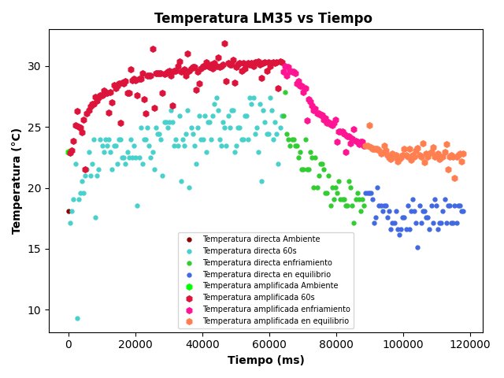

# Informe de Laboratorio — Sesión 3: Sensores — Entradas Digitales y Analógicas

---

**Universidad Nacional de Colombia**
**Electrónica Digital — 2016684 — 2026-1**
**Prof. Ricardo Amézquita Orozco**

---

| Campo | |
|-------|--|
| **Integrantes** | 1. Felipe Lizcano Quimbaya |
| | 2. Sergio Andres Poveda Perez|
| | 3. Sara Romero Chaves|
| | 4. Simon Gabriel Sandoval Palma |
| **Grupo** |3|
| **Fecha de la práctica** | Miércoles 25 de Febrero, 2026 |
| **Fecha de entrega** | Miércoles 11 de Marzo, 2026, 23:59 (Informe Bloque 1) |

---

## 1. Resultados

<!-- CRITERIO DE RÚBRICA: Resultados
     Nivel 2: Resultados completos y organizados — todas las tablas con datos reales
     Nivel 3: Con análisis estadístico cuando aplique (promedio, desv. estándar, rango) -->

### Tabla 1: Debouncing por Software — Contador Bruto vs Contador Debounce (Parte 1, Fase A)

| Pulsación | contadorBruto | contadorDebounce | Flancos espurios (bruto − debounce) |
|-----------|--------------|-----------------|--------------------------------------|
| 1  |0|0|0|
| 2  |0|0|0|
| 3  |3|1|2|
| 4  |3|1|2|
| 5  |3|1|2|
| 6  |4|2|2|
| 7  |4|2|2|
| 8  |5|3|2|
| 9  |5|3|2|
| 10 |6|4|2|
| 11 |6|4|2|
| 12 |7|5|2|
| 13 |7|5|2|
| 14 |7|5|2|
| 15 |8|6|2|
| 16 |8|6|2|
| 17 |9|6|3|
| 18 |9|7|2|
| 19 |10|7|2|
| 20 |10|7|2|
| **Promedio flancos espurios** |-|-| 1.86 |
| **Máximo flancos espurios**   |-|-| 3 |

### Tabla 2: Debouncing por Hardware — contadorISR con Capacitor 100 nF (Parte 1, Fase B)

| Pulsación | contadorISR (con 100 nF) | ¿Bouncing? (ISR > 1) |
|-----------|------------------------|----------------------|
| 1  |1|NO|
| 2  |1|NO|
| 3  |1|NO|
| 4  |1|NO|
| 5  |3|SI|
| 6  |2|SI|
| 7  |1|NO|
| 8  |1|NO|
| 9  |1|NO|
| 10 |1|NO|
| **Promedio contadorISR** |1,3| — |

**Para comparación:** Promedio de contadorISR SIN capacitor (dato de trabajo autónomo S2): EL promedio del contador ISR sin capacitor fue de 1,5 lo que muestra que al utilizar este se reduce el bouncing sin embargo no se elimina

### Tabla 3: ADC Potenciómetro — Verificación de Linealidad (Parte 2)

| Posición del potenciómetro | raw (0–1023) | Voltaje medido [V] | Voltaje teórico [V] | Error [mV] |
|----------------------------|-------------|-------------------|---------------------|-----------|
| GND total       | ~0   |0 | 0.000 | 0|
| ~10%            | ~102 | 0.498| 0.498 | 1000|
| ~25%            | ~256 | 1.251| 1.251 | 0|
| ~50%            | ~512 | 2.502| 2.502 | 0|
| ~75%            | ~768 | 3.753| 3.754 | 1000|
| ~90%            | ~921 | 4.501| 4.501 | 0|
| VCC total       | ~1023| 5.000| 5.000 | 0|

*(Ajusta las posiciones según los valores raw que obtengas; registra al menos 7 puntos distribuidos.)*

### Tabla 4: Temperaturas LM35 — Canal Directo (A2) vs Canal Amplificado (A3) (Partes 4 y 5)

| Condición | raw\_A2 | T\_directa [°C] | raw\_A3 | T\_amplificada [°C] | ΔT = \|T\_dir − T\_amp\| |
|-----------|--------|----------------|--------|--------------------|--------------------------|
| Temperatura ambiente estable          |39 |19.06 |257 |21.47 |2.41 |
| LM35 cubierto con mano (30 s)         |58 |28.35 | 330|27.57 |0.78 |
| LM35 cubierto con mano (60 s)         |65 | 31.77|399 |33.34 |1.57 |
| Enfriando con aire (ventilador/soplido)|33 |16.13 |233 | 19.47|3.34|
| Posición en equilibrio térmico        |37 | 18.08|243 |20.3 |2.22 |

**Estadísticas — condición de equilibrio térmico (N ≥ 10 lecturas consecutivas):**

| Estadística | T\_directa [°C] | T\_amplificada [°C] |
|-------------|----------------|-------------------|
| Promedio    | 15.80| 17.20 |
| Desv. estándar |0.91 |0.10 |
| Rango (max − min) | 2.93|0.5 |

### Tabla 5: LDR — Tres Condiciones de Iluminación (Parte 3)

| Condición | raw (0–1023) | Voltaje [V] | Comportamiento esperado |
|-----------|-------------|-------------|------------------------|
| Oscuridad total (LDR tapado con mano) |523|2.556| raw bajo → V bajo |
| Iluminación ambiente (sin intervención) |730|3.568| valor intermedio |
| Luz directa de linterna cercana |1021|4.990 | raw alto → V alto |

### Tabla 6: Termostato — Comportamiento del Umbral de Control (Parte 6)

| Condición del ensayo | raw\_umbral (A0) | Temp\_umbral [°C] | raw\_temp (A2) | Temp\_actual [°C] | Estado LED |
|----------------------|----------------|-----------------|--------------|-----------------|-----------|
| Umbral mayor que temperatura ambiente    | 1023.00| 500.00| 43.00| 21.02| APAGADO |
| Umbral igual a temperatura ambiente (frontera) | 41.00| 20.04| 41.00| 20.04| APAGADO |
| LM35 calentado con mano (temp > umbral) | 18.00| 8.80| 41.00| 20.04| ENCENDIDO |

**Verificación:** Para al menos una fila, "Temp\_umbral" y "Temp\_actual" deben diferir en ≥ 2°C para demostrar control efectivo. Esto se cumple en la tercera fila y en la primera fila, por lo que se concluye que si se logró el control eficaz del termostato con umbral ajustable.

---

## 2. Visualización

<!-- CRITERIO DE RÚBRICA: Visualización
     Nivel 2: Figuras claras, rotuladas y referenciadas en el texto
     Nivel 3: Con interpretación cuantitativa o comparación directa con la predicción teórica -->

### Gráfica 1: Voltaje ADC vs Posición del Potenciómetro — Linealidad (Tabla 3)

**Eje X:** raw (0–1023)
**Eje Y:** Voltaje [V]

Puntos experimentales como diagrama de dispersión. Superponer la recta teórica $V = \text{raw} \times (5{,}000\,\text{V} / 1023)$. Incluir la ecuación del ajuste lineal y el coeficiente $R^2$.


**Interpretación:** ¿Los datos experimentales confirman la linealidad del ADC? ¿Cuál es el mayor error observado y en qué punto del rango ocurre?

> [Los datos experimentales efectivamente confirman la linealidad del ADC; esto se puede apreciar en la gráfica 1. El mayor error observado fue de 0,2 % y se presentó alrededor del rango del 10 % de la capacidad de giro del potenciómetro.]

### Gráfica 2: Temperatura LM35 vs Tiempo — Canal Directo y Amplificado (Tabla 4)

**Eje X:** Tiempo [s]
**Eje Y:** Temperatura [°C]

Dos curvas superpuestas: T\_directa (A2) y T\_amplificada (A3), con colores o estilos de línea diferenciados. El gráfico debe mostrar la secuencia de condiciones térmicas aplicadas (ambient → mano 30 s → mano 60 s → enfriamiento → equilibrio).



**Interpretación:** ¿Las dos curvas siguen la misma tendencia? ¿La diferencia ΔT es consistente con la predicción de la resolución por bit de cada canal?

> [Sí, ambas curvas tienen el mismo comportamiento físico: en la etapa de calentamiento la temperatura aumenta progresivamente; en la etapa de enfriamiento ambas gráficas presentan un decaimiento exponencial y, por último, en el equilibrio térmico la temperatura se estabiliza alrededor de la temperatura ambiente. Con esto podemos concluir que la amplificación no altera el fenómeno térmico, solo varía la escala de la señal. La diferencia $\Delta T$ sí es consistente, ya que al realizar la amplificación la medida se vuelve más precisa debido a que ahora se tiene mayor sensibilidad y, por la misma razón, se reduce el error de cuantización.]

### Gráfica 3: Histograma de Flancos Espurios por Pulsación (Tabla 1)

**Eje X:** Número de flancos espurios (valores enteros ≥ 0)
**Eje Y:** Frecuencia (número de pulsaciones que generaron esa cantidad de espurios)

Diagrama de barras con los datos de la columna "Flancos espurios" de la Tabla 1 (20 pulsaciones).


**Interpretación:** ¿El bouncing es un fenómeno ocasional o sistemático para el botón utilizado? ¿En qué rango de valores se concentra la distribución?

> [El bouncing es un fenómeno sistemático para el botón utilizado; esto se puede interpretar gracias a que la distribución se concentra en 2 flancos espurios. Si fuera un fenómeno ocasional, la distribución debería verse concentrada alrededor del valor 0.]

---

## 3. Análisis

<!-- CRITERIO DE RÚBRICA: Análisis
     Nivel 2: Respuesta correcta respaldada por los resultados propios de las tablas
     Nivel 3: Con cálculo cuantitativo explícito y justificación técnica -->

**Pregunta 1:** Con los datos de las Tablas 1 y 2: ¿qué porcentaje de las 20 pulsaciones generaron al menos un flanco espurio sin debouncing? ¿Cuánto redujo el capacitor de 100 nF el número de eventos espurios en comparación con el contadorISR de S2? Expresa ambos resultados cuantitativamente.

> [El 90% de las pulsaciones generaron al menos un flanco espurio sin debouncing (18 de 20). Con el capacitor de 100 nF, el número de eventos espurios se redujo a un 10% (2 de 20), lo que representa una reducción del 80% en la cantidad de eventos espurios.]

**Pregunta 2:** Un experimento requiere detectar variaciones de temperatura de 0,2 °C. Con los datos estadísticos de la Tabla 4 (condición de equilibrio): ¿qué canal (directo A2 o amplificado A3) es más adecuado? Justifica con la resolución en °C/bit de cada canal ($0{,}49\,°C/\text{bit}$ para A2; $0{,}098\,°C/\text{bit}$ para A3) y con los valores de desviación estándar medidos.

> [El canal amplificado A3 es más adecuado para detectar variaciones de temperatura de 0,2 °C, ya que su resolución de 0,098 °C/bit es menor que la variación que se desea detectar. Además, la desviación estándar del canal amplificado (0,10 °C) es significativamente menor que la del canal directo (0,91 °C), lo que indica que el canal amplificado tiene un nivel de ruido más bajo y es más preciso para medir pequeñas variaciones de temperatura.]

**Pregunta 3:** El LDR sigue una ley de potencias $R_\text{LDR} = A \cdot E^{-\gamma}$ en su respuesta a la iluminancia.

**(a)** Con los valores de la Tabla 5: ¿el rango de variación del raw entre oscuridad total y luz directa fue ≥ 200 cuentas? ¿En qué extremo de la escala (raw bajo o raw alto) se espera mayor sensibilidad a pequeños cambios de iluminación? Justifica con base en la forma de la curva $R_\text{LDR}$ vs $E$ y la región donde la pendiente $|dR/dE|$ es mayor.

> [Si.El rango fue de 498 cuentas (1021 − 523). Se espera mayor sensibilidad a pequeños cambios de iluminación en el extremo de raw bajo (oscuridad total) porque en esa región la curva $R_\text{LDR}$ vs $E$ es más empinada, lo que significa que la pendiente $|dR/dE|$ es mayor. Esto implica que pequeñas variaciones en la iluminancia $E$ producirán cambios más significativos en la resistencia del LDR, y por ende en el raw medido.]

**(b)** En el Experimento 1 (trabajo autónomo — ley del inverso cuadrado): si la curva raw vs distancia no sigue exactamente $V \propto 1/d^2$, identifica al menos dos factores — además de la no linealidad del LDR — que contribuyen a la desviación. ¿Cómo podrías minimizar cada uno?

> [La luz ambiente puede afectar la medición, especialmente a distancias largas donde la señal del LDR es más débil. Para minimizar este factor, se podría realizar la calibración y las mediciones en un entorno controlado con iluminación constante o utilizando una caja opaca para eliminar la luz ambiental. La alineación entre la fuente de luz y el LDR también puede influir, ya que una mala alineación puede reducir la cantidad de luz que incide sobre el sensor. Para minimizar este factor, se podría utilizar un soporte fijo para mantener la fuente de luz y el LDR alineados durante todas las mediciones.]

---

## 4. Código Documentado

<!-- CRITERIO DE RÚBRICA: Código documentado
     Nivel 2: Código con comentarios que explican la lógica de cada bloque
     Nivel 3: Código limpio, bien estructurado, con identificación del autor de cada sección (TODOs resueltos) -->

*Pegar el código de las Partes 3, 4, 5 y 6 (escritas de forma autónoma durante la sesión) con comentarios explicando la lógica implementada. No incluir el código de referencia de las Partes 1 y 2.*

### Parte 3: Lectura del LDR con Divisor de Voltaje (A1)

```cpp
// // Laboratorio 3 — Parte 3: Sensor de luz (LDR)

// Una LDR (resistencia dependiente de la luz) y una resistencia fija.
// La LDR cambia su resistencia dependiendo de la iluminación:
//  - Más luz implica menor resistencia
//  - Menos luz implica mayor resistencia
//  ADC (Conversor Analógico-Digital):
//  Resolución: 10 bits → valores entre 0 y 1023
//  Referencia: 5 V
//  Resolución mínima: 5V / 1023 ≈ 4.89 mV por paso
//  Conversión de lectura a voltaje:
//  V = raw × (5.0 / 1023.0)

// ---------- DEFINICIÓN DE PINES ---------- 

// Pin analógico donde se conecta la LDR y la resistencia de referencia 
const int pinLDR = A1;

// ---------- VARIABLES GLOBALES ----------

// Variable que almacena el tiempo de la última medición mostrada
unsigned long tiempoDisplay = 0;
// Intervalo entre mediciones (200 ms) lo cual produce 5 mediciones por segundo aproximadamente
const unsigned long INTERVALO_DISPLAY = 200;

// ---------- FUNCIÓN DE CONFIGURACIÓN ----------

void setup() {
  // Inicia el monitor serial
  Serial.begin(9600);
  // Mensajes que aparecerán en el monitor serial
  Serial.println("==========================================");
  Serial.println("  Lab 3 — Parte 3: Sensor de luz (LDR)");
  Serial.println("==========================================");
  Serial.println();
  Serial.println("Cambie la iluminacion del LDR");
  Serial.println("Tapelo con la mano o acerque una linterna.");
  Serial.println();
  // Encabezado de las columnas de datos
  Serial.println("t(ms)\traw(0-1023)\tvoltaje(V)");
  Serial.println("------------------------------------------");
  // No es necesario configurar pinMode para pines analógicos ya que analogRead() los configura automaticamente como INPUT 
}
 
// ---------- BUCLE PRINCIPAL -----------

void loop() {
  // millis() devuelve el tiempo (en milisegundos), se usa para controlar el intervalo entre medcions
  if ((millis() - tiempoDisplay) >= INTERVALO_DISPLAY) {
    // Se actualiza el instante de la última medición
    tiempoDisplay = millis();
    
    // ----- LECTURA DEL ADC -----
    
    // analogRead() mide el voltaje presente en el pin analógico A1 y lo convierte en un numero entero entre 0 y 1023
    int rawADC = analogRead(pinLDR);
    // ----- CONVERSIÓN A VOLTAJE -----
    // Convertimos la lectura digital del ADC al voltaje físico
    float voltaje = rawADC * (5.0 / 1023.0);
    
    // ----- ENVÍO DE DATOS AL MONITOR SERIAL -----

    // Se imprime el tiempo actual en milisegundos
    Serial.print(millis());
    Serial.print("\t");
    // Se imprime la lectura del ADC
    Serial.print(rawADC);
    Serial.print("\t\t");
    // Se imprime el voltaje calculado, ",3" significa mostrar 3 decimales
    Serial.println(voltaje, 3);
  }
}
```

### Parte 4: Lectura del LM35 — Canal Directo (A2)

```cpp
  //  Laboratorio 3 — Parte 4: Sensor de temperatura LM35 (lectura directa)
//  Este programa mide la temperatura usando un sensor LM35 conectado directamente a una entrada anológica 
//  El LM35 es un sensor de temperatura analógico cuya salida de voltaje es proporcional a la temperatura medida 
//  Su característica principal es: 10mV por °c
//  Se utiliza su ADC de 10 bits para convertir este voltaje en un valor digital entre 0 y 1023.
//  Para convertir la lectura digital a temperatura se usa: T(°C) = raw × (500 / 1023)

// ---------- DEFINICIÓN DE PINES ----------

// Pin analógico donde se conecta la salida del sensor LM35
const int pinLM35 = A2;

// ---------- CONFIGURACIÓN INICIAL ----------

void setup() {
  // Inicia el monitor serial 
  Serial.begin(9600);
  Serial.println("t(ms)\traw\ttempC");
}

// ---------- BUCLE PRINCIPAL DEL PROGRAMA ----------

void loop() {

  // ----- MEDICIÓN DEL TIEMPO -----
 
  // millis() devuelve el tiempo en milisegundos desde que comenzó a ejecutarse el programa
  unsigned long t = millis();
  
  // ----- LECTURA DEL SENSOR LM35 -----
  
  // analogRead() mide el voltaje presente en el pin A2 y lo convierte en un número entero entre 0 y 1023
  int rawLM35 = analogRead(pinLM35);
  
  // ----- CONVERSIÓN A TEMPERATURA -----
  
  // Primero se convierte el valor RAW del ADC a temperatura usando la relación del LM35.
  float tempC = rawLM35 * (500.0 / 1023.0);
  
  // ----- DATOS EN EL MONITOR SERIAL -----

  Serial.print(t);
  Serial.print("\t");
  Serial.print(rawLM35);
  Serial.print("\t");
  Serial.println(tempC);
  
  // ----- INTERVALO DE MUESTREO -----
  
  // Espera 500 ms antes de la siguiente medición, esto produce aproximadamente 2 mediciones por segundo
  delay(500);
}
```

### Parte 5: Lectura del LM35 — Canal Amplificado con LM324 (A3)

```cpp
//  Laboratorio 3 — Parte 5: Sensor de temperatura LM35 con amplificador LM324
//  Este programa mide la temperatura usando un sensor LM35 de dos maneras:
//  1) Medición directa del LM35
//  2) Medición amplificada usando un amplificador operacional LM324
//  Debido a que los voltajes que el LM35, que son proporcionales a la temperatura, son pequeños se utiliza un amplificador 
//  operacional LM324 configurado con una ganancia de aproximadamente x5.
//  Esto permite aumentar la resolución efectiva de la medición del ADC.

// ---------- DEFINICIÓN DE PINES ----------

// Pin analógico donde se conecta la salida directa del LM35
const int pinLM35 = A2;
// Pin analógico donde se conecta la salida del amplificador LM324
const int pinLM35amp = A3;

// ---------- VARIABLES ----------

// Variables para almacenar las lecturas del ADC
int rawLM35;
int rawLM35amp;
// Variables para almacenar las temperaturas calculadas
float tempDirecta;
float tempAmplificada;
// Variable para guardar el tiempo actual del programa
unsigned long tiempo;

// ---------- CONFIGURACIÓN INICIAL ----------

void setup() {
  // Inicia el monitor serial
  Serial.begin(9600);
  // Mensajes que apareceeran en el monitor serial
  Serial.println("t(ms)\traw_A2\tT_directa(C)\traw_A3\tT_amplificada(C)");
}

// ---------- BUCLE PRINCIPAL ----------

void loop() {
  // millis() devuelve el tiempo en milisegundos desde que inició el programa
  tiempo = millis();

  // ----- LECTURAS DEL ADC -----
  
  // Lectura de la señal directa del LM35, esta señal es pequeña porque el sensor produce solo 10 mV por °C
  rawLM35 = analogRead(pinLM35);
  // Lectura de la señal amplificada por el LM324, esta señal es aproximadamente 5 veces mayor
  rawLM35amp = analogRead(pinLM35amp);

  // ----- CONVERSIÓN A TEMPERATURA -----

  // Primero convertimos el valor del ADC a voltaje:
  // V = raw × (5.0 / 1023.0)
  // Luego convertimos voltaje a temperatura usando:
  // °C = V × 100
  tempDirecta = rawLM35 * (5.0 / 1023.0) * 100.0;
  // En el caso amplificado:
  // el LM324 aumenta el voltaje aproximadamente 5 veces.
  // Por lo tanto:
  // temperatura = (V_amplificado / 5) × 100
  tempAmplificada = rawLM35amp * (100.0 / 1023.0);
  
  // ----- ENVÍO DE DATOS AL MONITOR SERIAL -----

  Serial.print(tiempo);
  Serial.print("\t");
  // Valor  del ADC del LM35 directo
  Serial.print(rawLM35);
  Serial.print("\t");
  // Temperatura calculada directamente
  Serial.print(tempDirecta, 2);
  Serial.print("\t");
  // Valor del ADC de la señal amplificada
  Serial.print(rawLM35amp);
  Serial.print("\t");
  // Temperatura calculada usando la señal amplificada
  Serial.println(tempAmplificada, 2);

  // ----- INTERVALO DE TOMA DE DATOS -----

  // Espera 500 ms antes de la siguiente medición
  // Esto produce aproximadamente 2 mediciones por segundo
  delay(500);
}
```

### Parte 6: Termostato con Umbral Ajustable (A0 + A2 + D13)

```cpp
//  Laboratorio 3 — Parte 6: Sistema integrador — Termostato con umbral ajustable
// Este programa implementa un sistema de control tipo termostato usando:
//  - Sensor de temperatura LM35
//  - Potenciómetro para ajustar el umbral de temperatura
//  - LED indicador de activación
//  - Dos botones:
//        1) Botón de modo (encender/apagar sistema)
//        2) Botón de reset del sistema
//
//  Funcionamiento:
//    1. El LM35 mide la temperatura ambiente.
//    2. El potenciómetro establece un valor umbral (temperatura límite).
//    3. El Arduino compara ambos valores.
//    4. Si la temperatura medida supera el umbral entonces se enciende el LED.
//    5. Si es menor entonces el LED permanece apagado.

// ---------- DEFINICIÓN DE PINES ----------

// Pin analógico conectado al potenciómetro, este determina el umbral de activación del sistema
const int pinUmbral = A0;
// Pin analógico conectado al sensor de temperatura LM35
const int pinLM35 = A2;
// LED que indica si la temperatura supera el umbral
const int pinLED = 13;
// Botón para activar o desactivar el sistema
const int botonModo = 2;
// Botón para reiniciar el sistema
const int botonReset = 3;

// ---------- VARIABLES DEL SISTEMA ----------

// Variable que indica si el sistema está activo o no
bool sistemaActivo = true;
// Variables para almacenar lecturas del ADC
int umbral_raw = 0;
int temp_raw = 0;
// Variable para guardar la temperatura convertida a °C
float temperaturaC = 0;

// ---------- CONFIGURACIÓN INICIAL ----------

void setup() {
  // Inicia el monitor serial
  Serial.begin(9600);
  // Configura el LED como salida digital
  pinMode(pinLED, OUTPUT);
  // Configuración de los botones como entradas
  pinMode(botonModo, INPUT);
  pinMode(botonReset, INPUT);
  // Mensaje inicial del sistema
  Serial.println("Sistema de Termostato Iniciado");
}

// ---------- BUCLE PRINCIPAL DEL SISTEMA ----------

void loop() {
  
  // ----- BOTÓN DE CAMBIO DE MODO (D2) -----

  // Cada vez que se presiona cambia el estado de la variable sistemaActivo
    if (digitalRead(botonModo) == HIGH) {
    // Cambia el estado del sistema
    sistemaActivo = !sistemaActivo;
    Serial.println("Cambio de modo");
    delay(300);
  }

  // ----- BOTÓN PARA REINICIAR (D3) -----
  
  // Este botón vuelve el sistema a su estado inicial.
  if (digitalRead(botonReset) == HIGH) {
    // Reactiva el sistema
    sistemaActivo = true;
    // Apaga el LED
    digitalWrite(pinLED, LOW);
    Serial.println("Sistema reiniciado");
    delay(300);
  }
  
  // ----- FUNCIONAMIENTO DEL TERMOSTATO -----
  
  if (sistemaActivo) {
    // Lectura del umbral, se define el punto de activacion del sistema 
    umbral_raw = analogRead(pinUmbral);
    // Lectura del sensor de temperatura LM35
    temp_raw = analogRead(pinLM35);
    
    // ----- CONVERSIÓN A TEMPERATURA -----

    // Se realiza igual que en la parte 4 
    float voltaje = temp_raw * (5.0 / 1023.0);
    temperaturaC = voltaje * 100.0;
    
    // ----- COMPARACIÓN DEL TERMOSTATO -----
    
    // Se comparan directamente los valores RAW del ADC.
    // Si la temperatura medida supera el umbral se activa el led 
    if (temp_raw > umbral_raw) {
      digitalWrite(pinLED, HIGH);
    } else {
      digitalWrite(pinLED, LOW);
    }
    // 
    // ----- DATOS EN EL MONITOR SERIAL -----
    
    // Se imprimen los valores
    Serial.print("Umbral raw: ");
    Serial.print(umbral_raw);
    Serial.print(" | Temp raw: ");
    Serial.print(temp_raw);
    Serial.print(" | Temp (C): ");
    Serial.print(temperaturaC);
    Serial.print(" | LED: ");
    // Estado del LED
    if (digitalRead(pinLED) == HIGH) {
      Serial.println("ENCENDIDO");
    } else {
      Serial.println("APAGADO");
    }
  } else {
    
    // ----- SISTEMA DESACTIVADO -----
    
    // Cuando el sistema está desactivado el LED permanece apagado
    digitalWrite(pinLED, LOW);
    Serial.println("Sistema desactivado");
  }
  // Intervalo entre mediciones
  delay(200);
}
```

---

## 5. Dificultades Encontradas y Soluciones Aplicadas

<!-- CRITERIO DE RÚBRICA: Dificultades y soluciones
     Nivel 2: Describe el problema observado y cómo fue resuelto
     Nivel 3: Análisis de causa raíz + lección transferible a futuros laboratorios -->

### Dificultad 1: 
Durante el montaje del circuito que utilizaba el amplificador operacional LM324. Al realizar la conexión a tierra del circuito, el Arduino dejaba de responder y el montaje no operaba como se esperaba. Este comportamiento se debía a una conexión incorrecta en la protoboard que provocaba un contacto directo entre las líneas de alimentación y tierra, generando un cortocircuito que afectaba el funcionamiento normal del sistema.

- **Síntoma observado:** Al conectar el circuito con el LM324, el sistema no funcionaba correctamente y el arduino dejaba de responder cuando se conectaba a tierra el circuito.
- **Causa identificada:** Se identificó un cortocircuito entre las líneas de alimentación y tierra en el montaje del amplificador operacional en la protoboard.
- **Solución aplicada:** Se utilizó un multímetro para medir la resistencia y asi revisar las conexiones entre VCC y GND. De esta forma se localizaron los puntos donde existía el cortocircuito y se corrigieron las conexiones en la protoboard.
- **Lección aprendida:** Antes de poner en funcionamiento un circuito con amplificadores operacionales u otros componentes activos, es recomendable verificar con el multímetro que no exista continuidad entre VCC y GND, lo que permite detectar cortocircuitos y evitar daños en los componentes.

### Dificultad 2: 
Durante las pruebas del circuito con el amplificador operacional LM324, el sistema no funcionó de manera adecuada y uno de los integrados resultó dañado. Esto ocurrió porque el componente fue conectado sin considerar correctamente la orientación del encapsulado ni la disposición de sus pines, lo que provocó que algunas terminales de alimentación y señal quedaran mal conectadas, afectando el funcionamiento del circuito.

- **Síntoma observado:** El circuito no funcionaba correctamente y uno de los integrados se dañó durante las pruebas.
- **Causa identificada:** El amplificador operacional fue conectado inicialmente sin identificar correctamente la orientación del encapsulado y el orden de los pines, lo que provocó una conexión incorrecta de las terminales de alimentación y señal.
- **Solución aplicada:** Se consultó la guia del LM324 para verificar la disposición correcta de los pines y la orientación del integrado en la protoboard, y se volvió a montar el circuito siguiendo el diagrama de pines.
- **Lección aprendida:** Es recomednable leer el instructivo del componente antes de conectarlo, especialmente para circuitos integrados, verificando la orientación del encapsulado y la función de cada pin para evitar daños en el dispositivo.

*(Agregar más dificultades si aplica)*

---

## 6. Pregunta Abierta

<!-- CRITERIO DE RÚBRICA: Pregunta abierta
     Nivel 2: Propuesta viable, correctamente formulada y justificada
     Nivel 3: Con análisis cuantitativo usando datos reales de la Tabla 4 -->

**Pregunta:** El termostato de la Parte 6 activa un LED cuando `temp > umbral`. En instrumentación real, este comportamiento produce "chattering" (encendido/apagado rápido) cuando la temperatura oscila alrededor del umbral. Propone una modificación al algoritmo que incorpore un umbral de histéresis para eliminar el chattering. Describe: qué parámetros agregarías, cómo cambiaría la lógica del `if`, y qué valor de histéresis (en °C) sería apropiado dado el ruido de medición observado en la Tabla 4 (estadísticas de equilibrio).

> [Se podrian definir 2 parametros adicionales umbral_on y umbral_off ,donde la diferencia entre ambos define la histéresis. La lógica del if se modificaría para encender el LED solo si temp > umbral_on y apagarlo solo si temp < umbral_off. Dado el ruido de medición observado en la Tabla 4, una histéresis de al menos 0,5 °C podría ser apropiada para evitar el chattering, ya que es mayor que la desviación estándar del canal amplificado (0,10 °C) y proporciona un margen suficiente para las fluctuaciones de temperatura.]

---

## Anexo: Trabajo Autónomo

<!-- Los tres experimentos son OBLIGATORIOS y sus datos se incluyen en este informe -->

### Experimento 1: Medidor de Distancia con LDR — Calibración Empírica (OBLIGATORIO)

#### Fase 1 y 2: Tabla de Calibración y Parámetros del Ajuste Log-Log

| $d$ [cm] | raw | $R_\text{LDR}$ [kΩ] $= 10 \times (1023 - \text{raw})/\text{raw}$ |
|----------|-----|-------------------------------------------------------------------|
| 5  | | |
| 8  | | |
| 12 | | |
| 16 | | |
| 20 | | |
| 25 | | |
| 30 | | |
| 40 | | |
| 50 | | |
| 60 | | |

**Constantes de calibración obtenidas por regresión lineal en escala log-log:**

$$A = \text{\_\_\_\_\_}\,\Omega \qquad \alpha = \text{\_\_\_\_\_} \qquad R^2 = \text{\_\_\_\_\_}$$

**Gráfica:** $\log_{10}(R_\text{LDR})$ vs $\log_{10}(d)$ con recta de regresión y valor de $R^2$.


#### Fase 4: Validación del Medidor (5 distancias fuera del rango de calibración)

| $d_\text{real}$ [cm] | $d_\text{est}$ [cm] | Error [%] |
|----------------------|---------------------|----------|
| | | |
| | | |
| | | |
| | | |
| | | |

**Preguntas de análisis del Experimento 1:**

**P1:** ¿El ajuste log-log dio una recta? ¿Cuál fue el valor de $R^2$? ¿En qué extremo del rango (distancias cortas o largas) se observa mayor desviación de la recta?

> [Respuesta del estudiante aquí]

**P2:** ¿Los errores de validación son mayores en distancias dentro del rango de calibración o fuera de él? ¿Por qué se espera ese comportamiento (interpolación vs extrapolación)?

> [Respuesta del estudiante aquí]

**P3:** Si cambias la lámpara por otra de diferente potencia y repites la validación sin recalibrar, ¿qué le pasará a $d_\text{est}$? ¿Qué parámetro del modelo ($A$ o $\alpha$) cambia y cuál permanece igual?

> [Respuesta del estudiante aquí]

---

### Experimento 2: Enfriamiento de Newton — LM35 (OBLIGATORIO)

**Longitud de calentamiento:** LM35 cubierto con mano durante 2 minutos  
**Intervalo de muestreo:** cada 5 s durante 5 minutos tras retirar la mano  
**$T_\text{amb}$ (temperatura ambiente medida al inicio):** 19,5 °C

| t [s] | T [°C] |
|-------|--------|
| 0   |28.84 |
| 5   |28.84 |
| 10  |27.37 |
| 15  |26.39 |
| 20  |25.42 |
| 25  |24.44 |
| 30  |23.46 |
| 40  |22.48 |
| 50  |21.99 |
| 60  |21.51 |
| 75  |20.53 |
| 90  |20.53 |
| 120 |20.04 |
| 150 |20.04 |
| 180 |19.55 |
| 210 |19.55 |
| 240 |19.06 |
| 270 |18.57 |
| 300 |19.06 |

**Ajuste de curva exponencial** $T(t) = T_\text{amb} + (T_0 - T_\text{amb})\,e^{-kt}$:

| Parámetro | Valor |
|-----------|-------|
| $T_\text{amb}$ ajustado [°C] |19.26 |
| $T_0$ [°C] | 29.1|
| $k$ [s⁻¹] |0.02 |
| $t_{1/2} = \ln(2)/k$ [s] |26.6|

**Gráfica:** T(t) vs t con la curva de ajuste superpuesta.


---

### Experimento 3: Comparación de Resolución LM35 Directo vs Amplificado (OBLIGATORIO)

**N = 30 lecturas consecutivas por condición (cada ~1 s)**

#### Condición A: Temperatura ambiente

| Estadística | T\_directa (A2) [°C] | T\_amplificada (A3) [°C] |
|-------------|---------------------|------------------------|
| Promedio    | | |
| Desv. estándar | | |
| Rango (max − min) | | |

#### Condición B: LM35 cubierto con mano abierta

| Estadística | T\_directa (A2) [°C] | T\_amplificada (A3) [°C] |
|-------------|---------------------|------------------------|
| Promedio    | | |
| Desv. estándar | | |
| Rango (max − min) | | |

#### Condición C: LM35 sobre superficie fría (vaso con agua fría)

| Estadística | T\_directa (A2) [°C] | T\_amplificada (A3) [°C] |
|-------------|---------------------|------------------------|
| Promedio    | | |
| Desv. estándar | | |
| Rango (max − min) | | |

**Análisis:** ¿El canal amplificado tiene mayor o menor desviación estándar que el directo? ¿La amplificación se justifica dado el nivel de ruido observado?

> [Respuesta del estudiante aquí]

---

*Contacto: ramezquitao@unal.edu.co*
