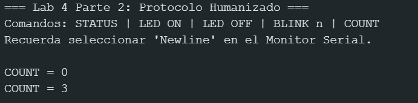
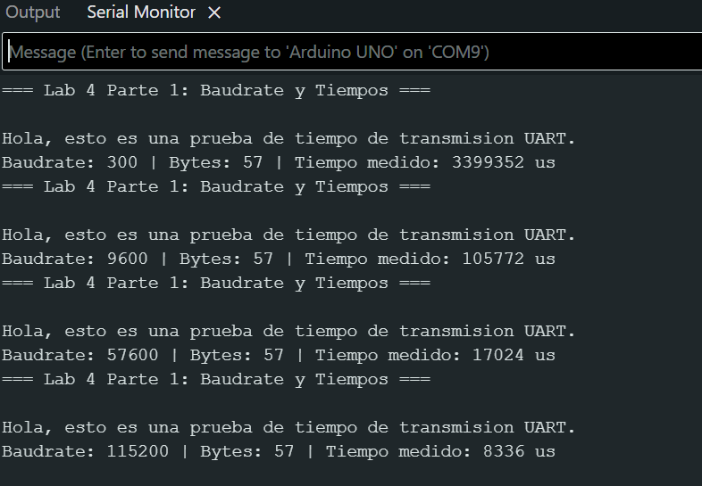
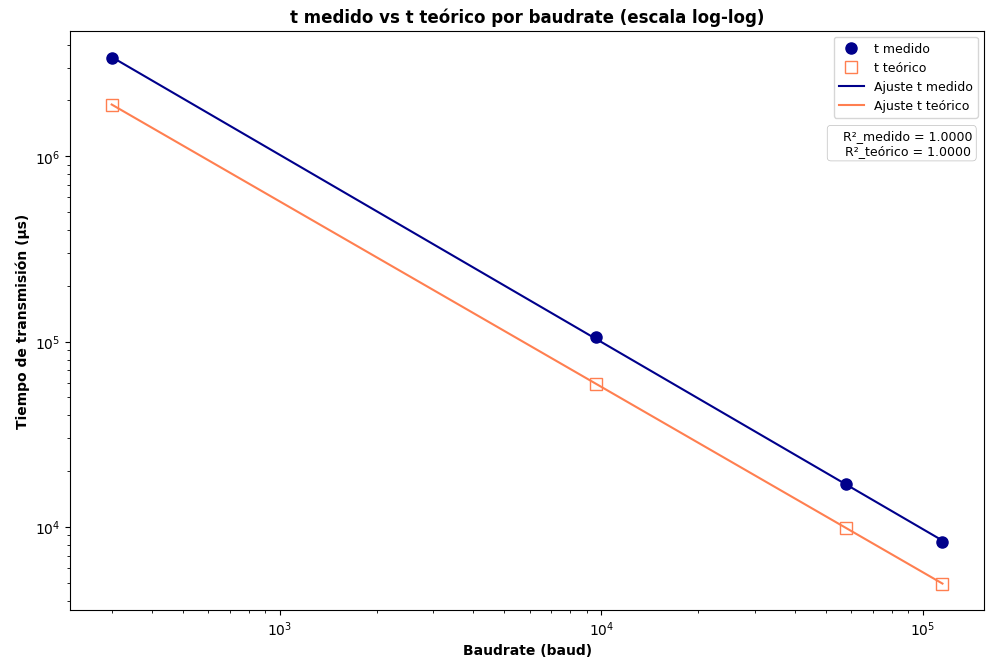
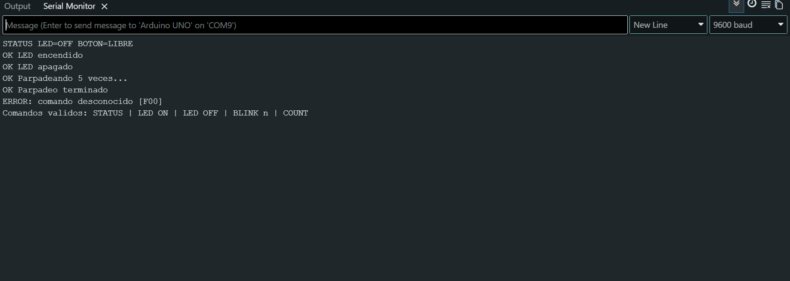
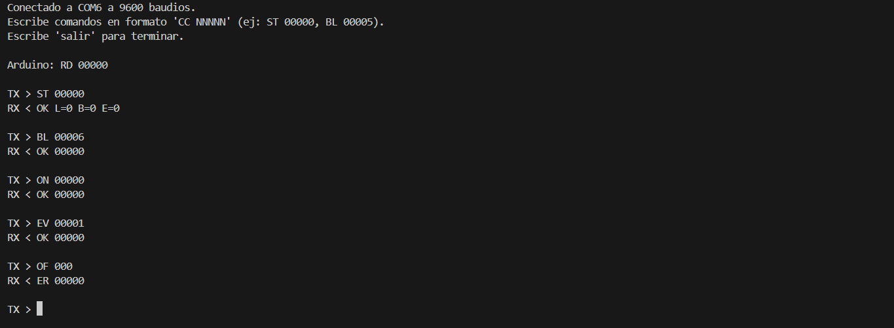

# Informe de Laboratorio — Sesión 4: Comunicación Serial UART y Automatización con Python

---

**Universidad Nacional de Colombia**
**Electrónica Digital — 2016684 — 2026-1**
**Prof. Ricardo Amézquita Orozco**

---

| Campo | |
|-------|--|
| **Integrantes** | 1. Felipe Lizcano Quimbaya|
| | 2. Sergio Andres Poveda Perez |
| | 3. Sara Romero Chaves|
| | 4. Simon Gabriel Sandoval Palma|
| **Grupo** |3|
| **Fecha de la práctica** | Miercoles 22 de Abril 2026 |
| **Fecha de entrega** | Miércoles 8 de Abril, 2026 — 23:59 (Informe Bloque 2: S4, S5, S6) |

---

## 1. Resultados


### Actividad 2 — Medición de Tiempos de Transmisión

**Tabla 1 — Tiempos de Transmisión vs. Baudrate**

| Baudrate (baud) | Bytes enviados | $t_{\text{medido}}$ (µs) | $t_{\text{teórico}}$ (µs) | Error (%) | Justificación |
|:----------------|:--------------:|:------------------------:|:-------------------------:|:---------:|:--------------|
| 300 |57 |3399352 |1900000 |78.91 |Se desconoce la razon del porcentaje de error |
| 9600 | 57|105772 |59375 |78.14 | Se desconoce la razon del porcentaje de error|
| 57600 | 57|17024 |9896 |72.03 |Se desconoce la razon del porcentaje de error |
| 115200 | 57|8336 |4948 |68.47 |Se desconoce la razon del porcentaje de error |

*En "Bytes enviados" registra el número que reporta el sketch en su salida (campo `Bytes:`). Ese valor incluye los bytes del texto más los dos bytes del terminador `\r\n` agregados por `println()`. Usa ese mismo número para calcular $t_{\text{teórico}}$.*

*Fórmula teórica:*

$$t_{\text{teórico}} = \frac{N_{\text{bits}}}{f_{\text{baudrate}}} \quad \text{donde} \quad N_{\text{bits}} = \text{Bytes enviados} \times 10 \text{ bits/byte}$$

*Fórmula del error:*

$$\text{Error} = \frac{|t_{\text{medido}} - t_{\text{teórico}}|}{t_{\text{teórico}}} \times 100\%$$

---

### Actividad 3 — Verificación del Protocolo Humanizado

**Tabla 2 — Verificación del Protocolo Humanizado**

| Comando enviado | Terminador usado | Respuesta del Arduino | Acción observada en hardware | Observaciones |
|:----------------|:----------------:|:----------------------|:-----------------------------|:--------------|
| `STATUS` | Newline |led=off, botón=libre |led se mantiene apagado  | |
| `LED ON` | Newline |ok led encendido  |El led se encendio y se mantuvo encendido | |
| `LED OFF` | Newline |ok led apagado |se apago y se mantuvo asi  | |
| `BLINK 5` | Newline |ok parpadeando 5 veces...ok parpadeo terminado |El led se encendio y se apago 5 veces  | |
| `STATUS` (durante BLINK) | Newline |status led=off, , boton=libre |El led se encendio y se apago 5 veces | El resultado de status apareció al finalizar el proceso de blink 5|
| `FOO` | Newline | | | |
| `STATUS` | Sin terminador | nada|nada | No apareció nada en el serial monitor y no ocurrió nada con el circuito. Al colocar nuevamente el new line, aparecen los "status" colocados durante el no ending line, como si se guardaran para enviarse cuando se reestablece la conexión.|

---

### Actividad 4 — Comando COUNT

**Evidencia:** Pega a continuación la captura del Monitor Serial mostrando el comando `COUNT` funcionando (antes y después de pulsar el botón).



> [Se reinicio el arduino para poder observar el conteo de pulsaciones desde 0, luego se hundió el botón 5 veces y se observa el conteo actualizado a 5 pulsaciones. ]

---

### Actividad 5 — Verificación del Protocolo Compacto

**Tabla 3 — Verificación del Protocolo Compacto**

| Trama enviada | Respuesta recibida | Acción en hardware | ¿Respuesta correcta? (Sí/No) |
|:---------------------|:-------------------|:-------------------|:-----------------------------:|
| `ST 00000` | L=0, B=0, E=0|sin cambios( led apagado) |si|
| `ON 00000` |OK 00000 |led encendido |si |
| `OF 00000` |OK 00000 |se apagó el led |si |
| `BL 00003` |OK 00000 |se encendió 3 veces el led |sí |
| `EV 00001` |OK 00005|se hundió el botón 5 veces |si |
| Trama mal formada |ERM 00000 |no afecta el circuito | sí|

---

### Actividad 6 — BLINK No Bloqueante

**Tabla 4 — Diagnóstico del BLINK Bloqueante vs. No Bloqueante**

| Prueba | Versión bloqueante | Versión no bloqueante |
|:-------|:-------------------|:----------------------|
| Pulsaciones registradas tras `BL 00005` (5 pulsaciones durante parpadeo) | 0| 5|
| Respuesta a `ST 00000` durante parpadeo: ¿llega inmediatamente? | no, espera a que termine el parpadeo para mandar el status | sí, es inmediata y registra los eventos ocurridos|
| ¿El LED completa el número solicitado de parpadeos? | sí | sí |

**Justificación evaluable:** ¿Resolvería `attachInterrupt()` **ambos** problemas observados (pulsaciones perdidas Y falta de respuesta a `ST` durante el parpadeo)?

> [No, si se corrigen las pulsaciones perdidas porque la interrupcion detecta el boton en el momento exacto, aunque el programa este "ocupado" con el delay pero no arregla la falta dfe respuesta a 'ST' mientras el arduino esta en el parapadeo con delay ya que el programa queda congelado y no pude leer ni responder comandos seriales y la interrupcion no sirve para leer estos comandos ]

---

### Actividad 7 — Terminal Crudo Python

**Tabla 5 — Intercambios desde Terminal Crudo Python**

| # | Trama enviada por Python | Respuesta recibida | ¿Correcto? |
|:--|:-------------------------|:-------------------|:----------:|
| 1 | ST 00000 | OK L=0, B=0, E=0 | sí |
| 2 | BL 00006 | OK 00000 | sí |
| 3 | ON 00000 | OK 00000 | sí |
| 4 | EV 00001 | OK 00000 | sí |
| 5 | OF 000 | ER 00000 | sí |

*Incluye al menos una trama mal formada entre los intercambios registrados.*

---

## 2. Visualización


### Figura 1 — Monitor Serial: salida del sketch de medición (una captura por baudrate)



**Caption:** Cuatro capturas del Monitor Serial, una por baudrate (300, 9600, 57600, 115200). Indicar en cada caption: baudrate, número de bytes transmitidos y texto enviado.

**Interpretación:** 

> [Podemos observar de la imagen anterior que efectivamente el  tmedido   disminuye mientras el baudrate aumenta lo que verifica que al aumentar el baudrate el tiempo de transmisión disminuye ]

---

### Figura 2 — Gráfica: $t_{\text{medido}}$ vs. $t_{\text{teórico}}$ por Baudrate

**Eje X:** Baudrate (baud) — escala logarítmica recomendada: 300, 9600, 57600, 115200
**Eje Y:** Tiempo de transmisión (µs)
**Series:** $t_{\text{medido}}$ (puntos sólidos) y $t_{\text{teórico}}$ (puntos vacíos o línea de referencia)



**Lo que debe demostrar esta gráfica:** Que el tiempo de transmisión es inversamente proporcional al baudrate, y que el tiempo medido se ajusta al modelo teórico con un overhead sistemático pequeño y aproximadamente constante en valor absoluto.

**Interpretación:**

> [Podemos observar las rectas con pendiente negativa lo que precisamente nos confirma la relacion de proporcionalidad inversa entre el baudrate y el tiempo de transferencia, de igua manera se observa que la curva medida está siempre por encima de la teórica y la separación entre ambas es casi constante en el eje vertical (en µs), no proporcional y por lo tanto el overhead es aproximadamente constante en valor absoluto no en porcentaje.]

---

### Figura 3 — Monitor Serial: sesión del protocolo humanizado



**Caption:** Captura del Monitor Serial mostrando al menos cuatro comandos del protocolo humanizado con sus respuestas. Identificar en el caption que el protocolo es humanizado.

**Interpretación:**

> [En la imagen podemos apreciar la respuesta de los comandos validos(respueta previamente programada en hardaware y software) e invalidos( Error: comando invalido). Durante el blink podemos ver en la consola el mensaje de que se esta realizando el proceso y cuando este ha finalizado, en cuanto al hardware efectivame se puede apreciar el parpadeo del LED ]

---

### Figura 4 — Consola Python: sesión del terminal crudo



**Caption:** Captura de la consola Python mostrando la sesión completa del terminal crudo con cinco o más intercambios. Indicar en el caption: puerto serial y baudrate usados.

**Interpretación:**

> [Se pudo apreciar que Python efectivamente envia y recibe las tramas de forma fijo ( CC NNNNN) y las respuestas del Arduino fueron las esperadas con cada comando valido (ON 00000, ST 00000, OFF 00000, BL 0000N, EV 00001) ]

---

## 3. Análisis


**Pregunta 1** *(Actividad 2 — Tiempos de transmisión):*

Calcula el error porcentual promedio entre $t_{\text{medido}}$ y $t_{\text{teórico}}$ para los cuatro baudrates. ¿El error es aproximadamente constante en valor absoluto (µs) o en valor relativo (%)? ¿Qué overhead sistemático del sistema podría explicar el patrón observado?

> [El error es aproximandamente constante en el valor relativo , con un promedio de error de 74.39% .Por parte de los experimentadores no se encontro una razon para justificar este promedio de error  ]

---

**Pregunta 2** *(Actividad 3 — Protocolo humanizado):*

Con base en la fila STATUS durante BLINK de la Tabla 2: ¿en qué momento exacto respondió el Arduino y por qué? Relaciona la respuesta con la estructura del `loop()` y el uso de `delay()`.

> [Cuando se hacen BLINK 5 se tiene un delay de 500ms, por lo tanto el arduino no responde a los comandos enviados durante ese tiempo, y responde al finalizar el proceso de BLINK 5, esto se debe a que el loop() se encuentra bloqueado por el delay() y no puede procesar los comandos enviados durante ese tiempo. ]

---

**Pregunta 3** *(Actividad 5 — Protocolo compacto):*

¿Por qué `cmd2()` es suficiente para identificar comandos en el protocolo compacto pero no lo sería en el protocolo humanizado?

> [Dado que cmd2() tiene una trama de formato fijo, con 2 caracteres para el comando y 5 para el argumento, no es necesario usar strcmp() para comparar toda la cadena, sino que con comparar los primeros 2 caracteres es suficiente para identificar el comando. En cambio, en el protocolo humanizado, los comandos pueden tener diferentes longitudes y formatos, por lo que es necesario usar strcmp() para comparar toda la cadena y asegurarse de que se está identificando correctamente el comando. ]

---

**Pregunta 4** *(Actividad 6 — BLINK no bloqueante):*

¿Qué consecuencias concretas tendría usar `delay(1)` (un milisegundo) en lugar de `delay(500)` en el BLINK bloqueante sobre la capacidad del sistema para responder comandos seriales? Estima la frecuencia máxima de comandos que el cliente podría enviar sin pérdida de respuestas en cada caso, asumiendo que cada comando tiene una longitud de 9 caracteres a 9600 baudios.

> [Usar un delay(1) en lugar de delay (500) reduciria drasticamente el tiempo durante el cual el sistema permanece bloqueado sin atender el puerto serial. A 9600 baudios, un comando de 9 caracteres tarda aproximadamente 9.4 ms en trasnmitirse. Con el delay(500), el Arduino puede permanecer hasta 500ms sin leer el buffer serial, en ese intervalo pueden llegar aproximadamete 50 comandos, lo que excede la capacidad del buffer y provoca perdida de datos. Por ello la frecuencia maxxima de comandos que se puede manejar sin perdida de datos es de aproximadamente 2 comandos por segundo. En cambio con delay(1), el sistema solo queda bloqueado por 1ms antes de volver a ejecutar el loop() y revisar el puertoo serial. Dado que este tiempo es mucho menor que e tiempo de llegada de un comando el sistema puede atender el buffer multipkes veces durante la recepcion de cada mensaje. En este caso la frecuencia maxima queda limitada por la velocidad de transmision, siendo aproximadamente 100 comandos por segundo, sin perdida significativa. ]

---

**Pregunta 5** *(Análisis transversal — PA1):*

¿Por qué un protocolo textual necesita un delimitador de línea explícito (`\n`) y no puede basarse en pausas de tiempo entre comandos?

> [Un protocolo textual necesita un delimitador de linea explicito, porque la comunicacion serial UART es un flujo continuo de bytes, no una secuencia de mensajes separados de forma natural. El arduino recibe caracteres uno tras otro sin saber donde termina un comando y empieza el siguiente. El delimitador de linea actua como una marca que da fin al mensaje permitiendo saber al sistema cuando debe procesar el comando completo. Intentar usar pausas de tiempo como criterio de separacion es poco confiable ya que e un sistema real los datos pueden variar debido a multiples factores.Una pausa no es una condicion bien definida: puede haber retardos dentro de un mismo comando o , por el contrario, comandos consecutivos pueden llegar sin separacion apreciable y esto introduce ambiguedad, ademas basarse en temporizacion implica introducir umbrales arbitrarios ( "Si pasan x milisegundos, se asume fin del comando) y estos umbrales depeden del contexto y pueden fallar si se cambian las condiciones de operacion (otro baudrate, otro computador, otra carga de procesamiento) ]

---

**Pregunta 6** *(Análisis transversal — PA2):*

En el protocolo humanizado, el parser usa `strcmp()` para identificar comandos. En el protocolo compacto, solo compara dos caracteres con `cmd2()`. ¿Cuál de los dos parsers sería más eficiente si el protocolo tuviera 50 comandos distintos? Justifica considerando el número de comparaciones necesarias en el peor caso.

> [Si el protocolo tuviera 50 comandos distintos, el parser del protocolo compacto seria mas eficiente que el del protocolo humanizado. La razon principal es que en el compacto la idetificacion del comando se reduce a comparar un numero fijo y muy pequeño de caracteres( por ejemplos dos con cmd2()) mientras que en el humanizado se deben comparar cadenas completas de strcmp(). En el caso del protocolo humanizado, cada comandose identifica comparando strings completos como "STATUS", "LED ON", "BLINK", etc. En el peor caso, el parser tendría que probar hasta 50 comparaciones con strcmp(). Cada llamada a strcmp() no solo implica una comparación, sino un recorrido carácter por carácter hasta encontrar una diferencia o llegar al final de la cadena. En cambio, en el protocolo compacto, cada comando se identifica únicamente con dos caracteres fijos (por ejemplo, ST, ON, BL, etc.). En el peor caso también habría hasta 50 comparaciones, pero cada comparación es extremadamente barata: solo se revisan dos posiciones del arreglo de caracteres. No hay necesidad de recorrer cadenas completas ni verificar terminadores, lo que reduce significativamente el tiempo de ejecución.se identifica comparando strings completos como "STATUS", "LED ON", "BLINK", etc. En el peor caso, el parser tendría que probar hasta 50 comparaciones con strcmp(). Cada llamada a strcmp() no solo implica una comparación, sino un recorrido carácter por carácter hasta encontrar una diferencia o llegar al final de la cadena. ]

---

**Pregunta 7** *(Análisis transversal — PA3):*

Compara los parsers del protocolo humanizado y el protocolo compacto desde la perspectiva de un sistema embebido con recursos limitados (memoria y velocidad de CPU). ¿Cuál de los dos es más adecuado para una aplicación de producción y por qué?

> [En el protocolo humanizado, los comandos son cadenas de longitud variable (por ejemplo, "STATUS", "LED ON"), lo que obliga al parser a almacenar más texto y a utilizar funciones como strcmp(). Estas funciones recorren carácter por carácter hasta encontrar coincidencias o diferencias, lo que implica mayor uso de CPU, especialmente si el número de comandos crece. Además, manejar strings más largos aumenta el consumo de memoria RAM, que es un recurso crítico en microcontroladores como el Arduino. En contraste, el protocolo compacto utiliza un formato de longitud fija y comandos codificados en pocos caracteres (por ejemplo, ST, ON, BL). Esto permite identificar comandos con comparaciones directas de uno o dos caracteres, reduciendo significativamente el número de operaciones por comando. El parser no necesita recorrer cadenas completas ni gestionar longitudes variables, lo que lo hace más rápido y predecible. También reduce el uso de memoria, ya que los mensajes son más cortos y la lógica de procesamiento es más simple.]

---

## 4. Código Documentado


### `lab-04-parte1-baudrate.ino` — Corrección de baudrate (Actividad 1)

```cpp
    /*
    * lab-04-parte1-baudrate.ino
    */

    // Pin del LED (el integrado del Arduino)
    const int PIN_LED = 13;

    // Baudrate que vamos a usar
    // IMPORTANTE: tiene que ser el mismo del monitor serial de lo contrario se corrompe la señal
    long BAUDRATE = 9600;

    // Mensaje fijo para la prueba
    // Lo dejamos fijo para que siempre se envíe la misma cantidad de datos
    const char TEXTO_PRUEBA[] =
    "Hola, esto es una prueba de tiempo de transmision UART.";
    // Son 56 caracteres + 2 del println (\r\n) → 58 bytes

    void setup() {

    //Configuramos el LED como salida
    pinMode(PIN_LED, OUTPUT);

    //Iniciamos comunicación serial
    Serial.begin(BAUDRATE);

    //Hacemos parpadear el LED para saber que el programa arrancó bien
    for (int i = 0; i < 3; i++) {
        digitalWrite(PIN_LED, HIGH);
        delay(200);
        digitalWrite(PIN_LED, LOW);
        delay(200);
    }

    //Mensajito inicial
    Serial.println("=== Lab 4 Parte 1: Baudrate y Tiempos ===");
    Serial.println();
    }

    void loop() {

    //Llamo la función que mide el tiempo de transmisión
    medirTiempoTransmision();

    // Esto es para que no se repita infinitamente
    // solo queremos una medición por ejecución
    while (true) {}
    }

    //Funcion que mide cuánto se demora en enviarse el mensaje
    void medirTiempoTransmision() {

    //Se toma el tiempo antes de enviarse
    unsigned long t0 = micros();

    // Envio el mensaje
    Serial.println(TEXTO_PRUEBA);

    //Esto es clave:
    //flush() hace que el programa espere hasta que TODO se haya enviado
    //(no solo que esté en el buffer)
    Serial.flush();

    //El tiempo después de medir
    unsigned long t1 = micros();

    //Calculando el tiempo total
    unsigned long tiempoMedido_us = t1 - t0;

    //Resultados
    Serial.print("Baudrate: ");
    Serial.print(BAUDRATE);

    Serial.print(" | Bytes: ");
    Serial.print(strlen(TEXTO_PRUEBA) + 2);  // +2 por el salto de línea

    Serial.print(" | Tiempo medido: ");
    Serial.print(tiempoMedido_us);
    Serial.println(" us");
    }
```

### `lab-04-parte2-humanizado.ino` — Comando COUNT (Actividad 4)

```cpp
/*
        * lab-04-parte2-humanizado.ino
        *
        * En este programa hacemos como un "mini lenguaje" para comunicarnos
        * con el Arduino desde el Monitor Serial usando comandos tipo:
        *   STATUS, LED ON, BLINK 5, etc.
        *
        * La idea es que no sean números raros sino texto entendible.
        *
        * ¿Cómo funciona?
        * → Se van guardando los caracteres que escribimos
        * → Cuando presionamos ENTER (\n), se procesa todo el comando
        * → Se compara con los comandos conocidos y se ejecuta algo
        * 
        * Además, implementamos un comando MORSE que convierte texto a parpadeos
        * en código Morse. Por ejemplo, "MORSE SOS" hará parpadear el LED con el código Morse de "SOS" (··· --- ···).
        */

        // ========================
        // PINES
        // ========================
        const int PIN_BOTON = 2; // el botón está conectado a este pin
        const int PIN_LED   = 13; // el LED está conectado a este pin

        // ========================
        // COUNT + ANTIRREBOTE
        // ========================
        int contadorPulsaciones = 0;

        int estadoBoton = LOW;           // estado actual estable
        int ultimoEstadoBoton = LOW;     // última lectura

        unsigned long ultimoCambio = 0;  // para el debounce
        const unsigned long debounceDelay = 50; // ms

        // ========================
        // ESTADO DEL SISTEMA
        // ========================
        bool ledEncendido = false; // En este estado revisamos en el comando STATUS para informar si el LED está encendido o apagado

        // ========================
        // BUFFER DEL SERIAL
        // ========================
        // Aquí se guarda lo que vamos escribiendo hasta dar ENTER
        char bufferSerial[64]; // 64 caracteres máximo (incluyendo el '\0')
        int  indiceBuffer = 0; // índice para saber dónde guardar el próximo carácter


        // ========================
        // TIEMPOS PARA MORSE
        // ========================
        const int DOT = 200;          // punto 200 ms
        const int DASH = DOT * 3;     // raya 600 ms
        const int GAP = DOT;          // espacio entre símbolos 200 ms
        const int LETTER_GAP = DOT*3; // entre letras 600 ms
        const int WORD_GAP = DOT*7;   // entre palabras 1400 ms


        // ========================
        // TABLA MORSE
        // ========================
        // Relaciona cada letra/número con su código morse
        struct MorseMap {
        char c;
        const char* code;
        };
        // Solo letras mayúsculas y números por simplicidad}
        // Tabla de caracteres a código Morse
        MorseMap morseTable[] = {
        {'A', ".-"}, {'B', "-..."}, {'C', "-.-."}, {'D', "-.."}, {'E', "."},
        {'F', "..-."}, {'G', "--."}, {'H', "...."}, {'I', ".."}, {'J', ".---"},
        {'K', "-.-"}, {'L', ".-.."}, {'M', "--"}, {'N', "-."}, {'O', "---"},
        {'P', ".--."}, {'Q', "--.-"}, {'R', ".-."}, {'S', "..."}, {'T', "-"},
        {'U', "..-"}, {'V', "...-"}, {'W', ".--"}, {'X', "-..-"}, {'Y', "-.--"},
        {'Z', "--.."},
        {'0', "-----"}, {'1', ".----"}, {'2', "..---"}, {'3', "...--"},
        {'4', "....-"}, {'5', "....."}, {'6', "-...."}, {'7', "--..."},
        {'8', "---.."}, {'9', "----."}
        };


        // Busca el código morse de un carácter
        const char* getMorse(char c) {
        c = toupper(c);  // por si escriben en minúscula

        for (int i = 0; i < sizeof(morseTable)/sizeof(MorseMap); i++) {
            if (morseTable[i].c == c) return morseTable[i].code;
        }

        // Si no lo encuentra (ej: símbolo raro), devuelve vacío
        return "";
        }


        // Hace parpadear el LED en código morse según un texto
        void blinkMorse(const char* text) {

        // Bucle que recorre cada carácter del texto
        for (int i = 0; text[i] != '\0'; i++) {

            // Si es espacio → pausa larga (entre palabras)
            if (text[i] == ' ') {
            delay(WORD_GAP);
            continue;
            }

            const char* code = getMorse(text[i]); // obtiene el código morse del carácter

            // Recorre puntos y rayas
            for (int j = 0; code[j] != '\0'; j++) {

            digitalWrite(PIN_LED, HIGH); // enciendo LED

            if (code[j] == '.') delay(DOT); // si es punto, espero DOT
            else if (code[j] == '-') delay(DASH); // si es raya, espero DASH

            digitalWrite(PIN_LED, LOW); // apago LED
            delay(GAP); // espacio entre símbolos
            }

            // Separación entre letras
            delay(LETTER_GAP);
        }
        }


        // ========================
        // SETUP
        // ========================
        // Configura pines, inicia serial, muestra instrucciones
        void setup() {

        pinMode(PIN_BOTON, INPUT); // el pin del botón es de entrada
        pinMode(PIN_LED, OUTPUT); //  el pin del LED es de salida
        digitalWrite(PIN_LED, LOW); // me aseguro que el LED empiece apagado

        Serial.begin(9600); // inicio la comunicación serial a 9600 baudios

        // Muestro instrucciones al iniciar y titulo
        Serial.println("=== Lab 4 Parte 2: Protocolo Humanizado ===");
        Serial.println("Comandos: STATUS | LED ON | LED OFF | BLINK n | COUNT | MORSE txt");
        Serial.println("Importante: usar 'Newline' en el monitor serial");
        Serial.println();
        }


        // ========================
        // LOOP
        // ========================
        void loop() {

        // Siempre estoy revisando si llegó algo por serial
        leerSerial();

        // Función para contar pulsaciones del botón sin rebotes
        // Lectura del botón
        int lectura = digitalRead(PIN_BOTON);

        // Si cambió la lectura, reinicio el temporizador
        if (lectura != ultimoEstadoBoton) {
            ultimoCambio = millis();
        }

        // Si ya pasó el tiempo de debounce, considero el cambio válido
        if ((millis() - ultimoCambio) > debounceDelay) {

            // Si el estado cambió de verdad
            if (lectura != estadoBoton) {
            estadoBoton = lectura;

            // Solo cuento cuando pasa a HIGH (cuando se presiona)
            if (estadoBoton == HIGH) {
                contadorPulsaciones++;
            }
            }
        }

        // Guardo la lectura para la siguiente iteración
        ultimoEstadoBoton = lectura;
        }


        // ========================
        // LECTURA DEL SERIAL
        // ========================
        // Va armando el comando letra por letra
        void leerSerial() {

        // Mientras haya caracteres disponibles en el buffer serial
        while (Serial.available() > 0) {

            char c = Serial.read(); // leo un carácter

            // Si llega ENTER → procesar comando
            if (c == '\n') {
            bufferSerial[indiceBuffer] = '\0';  // cerrar string
            procesarComando(bufferSerial);
            indiceBuffer = 0;  // reiniciar
            }

            // Ignoro '\r' (problema típico de Windows)
            else if (c != '\r') {

            // Evito overflow del buffer
            if (indiceBuffer < 63) {
                bufferSerial[indiceBuffer] = c;
                indiceBuffer++;
            }
            }
        }
        }


        // ========================
        // PROCESAMIENTO DE COMANDOS
        // ========================
        // Compara el comando con los conocidos y ejecuta algo
        void procesarComando(char* cmd) {

        // STATUS → muestra estado del sistema
        if (strcmp(cmd, "STATUS") == 0) {

            Serial.print("STATUS LED=");
            Serial.print(ledEncendido ? "ON" : "OFF");

            Serial.print(" BOTON=");
            Serial.println(digitalRead(PIN_BOTON) == HIGH ? "PRESIONADO" : "LIBRE");
        }

        // Encender LED
        else if (strcmp(cmd, "LED ON") == 0) {
            ledEncendido = true;
            digitalWrite(PIN_LED, HIGH);
            Serial.println("OK LED encendido");
        }

        // Apagar LED
        else if (strcmp(cmd, "LED OFF") == 0) {
            ledEncendido = false;
            digitalWrite(PIN_LED, LOW);
            Serial.println("OK LED apagado");
        }

        // BLINK n → parpadea n veces
        else if (strncmp(cmd, "BLINK ", 6) == 0) {

            int n = atoi(cmd + 6);  // saco el número

            if (n <= 0 || n > 50) {
            Serial.println("ERROR: numero entre 1 y 50");
            } else {

            Serial.print("OK parpadeando ");
            Serial.print(n);
            Serial.println(" veces");

            for (int i = 0; i < n; i++) {
                digitalWrite(PIN_LED, HIGH);
                delay(500);
                digitalWrite(PIN_LED, LOW);
                delay(500);
            }

            Serial.println("OK terminado");
            }
        }

        // MORSE → convierte texto a parpadeos
        else if (strncmp(cmd, "MORSE ", 6) == 0) {

            char* mensaje = cmd + 6;

            if (strlen(mensaje) > 20) {
            Serial.println("ERROR: max 20 caracteres");
            return;
            }

            Serial.print("OK morse: ");
            Serial.println(mensaje);

            blinkMorse(mensaje);
        }

        // COUNT → muestra cuántas veces se ha presionado el botón
        else if (strcmp(cmd, "COUNT") == 0) {
            Serial.print("COUNT = ");
            Serial.println(contadorPulsaciones);
        }

        // Comando desconocido
        else {
            Serial.print("ERROR comando desconocido: ");
            Serial.println(cmd);
        }
    }
```

### `lab-04-parte3-compacto.ino` — BLINK no bloqueante (Actividad 6)

```cpp
    /*
    * lab-04-parte3-compacto.ino
    *
    * En esta parte usamos un protocolo más "estricto":
    * todos los comandos tienen EXACTAMENTE el mismo formato:
    *
    *   "CC NNNNN\n"
    *
    * Ejemplo:
    *   "BL 00005" → parpadear 5 veces
    *
    * La ventaja es que ya sabemos en qué posición está cada cosa,
    * entonces no necesitamos strcmp(), solo miramos posiciones fijas.
    */


    // ========================
    // PINES
    // ========================
    const int PIN_BOTON = 2; // botón conectado a este pin (con pull-down)
    const int PIN_LED   = 13; // LED conectado a este pin (con resistencia)


    // ========================
    // ESTADO DEL SISTEMA
    // ========================
    bool ledEncendido = false;     // guarda si el LED está encendido
    int  contadorEventos = 0;      // cuenta cuántas veces se presionó el botón
    bool estadoAnteriorBoton = LOW; // para detectar cambios (flanco)


    // ========================
    // BUFFER DEL SERIAL
    // ========================
    // Aquí guardamos lo que llega por serial
    // El formato es fijo: "CC NNNNN" → 8 caracteres
    char bufferSerial[16]; // un poco más grande por seguridad
    int  indiceBuffer = 0; // cuántos caracteres hemos leído (hasta 15 máximo)


    // ========================
    // VARIABLES PARA BLINK SIN delay()
    // ========================
    const unsigned long INTERVALO_BLINK_MS = 500; // tiempo entre cambios

    bool          blinkActivo         = false; // indica si está parpadeando
    int           parpadeosPendientes = 0;     // cuántos cambios faltan
    unsigned long ultimoCambioMs      = 0;     // último cambio de estado
    bool          estadoLEDParpadeo   = false; // estado actual del LED


    // ========================
    // SETUP
    // ========================
    void setup() {
    pinMode(PIN_BOTON, INPUT); // botón con pull-down
    pinMode(PIN_LED, OUTPUT); // LED como salida
    digitalWrite(PIN_LED, LOW); // aseguramos que el LED esté apagado

    Serial.begin(9600); // inicializa el serial a 9600 baudios

    // Mensaje inicial (RD = ready)
    Serial.println("RD 00000");
    }


    // ========================
    // LOOP PRINCIPAL
    // ========================
    void loop() {
    leerSerial();          // revisa si llegó un comando
    detectarPulsaciones(); // cuenta pulsaciones del botón
    updateBlink();         // maneja el parpadeo sin bloquear
    }


    // ========================
    // FUNCIÓN cmd2
    // ========================
    // Compara solo los primeros 2 caracteres del comando
    // Ej: "BL 00005" → 'B' y 'L'
    // Devuelve true si coinciden, false si no
    bool cmd2(char* buf, char c0, char c1) {
    return buf[0] == c0 && buf[1] == c1;
    }


    // ========================
    // LECTURA DEL SERIAL
    // ========================
    // Va guardando caracteres hasta que llega '\n'
    void leerSerial() {

    // Mientras haya datos disponibles en el buffer serial
    while (Serial.available() > 0) {

        char c = Serial.read(); // lee un carácter

        // Cuando llega ENTER → procesar comando
        if (c == '\n') {
        bufferSerial[indiceBuffer] = '\0';

        // Verifica que tenga exactamente 8 caracteres
        if (indiceBuffer != 8) {
            Serial.println("ER 00000");
            indiceBuffer = 0;
            return;
        }
        
        // Procesa el comando completo
        procesarComando(bufferSerial);
        indiceBuffer = 0;
        }

        // Ignora '\r' (problema típico de Windows)
        else if (c != '\r') {

        // Guarda el carácter en el buffer si no se ha excedido el límite
        if (indiceBuffer < 15) {
            bufferSerial[indiceBuffer] = c;
            indiceBuffer++;
        }
        }
    }
    }


    // ========================
    // PROCESAMIENTO DE COMANDOS
    // ========================
    void procesarComando(char* buf) {

    // Extrae el número (posiciones 3 a 7)
    int parametro = atoi(buf + 3);


    // --- STATUS ---
    // Responde con el estado actual del LED, botón y contador
    if (cmd2(buf, 'S', 'T')) {

        Serial.print("OK L=");
        Serial.print(ledEncendido ? "1" : "0");

        Serial.print(" B=");
        Serial.print(digitalRead(PIN_BOTON) == HIGH ? "1" : "0");

        Serial.print(" E=");
        Serial.println(contadorEventos);
    }


    // --- LED ON ---
    // Enciende el LED y actualiza el estado
    else if (cmd2(buf, 'O', 'N')) {
        ledEncendido = true;
        digitalWrite(PIN_LED, HIGH);
        Serial.println("OK 00000");
    }


    // --- LED OFF ---
    // Apaga el LED y actualiza el estado
    else if (cmd2(buf, 'O', 'F')) {
        ledEncendido = false;
        digitalWrite(PIN_LED, LOW);
        Serial.println("OK 00000");
    }


    // --- BLINK ---
    // Parpadea el LED N veces (sin bloquear con delay)
    else if (cmd2(buf, 'B', 'L')) {

        if (parametro <= 0 || parametro > 50) {
        Serial.println("ER 00000");
        } 
        else {

        Serial.println("OK 00000");

        // Activa el modo parpadeo sin delay
        blinkActivo = true;

        // Cada parpadeo tiene 2 cambios (ON y OFF)
        parpadeosPendientes = parametro * 2;

        ultimoCambioMs = millis();
        estadoLEDParpadeo = false;
        }
    }


    // --- EVENTS (contador del botón) ---
    // Responde con el número de eventos (pulsaciones) contados
    else if (cmd2(buf, 'E', 'V')) {

        Serial.print("OK ");

        // Imprime con formato fijo de 5 dígitos
        if (contadorEventos < 10) Serial.print("0000");
        else if (contadorEventos < 100) Serial.print("000");
        else if (contadorEventos < 1000) Serial.print("00");
        else if (contadorEventos < 10000) Serial.print("0");

        Serial.println(contadorEventos);
    }


    // --- ERROR ---
    // Si el comando no coincide con ninguno de los anteriores, responde con error
    else {
        Serial.println("ER 00000");
    }
    }


    // ========================
    // DETECCIÓN DE PULSACIONES
    // ========================
    // Cuenta cuando el botón pasa de LOW a HIGH
    // Cada vez que detecta un flanco ascendente, incrementa el contador de eventos
    void detectarPulsaciones() {

    bool estadoActual = digitalRead(PIN_BOTON); // lee el estado actual del botón

    // Detecta flanco ascendente (cuando se presiona)
    if (estadoActual == HIGH && estadoAnteriorBoton == LOW) {
        contadorEventos++;
    }

    estadoAnteriorBoton = estadoActual;
    }


    // ========================
    // BLINK NO BLOQUEANTE
    // ========================
    // Usa millis() en vez de delay()
    void updateBlink() {

    // Si no hay blink activo, no hace nada
    if (!blinkActivo) return;

    unsigned long ahora = millis(); // tiempo actual en ms

    // Verifica si ya toca cambiar el estado
    if (ahora - ultimoCambioMs >= INTERVALO_BLINK_MS) {

        ultimoCambioMs = ahora; //  actualiza el tiempo del último cambio

        // Cambia el estado del LED
        estadoLEDParpadeo = !estadoLEDParpadeo;
        digitalWrite(PIN_LED, estadoLEDParpadeo ? HIGH : LOW);

        parpadeosPendientes--; // decrementa el contador de cambios pendientes

        // Cuando termina, apaga todo
        if (parpadeosPendientes <= 0) {
        blinkActivo = false;
        digitalWrite(PIN_LED, LOW);
        ledEncendido = false;
        }
    }
    }
```

### `cliente_menu.py` — Cliente con menú humanizado (Actividad 8, si aplica)

```python
    #!/usr/bin/env python3
    """
    cliente_menu.py

    Este programa es un cliente en Python que se comunica con Arduino
    usando un protocolo compacto de formato fijo ("CC NNNNN").

    La idea es que el usuario no tenga que escribir comandos raros,
    sino elegir opciones de un menú, y el programa traduce eso a tramas seriales.
    """

    import serial   # Para comunicación serial
    import time     # Para pausas (necesarias al inicio)


    # =============================================================
    # CONFIGURACIÓN DEL PUERTO SERIAL
    # =============================================================
    PUERTO_SERIAL = "COM3"  # Cambia esto según tu sistema:
                            # - Windows: "COM3", "COM4", etc.
                            # - Linux/Mac: "/dev/ttyUSB0", "/dev/ttyACM0", etc.
    BAUDRATE      = 9600            # Debe coincidir con Arduino
    TIMEOUT_S     = 2               # Tiempo máximo de espera


    # =============================================================
    # FUNCIÓN: enviar_y_recibir
    # =============================================================
    # Envía una trama al Arduino y espera una respuesta
    def enviar_y_recibir(puerto, trama): # Recibe el puerto serial abierto y la trama a enviar (ej: "ST 00000")

        # IMPORTANTE: Arduino espera '\n' para procesar
        puerto.write((trama + "\n").encode("utf-8"))

        # Lee hasta encontrar '\n'
        respuesta = puerto.readline().decode("utf-8", errors="replace").strip()

        return respuesta # Devuelve la respuesta sin espacios extra (ej: "OK L=1 B=0 E=3")


    # =============================================================
    # FUNCIÓN: mostrar_menu
    # =============================================================
    # Solo imprime las opciones disponibles
    def mostrar_menu():
        print("\n--- MENÚ ---")
        print("  1. Ver estado del sistema")
        print("  2. Encender LED")
        print("  3. Apagar LED")
        print("  4. Parpadear LED")
        print("  5. Ver eventos del botón")
        print("  0. Salir")
        print("------------")


    # =============================================================
    # FUNCIÓN PRINCIPAL
    # =============================================================
    def main():

        # Intento abrir el puerto serial
        try:
            puerto = serial.Serial(PUERTO_SERIAL, BAUDRATE, timeout=TIMEOUT_S) # Abre el puerto con la configuración dada
        except serial.SerialException as e: # Si no se puede abrir, muestra un error y sale
            print(f"Error: no se pudo abrir {PUERTO_SERIAL}")
            print(f"Detalle: {e}")
            return # Sale de la función principal

        print(f"Conectado a {PUERTO_SERIAL}")# Muestra un mensaje de éxito

        # Espera importante: Arduino se reinicia al abrir el puerto
        time.sleep(2)

        # Limpio lo que haya quedado en el buffer (ej: "RD 00000")
        while puerto.in_waiting > 0:
            puerto.readline()# Lee y descarta cualquier línea que haya quedado en el buffer


        # =========================================================
        # BUCLE PRINCIPAL
        # =========================================================
        while True:
            # Imprime el menú y pide una opción al usuario
            mostrar_menu()
            # El usuario solo debe escribir el número de la opción (ej: "1" para STATUS)
            opcion = input("Opción > ").strip()


            # ---------------------------------------------------------
            # OPCIÓN 1: STATUS
            # ---------------------------------------------------------
            if opcion == "1": # Envía la trama "ST 00000" para pedir el estado actual del sistema

                respuesta = enviar_y_recibir(puerto, "ST 00000") # Recibe algo como "OK L=1 B=0 E=3" que indica el estado del LED, botón y eventos acumulados

                # Se espera algo como: "OK L=1 B=0 E=3"
                if respuesta.startswith("OK"): # Si la respuesta es correcta, extraigo los valores de LED, botón y eventos para mostrarlos al usuario
                    try:
                        partes = respuesta.split()# Divide la respuesta en partes: ["OK", "L=1", "B=0", "E=3"]

                        # Extraigo cada valor
                        L = partes[1].split("=")[1] # L=1 -> L=0, toma el número después del "="
                        B = partes[2].split("=")[1] # B=0 -> B=1, toma el número después del "="
                        E = partes[3].split("=")[1] # E=3 -> E=4, toma el número después del "="

                        # Paso a texto entendible
                        led = "encendido" if L == "1" else "apagado" # Si L es "1", el LED está encendido, si es "0", está apagado
                        boton = "presionado" if B == "1" else "libre" # Si B es "1", el botón está presionado, si es "0", está libre

                        print(f"LED: {led} | Botón: {boton} | Eventos: {E}") # Muestra el estado del LED, botón y eventos acumulados al usuario

                    except:
                        # Si el formato no coincide
                        print("Respuesta rara:", respuesta)
                else:
                    print("Error del Arduino:", respuesta)


            # ---------------------------------------------------------
            # OPCIÓN 2: LED ON
            # ---------------------------------------------------------
            elif opcion == "2":

                respuesta = enviar_y_recibir(puerto, "ON 00000") # Envía la trama "ON 00000" para encender el LED y espera una respuesta del Arduino

                if respuesta == "OK 00000":
                    print("LED encendido correctamente.") # Si la respuesta es "OK 00000", muestra un mensaje de éxito al usuario
                else:
                    print("Error:", respuesta) # Si la respuesta no es "OK 00000", muestra un mensaje de error con la respuesta recibida del Arduino


            # ---------------------------------------------------------
            # OPCIÓN 3: LED OFF
            # ---------------------------------------------------------
            elif opcion == "3":

                respuesta = enviar_y_recibir(puerto, "OF 00000")

                if respuesta == "OK 00000":
                    print("LED apagado correctamente.") # Si la respuesta es "OK 00000", muestra un mensaje de éxito al usuario
                else:
                    print("Error:", respuesta) # Si la respuesta no es "OK 00000", muestra un mensaje de error con la respuesta recibida del Arduino


            # ---------------------------------------------------------
            # OPCIÓN 4: BLINK
            # ---------------------------------------------------------
            elif opcion == "4":

                try:
                    # Pido número de parpadeos
                    n = int(input("Número de parpadeos (1–50): ").strip())

                    # Valido el rango
                    if n < 1 or n > 50:
                        print("Debe estar entre 1 y 50.")
                        continue

                    # Formato fijo de 5 dígitos
                    parametro = str(n).zfill(5)

                    trama = "BL " + parametro # Construye la trama "BL NNNNN" donde NNNNN es el número de parpadeos con ceros a la izquierda (ej: "BL 00005" para 5 parpadeos)

                    respuesta = enviar_y_recibir(puerto, trama) # Envía la trama al Arduino y espera una respuesta

                    if respuesta == "OK 00000":# Si la respuesta es "OK 00000", muestra un mensaje indicando que el LED está parpadeando el número de veces solicitado
                        print(f"Parpadeando {n} veces...")# Si la respuesta no es "OK 00000", muestra un mensaje de error con la respuesta recibida del Arduino
                    else:
                        print("Error:", respuesta)# Si el usuario no ingresa un número válido, muestra un mensaje de error indicando que debe escribir un número válido

                except ValueError:
                    print("Debes escribir un número válido.")# Si el usuario no ingresa un número válido, muestra un mensaje de error indicando que debe escribir un número válido


            # ---------------------------------------------------------
            # OPCIÓN 5: EVENTS
            # ---------------------------------------------------------
            elif opcion == "5":

                respuesta = enviar_y_recibir(puerto, "EV 00001")

                if respuesta.startswith("OK"):
                    try:# Extraigo el número de eventos del botón de la respuesta (ej: "OK E=3" -> número de eventos es 3)
                        numero = int(respuesta.split()[1])
                        print(f"El botón se ha presionado {numero} veces.")
                    except:
                        print("Respuesta rara:", respuesta)
                else:
                    print("Error:", respuesta)


            # ---------------------------------------------------------
            # SALIR
            # ---------------------------------------------------------
            elif opcion == "0":
                break# Si el usuario elige la opción "0", sale del bucle principal y cierra el programa


            # Opción inválida
            else:
                print("Opción inválida (0–5).")


        # Cierro el puerto al final
        puerto.close()
        print("Hasta luego.")


    # =============================================================
    # ENTRY POINT
    # =============================================================
    # Si este archivo se ejecuta directamente, llama a la función principal
    if __name__ == "__main__":
        main()
```

---

## 5. Dificultades Encontradas y Soluciones Aplicadas


### Dificultad 1: Los resultados obtenidos en la actividad #2 generaron errores porcentuales alrededor del 70% al compararlos con los tiempos teóricos que se encontraron siguiendo la ecuación sugerida en la guía. Sin embargo, no se logró identificar la causa directa de este error luego de revisar el código y las variables involucradas. Se sospecha que podría ser por algna memoría interna que posea el arduino, pero fue imposible confirmar esta hipótesis. Sin embargo, la tendencia que seguían los datos era la esperada, es decir, a mayor baudrate, menor tiempo de transmisión.

- **Síntoma observado:** Las mediciones discrepaban casi que por el doble con los valores teóricos, lo que indicaba un error porcentual muy alto (alrededor del 70%).
- **Causa identificada:** No se logró identificar la causa directa del error luego de revisar el código y las variables involucradas. Se sospecha que podría ser por alguna memoria interna que posea el Arduino, pero fue imposible confirmar esta hipótesis.
- **Solución aplicada:** Cambiamos el baudrate, reescribimos el mensaje que se enviaba para cambiar los bytes. Se calculó con varias herramientas el valor teórico para intentar encontrar algún error de cálculo. 
- **Lección aprendida:** Puede que usar un codigo no bloqueante (sin delay()) para medir el tiempo de transmisión sea más preciso, ya que el uso de delay() puede introducir variaciones en el tiempo medido. Además, es importante considerar factores externos como la calidad del cable USB, interferencias electromagnéticas o incluso la carga del sistema operativo que podrían afectar las mediciones.

### Dificultad 2 (si aplica): [Describe brevemente el problema]

- **Síntoma observado:**
- **Causa identificada:**
- **Solución aplicada:**
- **Lección aprendida:**

---

## 6. Pregunta Abierta


**Pregunta:** Propón una extensión del protocolo compacto para una sesión futura en la que el Arduino deba controlar dos actuadores (por ejemplo, un motor y un LED) y reportar dos sensores (temperatura y distancia). Especifica:

(a) Los nuevos comandos que agregarías con su formato de trama.

(b) Los nuevos tipos de respuesta necesarios.

(c) Cómo distinguirías en el protocolo las respuestas síncronas (a comandos) de los eventos asíncronos (cambios en sensores).

> (a) Nuevos comandos:
> - MC 00000: Motor Control (0 para apagar, 1 para encender; si se pueden controlar más parámetros de la velocidad se podría usar 100 para velocidad máxima, 050 para mitad, etc.)
> - LC 00000: LED Control (0 para apagar, 1 para encender, 2 para parpadeo intermitente)
> - LT 00000: Leer Temperatura (no necesita parámetro)
> - LD 00000: Leer Distancia (no necesita parámetro)
> - AR 00000: Auto Reporte (0 para desactivar todo, 1 para activar reporte de temperatura cada cierto tiempo, 2 para activar solo el sensor de distancia, 3 para activar ambos simultaneamente)

>
> (b) Nuevos tipos de respuesta:
> - MC 00000 → OK 00000 (confirmación de comando)
> - LC 00000 → OK 00000 (confirmación de comando)
> - LT 00000 → TEMP 00000 (la idea es que el resultado de la temperatura medida se devuelva de forma que el último dígito sea el decimal, por ejemplo, 02345 para 23.45°C)
> - LD 00000 → DIST 00000 (en este caso, los resultados se leen en cm, por ejemplo, 00150 para 150 cm)
> - AR 00000 → AK 00000 (confirmación de comando, se usa la A para hacer la distinción de que es un proceso asincrono)

>Cabe aclarar que la respuesta que se daría a una trama erronea es la misma: ER 00000, para mantener la consistencia del protocolo compacto. Si se quisiera expandir la respuesta de error se proponen las siguientes respuestas:ER 00000 (comando invalido), ER 00001 (parametro fuera de rango), ER 00002 (malfuncionamiento del sensor o sensor no disponible).

> (c) Con el objetivo de distinguir las respuestas síncrónicas y asíncronas, se colocaría un prefijo parecido a la confirmación de comando de AR. Por ejemplo, si se envía AR 00003, las respuestas asíncroncas de la temperatura y distancia recibidas se pueden ver como ATEMP XXXXX y ADIST XXXXXX respectivamente, donde el prefijo A indica que es un reporte asíncrono. De esta manera se logra mantener la distención entre las respuestas sincrónicas OK, TEMP, DIST. 