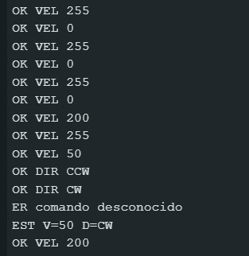

# Informe de Laboratorio — Sesión 5: Control PWM y Actuadores

---

**Universidad Nacional de Colombia**
**Electrónica Digital — 2016684 — 2026-1**
**Prof. Ricardo Amézquita Orozco**

---

| Campo | |
|-------|--|
| **Integrantes** | 1. Felipe Lizcano Quimbaya|
| | 2. Sergio Andrés Poveda Pérez|
| | 3. Simón Gabriel Snadoval Palma|
| | 4. Sara Romero Chaves|
| **Grupo** | 3 |
| **Fecha de la práctica** |29/04/2026 |
| **Fecha de entrega** | **Martes 22 de abril de 2026, 23:59** |

---

## 1. Resultados


### Actividad 1 — PWM con LED: Captura Serial Monitor

**Figura 1 — Serial Monitor (Actividad 1)**

Adjuntar captura de pantalla del Serial Monitor mostrando **al menos 10 filas** de las tres columnas correspondientes a distintas posiciones del potenciómetro.

**Caption obligatorio:** Indicar el valor de duty cycle al 0 %, al ~50 % y al 100 %.


a
> **Descripción:** _(En la imagen se observa que el valor del ADC y el ciclo de trabajo (duty cycle) presentan una relación aproximadamente lineal, de modo que al aumentar uno, el otro también se incrementa de manera proporcional.)_

---

### Actividad 3 — Control UART: Tabla del Protocolo Diseñado

**Tabla 1 — Protocolo UART Diseñado por el Grupo**


| Código | Descripción                         | Parámetro               | Respuesta del Arduino        |
|--------|-------------------------------------|--------------------------|------------------------------|
| VM N   | Cambia la velocidad del motor (PWM) | N: entero entre 0 y 255  | OK VEL N                     |
| DI N   | Cambia la dirección del motor       | N: 0 = CW, 1 = CCW       | OK DIR CW / OK DIR CCW       |
| ES     | Consulta el estado actual del motor | Sin parámetro            | EST V=<vel> D=CW / D=CCW     |
_Completar con los comandos implementados por el grupo. Mínimo tres filas._

---

### Actividad 3 — Control UART: Captura Serial Monitor

**Figura 2 — Serial Monitor (Actividad 3): Intercambios UART**

Adjuntar captura de pantalla del Serial Monitor mostrando **al menos tres intercambios comando→respuesta**, incluyendo un comando de velocidad, uno de dirección y uno de estado.

**Caption obligatorio:** Indicar los códigos de comando usados por el grupo.





> **Descripción:** _(se usó el comando VM N\n el cual controla la velocidad en un rando de 0-255. Las respuestas de este comando son las que dicen OK VEL N. También se usó el comando DI N\n el cual controla la dirección a la que gira el disco donde los parámetros permitidos son CW y CCW (clockwise y counter-clockwise respectivamente); de esta forma, la respuesta obtenida sigue la forma OK DIR N\n. Adicionalmente, se usó una trama incorrecta para mostrar la respuesta de error ER comando desconocido. Por último se mandó el comando el comando ES N\n que da como respuestas la velocidad y la dirección instantáneos. )_

---

### Actividad 4 — Encoder: Tabla Duty Cycle vs RPM

**Tabla 2 — Caracterización Duty Cycle vs RPM**


| Duty Cycle (0–255) | RPM medidas |
|:-------------------:|:-----------:|
| 0 |0|
| 25 |0|
| 50 |86.3 |
| 75 |183|
| 100 |270|
| 125 |352|
| 150 |495|
| 175 |607|
| 200 |821|
| 225 |1076|
| 255 |1417|
| **Duty cycle mínimo de arranque:** | |

---

## 2. Visualización


### Figura 3 — Curva Duty Cycle vs RPM (Actividad 4)

**Eje X:** Duty Cycle (0–255)
**Eje Y:** RPM medidas

**Requisitos de la gráfica:**
- Marcar claramente la **zona muerta** (RPM = 0 para duty cycle bajo).
- Marcar el punto de **duty cycle mínimo de arranque**.
- Marcar **dos puntos representativos de la zona lineal** para calcular la pendiente (RPM por unidad de duty cycle). Etiquetar ambos puntos con sus coordenadas.
- Indicar si la zona lineal es aproximadamente proporcional o presenta saturación.


> **Interpretación:** _(Describir la forma de la curva: zona muerta, punto de arranque, comportamiento en zona lineal. Indicar si la relación es aproximadamente proporcional. Incluir el valor calculado de la pendiente en la zona lineal.)_

---

## 3. Análisis


### Preguntas de Análisis — Actividad 1

**Pregunta A1.1:** ¿Cuántos niveles de brillo distintos puede producir `analogWrite()`?

> [La función analogWrite() trabaja con una resolución de 8 bits, lo que implica que el valor del duty cycle puede tomar cualquier entero entre 0 y 255. Esto corresponde a 256 niveles discretos de señal, y por tanto a 256 niveles distintos de brillo en el LED. Es importante no confundir esto con 255 niveles: el conteo incluye el cero, por lo que el total correcto es 256.]

**Pregunta A1.2:** ¿Qué ocurre con el brillo cuando el duty cycle es 0? ¿Y cuando es 255?

> [Cuando el duty cycle es 0, la señal PWM permanece siempre en nivel bajo (0V), lo que implica que no circula corriente por el LED y este permanece completamente apagado. En cambio, cuando el duty cycle es 255, la señal se mantiene constantemente en nivel alto (aproximadamente 5V), eliminando el comportamiento pulsado y convirtiéndose en una señal continua. En este caso, el LED emite su brillo máximo, ya que está permanentemente alimentado.]

**Pregunta A1.3:** ¿La frecuencia medida con el osciloscopio coincide con los ~490 Hz documentados para el Timer 1?

>[La frecuencia medida con el osciloscopio fue cercana a los ~490 Hz documentados para el pin D9 asociado al temporizador correspondiente. Sin embargo, no es correcto afirmar que coincidió exactamente, ya que existen pequeñas desviaciones debidas a tolerancias del reloj del microcontrolador, condiciones del entorno o precisión del instrumento de medición.]

**Pregunta A1.4:** La función `analogWrite()` genera una señal de frecuencia fija (~490 Hz en D9) con duty cycle variable. ¿Por qué el LED responde con brillo proporcional al duty cycle en lugar de parpadear a 490 Hz? ¿A partir de qué frecuencia mínima aproximada deja de percibirse el parpadeo en el ojo humano?

> [Aunque analogWrite() genera una señal PWM que enciende y apaga el LED a una frecuencia fija de aproximadamente 490 Hz, el ojo humano no percibe este parpadeo debido a su capacidad limitada de resolución temporal. El sistema visual integra la luz recibida en intervalos de tiempo relativamente largos, por lo que, cuando la frecuencia de conmutación supera aproximadamente los 50–60 Hz (frecuencia crítica de fusión), el parpadeo deja de ser distinguible y se percibe una iluminación continua. En estas condiciones, el brillo aparente del LED depende del valor promedio de la señal, que está directamente determinado por el duty cycle: a mayor tiempo encendido dentro de cada período, mayor intensidad luminosa percibida. Dado que 490 Hz es muy superior a este umbral, el LED no parece parpadear, sino variar suavemente su brillo.]

---

### Pregunta de Análisis — Actividad 2

**Pregunta A2.1:** ¿Qué limitación tiene el método de control con velocidad hardcodeada? ¿Qué se debe hacer cada vez que se quiere cambiar la velocidad?

> [El método de control con velocidad hardcodeada tiene como principal limitación su falta de flexibilidad, ya que el valor del duty cycle está fijado directamente en el código fuente. Esto implica que no es posible modificar la velocidad del motor en tiempo real durante la ejecución del sistema. Cada vez que se desea cambiar la velocidad, es necesario editar el código, recompilar el programa y volver a cargarlo en el microcontrolador, lo cual interrumpe la operación del sistema y hace el proceso lento e ineficiente, especialmente en contextos experimentales donde se requieren ajustes continuos.]

---

### Pregunta de Análisis — Actividad 3

**Pregunta A3.1:** En el protocolo UART, el parser identifica los comandos comparando `buf[0]` y `buf[1]` directamente en lugar de usar `strcmp()`. ¿Qué condición del formato `CC N\n` hace que esta estrategia sea suficiente? ¿Seguiría siendo válida si el protocolo usara comandos de longitud variable (como en la Parte 2 de S4)?

> [La estrategia de identificar comandos comparando directamente buf[0] y buf[1] es suficiente debido a que el protocolo tiene un formato fijo del tipo CC N\n, donde los dos primeros caracteres (CC) representan siempre el comando y tienen longitud constante. Esta estructura garantiza que la información relevante para identificar la instrucción se encuentra en posiciones conocidas del buffer, eliminando la necesidad de comparar cadenas completas como lo haría strcmp(). Además, el uso de un separador fijo (espacio) y un terminador definido (\n) hace que el parsing sea simple y determinista.Sin embargo, esta estrategia deja de ser válida si el protocolo permite comandos de longitud variable. En ese caso, ya no se podría asumir que el comando ocupa siempre las posiciones buf[0] y buf[1], por lo que sería necesario utilizar métodos más generales como strcmp(), búsqueda de delimitadores o tokenización. Esto introduce mayor complejidad en el parser, pero es indispensable para manejar correctamente comandos de longitud no fija.]

---

### Preguntas de Análisis — Actividad 4

**Pregunta A4.1:** Con base en la Tabla 2: ¿a qué duty cycle arranca el motor por primera vez? ¿Qué porcentaje de la escala total (0–255) representa esa zona muerta?

> [Respuesta del estudiante aquí]

**Pregunta A4.2:** La curva duty cycle vs RPM muestra una zona muerta en valores bajos de duty cycle. ¿Qué fenómeno físico del motor DC explica esa zona? ¿Cómo afectaría la existencia de esa zona a un sistema de control PID que intentara regular la velocidad del motor?

> [Respuesta del estudiante aquí]

---

### Preguntas de Análisis Transversal

**Pregunta T.1:** **Compare el enfoque de control de la Actividad 2 (velocidad hardcodeada) con el de la Actividad 3 (control por comandos UART).** ¿Qué ventaja concreta ofrece el segundo enfoque en el contexto de un experimento físico donde se necesita ajustar parámetros sin interrumpir la adquisición de datos? ¿Qué componente del sistema fue el que eliminó la restricción de recompilar? ¿Qué cambió arquitectónicamente entre los dos enfoques?

> [El enfoque de control de la Actividad 3 ofrece una ventaja clara y concreta: permite ajustar la velocidad y otros parámetros del sistema en tiempo real sin detener la ejecución ni interrumpir la adquisición de datos. En un experimento físico, esto es crítico porque evita perder condiciones transitorias, mantiene la continuidad de las mediciones y permite explorar rápidamente distintos valores de entrada, algo que con velocidad hardcodeada es impráctico debido al ciclo constante de edición–compilación–carga. El componente del sistema que elimina la restricción de recompilar es la interfaz de comunicación UART junto con el parser implementado en el microcontrolador. Gracias a esto, el Arduino deja de depender de valores fijos en el código y pasa a recibir instrucciones dinámicas desde el exterior (por ejemplo, el Serial Monitor), lo que desacopla el control del programa compilado. Arquitectónicamente, el cambio es significativo: se pasa de un sistema cerrado y estático, donde los parámetros están embebidos en el firmware, a un sistema abierto y reactivo, donde existe una capa de entrada (UART) que permite modificar el comportamiento en tiempo de ejecución. Esto introduce una separación entre la lógica de control y la configuración de parámetros, acercando el diseño a un modelo más modular y flexible, propio de sistemas embebidos más avanzados.]

**Pregunta T.2:** **Con base en la gráfica de la Actividad 4:** ¿La relación RPM vs duty cycle en la zona lineal es aproximadamente proporcional? Estime la pendiente (RPM por unidad de duty cycle) usando dos puntos de la zona lineal y determine si el ajuste es adecuado para un control proporcional simple.

> [Respuesta del estudiante aquí]

---

## 4. Código Documentado


### Actividad 2 — Motor DC: control de velocidad y dirección

```cpp
// Pegar aquí el código de la Actividad 2 (control de motor DC).
// Comentar: configuración de pines, lógica de dirección (IN1/IN2),
// control de velocidad con analogWrite(ENA, ...) y lectura del botón.
```

### Actividad 3 — Control UART: parser y protocolo

```cpp
// Pegar aquí el código de la Actividad 3 (parser UART).
// Comentar: lectura serial no bloqueante con Serial.available(),
// acumulación en buffer char buf[16], identificación de comandos
// con buf[0] y buf[1], extracción de parámetro con atoi(buf + 3),
// y respuesta de confirmación por Serial para cada comando.
```

### Actividad 4 — Encoder óptico: contador de pulsos y cálculo de RPM

```cpp
// Pegar aquí el código de la Actividad 4 (encoder + RPM).
// Comentar: ISR attachInterrupt() con variable volatile,
// cálculo de RPM con millis() cada 2 segundos,
// fórmula RPM = (contadorPulsos / N_franjas) × (60 / 2),
// e integración con el protocolo UART de Act. 3.
```

---

## 5. Dificultades Encontradas y Soluciones Aplicadas


### Dificultad 1: no sobre pasar los 500mA sugeridos para el motor DC

- **Síntoma observado:** Dado que en la guía se sugería no sobrepasar los 500mA para el motor DC, se tuvo dificultad para colocar este tope en la fuente de voltaje pues automáticamente se superaban los límites lo cual retrasó el desarrollo de la práctica.
- **Causa identificada:** Se identificó que el motor DC utilizado tenía una corriente de arranque (stall current) que superaba los 500mA, superando el límite sugerido.
- **Solución aplicada:** El profesor especificó luego que no había problema con superar ese límite durante la práctica, lo que permitió continuar sin restricciones. Sin embargo, se aprendió la importancia de revisar las especificaciones del motor antes de la práctica para anticipar este tipo de problemas.
- **Lección aprendida:** Antes de iniciar una práctica, es fundamental revisar las especificaciones técnicas de los componentes para evitar sorpresas y retrasos. En este caso, conocer la corriente de arranque del motor DC habría permitido planificar mejor el experimento y evitar la preocupación por superar el límite de corriente.

### Dificultad 2 (si aplica): Precesión en el disco.

- **Síntoma observado:** Durante la realización de la Actividad 4, se observó que el disco presentaba un movimiento de precesión, lo que afectaba la precisión de las mediciones de RPM.
- **Causa identificada:** La parte del motor en la que se montaba el disco no estaba completamente asegurada, lo que permitía un ligero movimiento de precesión al girar. Esto luego se tradujo en fluctuaciones en el conteo de pulsos del encoder, dificultando la obtención de una curva de caracterización precisa.
- **Solución aplicada:** Se amplió el grosor de disco para reducir la precesión, lo que mejoró la estabilidad del sistema y permitió obtener mediciones más consistentes. Sin embargo, esta solución no eliminó completamente el problema.
- **Lección aprendida:** La estabilidad del motor, y su calidad, son factores cruciales para lograr precisión en las medidas. En futuras prácticas, se podría considerar el uso de motores con mejor calidad de construcción o implementar mecanismos adicionales para asegurar el disco y minimizar la precesión, como el uso de acoples rígidos o soportes adicionales.

---

## 6. Pregunta Abierta


**Pregunta:** La curva de caracterización de la Actividad 4 fue obtenida sin carga mecánica en el eje del motor. Proponga cómo cambiaría la curva si se aplica una carga de fricción constante al eje (por ejemplo, frenando el disco encoder con un dedo levemente). ¿En qué dirección se desplazaría la zona muerta? ¿Cómo podría usarse esa diferencia para estimar el torque de fricción del sistema, conociendo las especificaciones del motor?

> [Respuesta del estudiante aquí]
