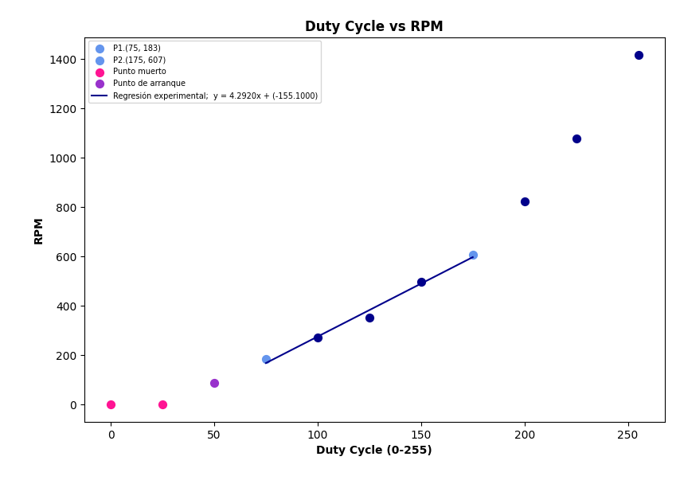

# Informe de Laboratorio — Sesión 5: Control PWM y Actuadores

---

**Universidad Nacional de Colombia**
**Electrónica Digital — 2016684 — 2026-1**
**Prof. Ricardo Amézquita Orozco**

---

| Campo | |
|-------|--|
| **Integrantes** | 1. Felipe Lizcano Quimbaya|
| | 2. Sergio Andrés Poveda Pérez|
| | 3. Simón Gabriel Snadoval Palma|
| | 4. Sara Romero Chaves|
| **Grupo** | 3 |
| **Fecha de la práctica** |29/04/2026 |
| **Fecha de entrega** | **Martes 22 de abril de 2026, 23:59** |

---

## 1. Resultados


### Actividad 1 — PWM con LED: Captura Serial Monitor

**Figura 1 — Serial Monitor (Actividad 1)**

Adjuntar captura de pantalla del Serial Monitor mostrando **al menos 10 filas** de las tres columnas correspondientes a distintas posiciones del potenciómetro.

**Caption obligatorio:** Indicar el valor de duty cycle al 0 %, al ~50 % y al 100 %.


> **Descripción:** _(En la imagen se observa que el valor del ADC y el ciclo de trabajo (duty cycle) presentan una relación aproximadamente lineal, de modo que al aumentar uno, el otro también se incrementa de manera proporcional.)_

---

### Actividad 3 — Control UART: Tabla del Protocolo Diseñado

**Tabla 1 — Protocolo UART Diseñado por el Grupo**


| Código | Descripción                         | Parámetro               | Respuesta del Arduino        |
|--------|-------------------------------------|--------------------------|------------------------------|
| VM N   | Cambia la velocidad del motor (PWM) | N: entero entre 0 y 255  | OK VEL N                     |
| DI N   | Cambia la dirección del motor       | N: 0 = CW, 1 = CCW       | OK DIR CW / OK DIR CCW       |
| ES     | Consulta el estado actual del motor | Sin parámetro            | EST V=<vel> D=CW / D=CCW     |
_Completar con los comandos implementados por el grupo. Mínimo tres filas._

---

### Actividad 3 — Control UART: Captura Serial Monitor

**Figura 2 — Serial Monitor (Actividad 3): Intercambios UART**

Adjuntar captura de pantalla del Serial Monitor mostrando **al menos tres intercambios comando→respuesta**, incluyendo un comando de velocidad, uno de dirección y uno de estado.

**Caption obligatorio:** Indicar los códigos de comando usados por el grupo.


> **Descripción:** _(se usó el comando VM N\n el cual controla la velocidad en un rando de 0-255. Las respuestas de este comando son las que dicen OK VEL N. También se usó el comando DI N\n el cual controla la dirección a la que gira el disco donde los parámetros permitidos son CW y CCW (clockwise y counter-clockwise respectivamente); de esta forma, la respuesta obtenida sigue la forma OK DIR N\n. Adicionalmente, se usó una trama incorrecta para mostrar la respuesta de error ER comando desconocido. Por último se mandó el comando el comando ES N\n que da como respuestas la velocidad y la dirección instantáneos. )_

---

### Actividad 4 — Encoder: Tabla Duty Cycle vs RPM

**Tabla 2 — Caracterización Duty Cycle vs RPM**


| Duty Cycle (0–255) | RPM medidas |
|:-------------------:|:-----------:|
| 0 |0|
| 25 |0|
| 50 |86.3 |
| 75 |183|
| 100 |270|
| 125 |352|
| 150 |495|
| 175 |607|
| 200 |821|
| 225 |1076|
| 255 |1417|
| **Duty cycle mínimo de arranque:** | |

---

## 2. Visualización


### Figura 3 — Curva Duty Cycle vs RPM (Actividad 4)

**Eje X:** Duty Cycle (0–255)
**Eje Y:** RPM medidas

**Requisitos de la gráfica:**
- Marcar claramente la **zona muerta** (RPM = 0 para duty cycle bajo).
- Marcar el punto de **duty cycle mínimo de arranque**.
- Marcar **dos puntos representativos de la zona lineal** para calcular la pendiente (RPM por unidad de duty cycle). Etiquetar ambos puntos con sus coordenadas.
- Indicar si la zona lineal es aproximadamente proporcional o presenta saturación.



> **Interpretación:** _(La curva cuenta con dos zonas muertas al inicio, en los puntos de duty call 0 y 25. Luego, el arranque del motor se da a partir de un duty cycle de 50, lo que representa aproximadamente el 20 % de la escala total. En la zona lineal, se observa un comportamiento aproximadamente proporcional entre el duty cycle y las RPM, aunque con una ligera tendencia a la saturación a medida que se acerca al máximo duty cycle. La pendiente calculada en la zona lineal es de aproximadamente 4.29 RPM por unidad de duty cycle, lo que indica que por cada incremento de 1 en el duty cycle, las RPM aumentan en promedio en 4.29 unidades.)_

---

## 3. Análisis


### Preguntas de Análisis — Actividad 1

**Pregunta A1.1:** ¿Cuántos niveles de brillo distintos puede producir `analogWrite()`?

> [La función analogWrite() trabaja con una resolución de 8 bits, lo que implica que el valor del duty cycle puede tomar cualquier entero entre 0 y 255. Esto corresponde a 256 niveles discretos de señal, y por tanto a 256 niveles distintos de brillo en el LED. Es importante no confundir esto con 255 niveles: el conteo incluye el cero, por lo que el total correcto es 256.]

**Pregunta A1.2:** ¿Qué ocurre con el brillo cuando el duty cycle es 0? ¿Y cuando es 255?

> [Cuando el duty cycle es 0, la señal PWM permanece siempre en nivel bajo (0V), lo que implica que no circula corriente por el LED y este permanece completamente apagado. En cambio, cuando el duty cycle es 255, la señal se mantiene constantemente en nivel alto (aproximadamente 5V), eliminando el comportamiento pulsado y convirtiéndose en una señal continua. En este caso, el LED emite su brillo máximo, ya que está permanentemente alimentado.]

**Pregunta A1.3:** ¿La frecuencia medida con el osciloscopio coincide con los ~490 Hz documentados para el Timer 1?

>[La frecuencia medida con el osciloscopio fue cercana a los ~490 Hz documentados para el pin D9 asociado al temporizador correspondiente. Sin embargo, no es correcto afirmar que coincidió exactamente, ya que existen pequeñas desviaciones debidas a tolerancias del reloj del microcontrolador, condiciones del entorno o precisión del instrumento de medición.]

**Pregunta A1.4:** La función `analogWrite()` genera una señal de frecuencia fija (~490 Hz en D9) con duty cycle variable. ¿Por qué el LED responde con brillo proporcional al duty cycle en lugar de parpadear a 490 Hz? ¿A partir de qué frecuencia mínima aproximada deja de percibirse el parpadeo en el ojo humano?

> [Aunque analogWrite() genera una señal PWM que enciende y apaga el LED a una frecuencia fija de aproximadamente 490 Hz, el ojo humano no percibe este parpadeo debido a su capacidad limitada de resolución temporal. El sistema visual integra la luz recibida en intervalos de tiempo relativamente largos, por lo que, cuando la frecuencia de conmutación supera aproximadamente los 50–60 Hz (frecuencia crítica de fusión), el parpadeo deja de ser distinguible y se percibe una iluminación continua. En estas condiciones, el brillo aparente del LED depende del valor promedio de la señal, que está directamente determinado por el duty cycle: a mayor tiempo encendido dentro de cada período, mayor intensidad luminosa percibida. Dado que 490 Hz es muy superior a este umbral, el LED no parece parpadear, sino variar suavemente su brillo.]

---

### Pregunta de Análisis — Actividad 2

**Pregunta A2.1:** ¿Qué limitación tiene el método de control con velocidad hardcodeada? ¿Qué se debe hacer cada vez que se quiere cambiar la velocidad?

> [El método de control con velocidad hardcodeada tiene como principal limitación su falta de flexibilidad, ya que el valor del duty cycle está fijado directamente en el código fuente. Esto implica que no es posible modificar la velocidad del motor en tiempo real durante la ejecución del sistema. Cada vez que se desea cambiar la velocidad, es necesario editar el código, recompilar el programa y volver a cargarlo en el microcontrolador, lo cual interrumpe la operación del sistema y hace el proceso lento e ineficiente, especialmente en contextos experimentales donde se requieren ajustes continuos.]

---

### Pregunta de Análisis — Actividad 3

**Pregunta A3.1:** En el protocolo UART, el parser identifica los comandos comparando `buf[0]` y `buf[1]` directamente en lugar de usar `strcmp()`. ¿Qué condición del formato `CC N\n` hace que esta estrategia sea suficiente? ¿Seguiría siendo válida si el protocolo usara comandos de longitud variable (como en la Parte 2 de S4)?

> [La estrategia de identificar comandos comparando directamente buf[0] y buf[1] es suficiente debido a que el protocolo tiene un formato fijo del tipo CC N\n, donde los dos primeros caracteres (CC) representan siempre el comando y tienen longitud constante. Esta estructura garantiza que la información relevante para identificar la instrucción se encuentra en posiciones conocidas del buffer, eliminando la necesidad de comparar cadenas completas como lo haría strcmp(). Además, el uso de un separador fijo (espacio) y un terminador definido (\n) hace que el parsing sea simple y determinista.Sin embargo, esta estrategia deja de ser válida si el protocolo permite comandos de longitud variable. En ese caso, ya no se podría asumir que el comando ocupa siempre las posiciones buf[0] y buf[1], por lo que sería necesario utilizar métodos más generales como strcmp(), búsqueda de delimitadores o tokenización. Esto introduce mayor complejidad en el parser, pero es indispensable para manejar correctamente comandos de longitud no fija.]

---

### Preguntas de Análisis — Actividad 4

**Pregunta A4.1:** Con base en la Tabla 2: ¿a qué duty cycle arranca el motor por primera vez? ¿Qué porcentaje de la escala total (0–255) representa esa zona muerta?

> [El motor arranca por primera vez a un duty cycle de 50 a 86.3 RPM. Esto representa aproximadamente el 19.6 % de la escala total. Por lo tanto, la zona muerta corresponde a los duty cycles entre 0 y 49, donde el motor no genera suficiente torque para superar la inercia inicial.]

**Pregunta A4.2:** La curva duty cycle vs RPM muestra una zona muerta en valores bajos de duty cycle. ¿Qué fenómeno físico del motor DC explica esa zona? ¿Cómo afectaría la existencia de esa zona a un sistema de control PID que intentara regular la velocidad del motor?

> [Para que el motor logre rotar, necesita superar la inercia estática que generan su propia masa y la del disco colocado; el campo magnético generado por la corriente inducida no es suficiente para superar dicha inercia hasta que el duty cycle alcanza un valor mínimo (en este caso, 50). Un control PID que intente regular la velocidad encontraría un problema en la zona muerta, forzando el motor a subir los duty cycles a valores por encima de ese umbral para lograr cualquier movimiento. Este aumento brusco podría resultar en oscilaciones o inestabilidad. ]

---

### Preguntas de Análisis Transversal

**Pregunta T.1:** **Compare el enfoque de control de la Actividad 2 (velocidad hardcodeada) con el de la Actividad 3 (control por comandos UART).** ¿Qué ventaja concreta ofrece el segundo enfoque en el contexto de un experimento físico donde se necesita ajustar parámetros sin interrumpir la adquisición de datos? ¿Qué componente del sistema fue el que eliminó la restricción de recompilar? ¿Qué cambió arquitectónicamente entre los dos enfoques?

> [El enfoque de control de la Actividad 3 ofrece una ventaja clara y concreta: permite ajustar la velocidad y otros parámetros del sistema en tiempo real sin detener la ejecución ni interrumpir la adquisición de datos. En un experimento físico, esto es crítico porque evita perder condiciones transitorias, mantiene la continuidad de las mediciones y permite explorar rápidamente distintos valores de entrada, algo que con velocidad hardcodeada es impráctico debido al ciclo constante de edición–compilación–carga. El componente del sistema que elimina la restricción de recompilar es la interfaz de comunicación UART junto con el parser implementado en el microcontrolador. Gracias a esto, el Arduino deja de depender de valores fijos en el código y pasa a recibir instrucciones dinámicas desde el exterior (por ejemplo, el Serial Monitor), lo que desacopla el control del programa compilado. Arquitectónicamente, el cambio es significativo: se pasa de un sistema cerrado y estático, donde los parámetros están embebidos en el firmware, a un sistema abierto y reactivo, donde existe una capa de entrada (UART) que permite modificar el comportamiento en tiempo de ejecución. Esto introduce una separación entre la lógica de control y la configuración de parámetros, acercando el diseño a un modelo más modular y flexible, propio de sistemas embebidos más avanzados.]

**Pregunta T.2:** **Con base en la gráfica de la Actividad 4:** ¿La relación RPM vs duty cycle en la zona lineal es aproximadamente proporcional? Estime la pendiente (RPM por unidad de duty cycle) usando dos puntos de la zona lineal y determine si el ajuste es adecuado para un control proporcional simple.

> [Con base en la gráfica, la relación entre RPM y duty cycle muestra un comportamiento aproximadamente lineal únicamente en un rango intermedio (alrededor de 70 a 180). En valores bajos de duty cycle se observa una zona muerta donde el motor no gira, lo que indica que la proporcionalidad no se cumple en todo el dominio, sino solo en una región específica. Para estimar la pendiente en la zona lineal, se pueden tomar dos puntos representativos como (75, 183) y (175, 607). Al calcular la pendiente como la razón de cambio entre estos puntos se obtiene aproximadamente 4.24 RPM por unidad de duty cycle. Este valor coincide bastante bien con la recta de regresión mostrada en la gráfica, lo que confirma que el ajuste lineal en esa región es consistente. Sin embargo, la relación no es proporcional en sentido estricto, ya que la recta no pasa por el origen y presenta un término independiente negativo. Esto refleja la existencia de un umbral mínimo de operación (zona muerta), lo que implica que el sistema no responde hasta superar cierto valor de duty cycle. En consecuencia, el ajuste lineal es adecuado para implementar un control proporcional simple únicamente dentro de la zona lineal de operación. No obstante, para lograr un control más preciso, es necesario considerar una compensación del offset o del punto de arranque, ya que de lo contrario el sistema presentará errores significativos a bajas velocidades.]

---

## 4. Código Documentado


### Actividad 2 — Motor DC: control de velocidad y dirección

```cpp
    /*
    * lab-05-parte1-pwm-led.ino
    * Laboratorio 5 — Parte 1: PWM con LED y potenciómetro
    *
    * === DESCRIPCIÓN ===
    *
    * Este sketch implementa control de brillo de un LED mediante PWM
    * (Pulse Width Modulation). La posición del potenciómetro en A0 se
    * mapea linealmente al duty cycle de la señal PWM en D9~.
    *
    * El objetivo es internalizar el concepto de duty cycle antes de
    * aplicar PWM al control de velocidad de un motor DC (Parte 2).
    *
    * === FUNCIONES NUEVAS EN ESTA SESIÓN ===
    *
    * analogWrite(pin, valor):
    *   Genera una señal PWM en el pin especificado (debe ser un pin ~).
    *   'valor' es el duty cycle en escala 0–255:
    *     0   → duty cycle 0 %  (señal siempre LOW  → LED apagado)
    *     127 → duty cycle 50 % (señal al 50 % HIGH → brillo medio)
    *     255 → duty cycle 100% (señal siempre HIGH → brillo máximo)
    *   Frecuencia PWM en D9 (Timer 1): ~490 Hz según datasheet ATmega328P.
    *
    * map(valor, desdeMin, desdeMax, hastaMin, hastaMax):
    *   Remapea linealmente un valor de un rango a otro.
    *   Ejemplo: map(512, 0, 1023, 0, 255) → 127
    *   Internamente: resultado = (valor - desdeMin) * (hastaMax - hastaMin)
    *                             / (desdeMax - desdeMin) + hastaMin
    *   Nota: map() trabaja con enteros — el resultado se trunca, no se redondea.
    *
    * === CIRCUITO ===
    *   A0  — Cursor del potenciómetro (extremos a 5V y GND)
    *   D9~ — LED + resistencia 220 Ω en serie (cátodo a GND)
    *
    * Autor: Ricardo Amézquita Orozco
    * Curso: Electrónica Digital 2016684 — UNAL 2026-1
    */

    // === DEFINICIÓN DE PINES ===
    const int PIN_POT = A0;   // Entrada analógica del potenciómetro
    const int PIN_LED = 9;    // Salida PWM~ el LED con resistencia 220 Ω

    // === CONFIGURACIÓN ===
    void setup() {
    // PIN_POT es entrada analógica — no requiere pinMode() 
    pinMode(PIN_LED, OUTPUT);

    Serial.begin(9600);
    // Imprimimos un encabezado en formato de tabla
    Serial.println("Lab 5 — Parte 1: PWM con LED");
    Serial.println("ADC(0-1023) | DutyCycle(0-255) | Porcentaje(%)");
    Serial.println("---------------------------------------------");
    }

    // === BUCLE PRINCIPAL ===
    void loop() {
    // Leer valor del ADC: 0 (0 V) a 1023 (5 V)
    int valorADC = analogRead(PIN_POT);

    // Barrer el rango ADC (0–1023) a rango duty cycle (0–255)
    // analogWrite() acepta valores en escala 0–255 (resolución de 8 bits)
    int dutyCycle = map(valorADC, 0, 1023, 0, 255); // Mapeo lineal del ADC al duty cycle PWM

    // Aplicar duty cycle al LED — PWM convierte el valor digital en una
    // proporción de tiempo HIGH vs. LOW que el LED percibe como brillo
    analogWrite(PIN_LED, dutyCycle); // Control de brillo del LED

    // Calcular porcentaje para visualización en Serial Monitor
    // Escala: (dutyCycle / 255) * 100, expresado como entero
    int porcentaje = map(dutyCycle, 0, 255, 0, 100); // Alternativamente: int porcentaje = (dutyCycle * 100) / 255;

    // Imprimir las tres columnas para correlacionar entrada analógica,
    // duty cycle resultante y porcentaje legible por el operador
    Serial.print(valorADC);
    Serial.print("\t\t"); // Tabulación para formato de tabla
    Serial.print(dutyCycle); // Valor de duty cycle en escala 0–255
    Serial.print("\t\t");
    Serial.println(porcentaje);

    // Esperar 200 ms entre lecturas para que el Serial Monitor sea legible
    // El delay() es aceptable aquí: la Parte 1 no requiere respuesta en tiempo real
    delay(200);
    }
```

### Actividad 3 — Control UART: parser y protocolo

```cpp
    /*
    * Protocolo compacto para control de motor DC
    * Formato: CC N\n
    * - CC: comando de 2 letras mayúsculas
    * - espacio separador
    * - N: entero de longitud variable
    * - \n: delimitador
    *
    * Comandos:
    *   VM <vel>  -> velocidad PWM (0-255)
    *   DI <dir>  -> direccion (0=CW, 1=CCW)
    *   ES        -> estado actual
    *
    * Pines:
    *   ENA: velocidad (PWM)
    *   IN1, IN2: direccion
    */

    // Pines del motor (ajustar según conexion)
    const int PIN_ENA = 9;   // PWM
    const int PIN_IN1 = 8;
    const int PIN_IN2 = 7;

    // Estado del sistema
    int velocidadActual = 0;
    int direccionActual = 0;   // 0=CW, 1=CCW

    // Buffer serial no bloqueante.
    // Se usa un arreglo de chars para almacenar temporalmente
    // el comando recibido por UART.
    char bufferSerial[16];
    int indiceBuffer = 0;

    void setup() {
        pinMode(PIN_ENA, OUTPUT);
        pinMode(PIN_IN1, OUTPUT);
        pinMode(PIN_IN2, OUTPUT);
        
        // Estado inicial: motor apagado, CW
        analogWrite(PIN_ENA, 0);
        digitalWrite(PIN_IN1, HIGH);
        digitalWrite(PIN_IN2, LOW);
        
        Serial.begin(9600);
        Serial.println("Sistema listo");
    }

    void loop() {
        // Lectura serial no bloqueante:
        // se verifica constantemente si hay datos disponibles
        // usando Serial.available() sin detener el programa.
        leerSerial();
    }

    void leerSerial() {

        // Mientras existan caracteres disponibles en el buffer UART
        while (Serial.available() > 0) {

            // Leer un caracter recibido
            char c = Serial.read();
            
            // Si llega el delimitador '\n'
            // significa que el comando terminó
            if (c == '\n') {

                // Agregar terminador de cadena
                bufferSerial[indiceBuffer] = '\0';

                // Procesar el comando completo
                procesarComando(bufferSerial);

                // Reiniciar buffer para el siguiente comando
                indiceBuffer = 0;
            }

            // Ignorar '\r' y evitar overflow del buffer
            else if (c != '\r' && indiceBuffer < 15) {

                // Acumulación de caracteres en el buffer char[16]
                bufferSerial[indiceBuffer] = c;
                indiceBuffer++;
            }
        }
    }

    void procesarComando(char* buf) {

        // Validar longitud mínima del comando
        if (indiceBuffer < 2) {
            Serial.println("ER comando muy corto");
            return;
        }
        
        // Extracción del parámetro numérico:
        // buf[0] y buf[1] contienen el identificador del comando.
        // Ejemplo:
        // "VM 120"
        // 012345
        //
        // buf + 3 apunta al inicio del número.
        // atoi() convierte la cadena a entero.
        int valor = 0;

        if (indiceBuffer > 3) {
            valor = atoi(buf + 3);
        }
        
        // Identificación del comando mediante buf[0] y buf[1]

        // -------------------------
        // COMANDO VM -> Velocidad
        // -------------------------
        if (buf[0] == 'V' && buf[1] == 'M') {

            // Validar rango PWM
            if (valor < 0 || valor > 255) {
                Serial.println("ER velocidad fuera de rango (0-255)");
                return;
            }

            // Actualizar velocidad
            velocidadActual = valor;
            analogWrite(PIN_ENA, velocidadActual);

            // Respuesta de confirmación por Serial
            Serial.print("OK VEL ");
            Serial.println(velocidadActual);
        }
        
        // -------------------------
        // COMANDO DI -> Dirección
        // -------------------------
        else if (buf[0] == 'D' && buf[1] == 'I') {

            // Validar dirección
            if (valor != 0 && valor != 1) {
                Serial.println("ER direccion invalida (0=CW, 1=CCW)");
                return;
            }

            // Actualizar dirección
            direccionActual = valor;

            if (direccionActual == 0) {
                digitalWrite(PIN_IN1, HIGH);
                digitalWrite(PIN_IN2, LOW);
            } 
            else {
                digitalWrite(PIN_IN1, LOW);
                digitalWrite(PIN_IN2, HIGH);
            }

            // Confirmación enviada por UART
            Serial.print("OK DIR ");
            Serial.println(direccionActual == 0 ? "CW" : "CCW");
        }
        
        // -------------------------
        // COMANDO ES -> Estado
        // -------------------------
        else if (buf[0] == 'E' && buf[1] == 'S') {

            // Respuesta con el estado actual del sistema
            Serial.print("EST V=");
            Serial.print(velocidadActual);
            Serial.print(" D=");
            Serial.println(direccionActual == 0 ? "CW" : "CCW");
        }
        
        // -------------------------
        // COMANDO DESCONOCIDO
        // -------------------------
        else {
            Serial.println("ER comando desconocido");
        }
    }

```

### Actividad 4 — Encoder óptico: contador de pulsos y cálculo de RPM

```cpp
    /*
    * Protocolo compacto para control de motor DC con encoder IR y RPM
    * Formato: CC N\n
    *
    * Comandos:
    *   VM <vel>  -> velocidad PWM (0-255)
    *   DI <dir>  -> direccion (0=CW, 1=CCW)
    *   ES        -> estado (velocidad, direccion, RPM)
    *   PC        -> leer contador de pulsos
    *
    * Pines:
    *   ENA: velocidad (PWM) - D9
    *   IN1, IN2: direccion - D8, D7
    *   SENSOR_IR: encoder - D3
    */

    // =========================
    // DEFINICIÓN DE PINES
    // =========================

    // Pines del motor DC
    const int PIN_ENA = 9;
    const int PIN_IN1 = 8;
    const int PIN_IN2 = 7;

    // Pin del sensor IR del encoder
    const int PIN_SENSOR = 3;

    // =========================
    // CONSTANTES DEL ENCODER
    // =========================

    // Número de franjas negras del disco encoder.
    // Cada vuelta completa genera N_FRANJAS pulsos.
    const int N_FRANJAS = 8;

    // Factor de conversión RPM:
    // RPM = (pulsos / N_franjas) × (60 / 2)
    //
    // Como el cálculo se hace cada 2 segundos:
    // (60 / 2) = 30
    const float FACTOR_RPM = 30.0;

    // =========================
    // ESTADO DEL MOTOR
    // =========================

    // Duty cycle actual
    int velocidadActual = 0;

    // Dirección actual:
    // 0 = CW
    // 1 = CCW
    int direccionActual = 0;

    // =========================
    // CONTADOR DE PULSOS
    // =========================

    // Variable volatile:
    //
    // La ISR modifica esta variable de forma asíncrona.
    // volatile evita que el compilador optimice incorrectamente
    // su lectura/escritura.
    volatile unsigned long contadorPulsos = 0;

    // =========================
    // VARIABLES PARA RPM
    // =========================

    // Guarda el instante de la última medición
    unsigned long tiempoAnteriorRPM = 0;

    // Intervalo de cálculo de RPM:
    // 2000 ms = 2 segundos
    const unsigned long INTERVALO_RPM_MS = 2000;

    // RPM calculadas actualmente
    float rpmActual = 0.0;

    // =========================
    // BUFFER SERIAL UART
    // =========================

    // Buffer de recepción serial no bloqueante
    char bufferSerial[16];
    int indiceBuffer = 0;

    // =========================
    // SETUP
    // =========================

    void setup() {

        // Configurar pines del motor
        pinMode(PIN_ENA, OUTPUT);
        pinMode(PIN_IN1, OUTPUT);
        pinMode(PIN_IN2, OUTPUT);
        
        // Configurar sensor IR como entrada con pull-up interno
        pinMode(PIN_SENSOR, INPUT_PULLUP);
        
        // Configuración de interrupción externa:
        //
        // attachInterrupt():
        // Ejecuta automáticamente la ISR contarPulso()
        // cada vez que ocurre un flanco FALLING
        // en el pin del sensor.
        //
        // digitalPinToInterrupt():
        // Convierte el pin físico en el número de interrupción.
        attachInterrupt(
            digitalPinToInterrupt(PIN_SENSOR),
            contarPulso,
            FALLING
        );
        
        // Estado inicial del motor:
        // apagado y dirección CW
        analogWrite(PIN_ENA, 0);

        digitalWrite(PIN_IN1, HIGH);
        digitalWrite(PIN_IN2, LOW);
        
        // Inicializar UART
        Serial.begin(9600);

        Serial.println("Sistema listo");
    }

    // =========================
    // ISR DEL ENCODER
    // =========================

    // ISR = Interrupt Service Routine
    //
    // Esta función se ejecuta automáticamente
    // cada vez que el encoder detecta un pulso.
    //
    // La ISR debe ser extremadamente corta:
    // únicamente incrementar el contador.
    void contarPulso() {
        contadorPulsos++;
    }

    // =========================
    // LOOP PRINCIPAL
    // =========================

    void loop() {

        // Lectura UART no bloqueante
        leerSerial();

        // Cálculo periódico de RPM
        calcularRPM();
    }

    // =========================
    // LECTURA SERIAL UART
    // =========================

    void leerSerial() {

        // Mientras existan caracteres disponibles
        while (Serial.available() > 0) {

            // Leer carácter recibido
            char c = Serial.read();
            
            // '\n' indica fin de comando
            if (c == '\n') {

                // Agregar terminador de cadena
                bufferSerial[indiceBuffer] = '\0';

                // Procesar comando completo
                procesarComando(bufferSerial);

                // Reiniciar buffer
                indiceBuffer = 0;
            }

            // Ignorar '\r' y evitar overflow
            else if (c != '\r' && indiceBuffer < 15) {

                // Acumulación de caracteres
                // en char bufferSerial[16]
                bufferSerial[indiceBuffer] = c;

                indiceBuffer++;
            }
        }
    }

    // =========================
    // CÁLCULO DE RPM
    // =========================

    void calcularRPM() {

        // millis():
        // devuelve el tiempo transcurrido desde
        // el inicio del programa en milisegundos.
        unsigned long tiempoActual = millis();
        
        // Ejecutar cálculo cada 2 segundos
        if (tiempoActual - tiempoAnteriorRPM >= INTERVALO_RPM_MS) {

            // Deshabilitar interrupciones temporalmente
            // para leer el contador de forma segura.
            noInterrupts();

            // Guardar pulsos medidos
            unsigned long pulsosEnIntervalo = contadorPulsos;

            // Reiniciar contador
            contadorPulsos = 0;

            // Reactivar interrupciones
            interrupts();
            
            // ==========================================
            // FÓRMULA DE RPM
            // ==========================================
            //
            // RPM = (contadorPulsos / N_franjas)
            //       × (60 / tiempoMedición)
            //
            // Como tiempoMedición = 2 s:
            //
            // RPM = (contadorPulsos / N_franjas) × 30
            //
            rpmActual =
                ((float)pulsosEnIntervalo / N_FRANJAS)
                * FACTOR_RPM;
            
            // Mostrar RPM calculadas
            Serial.print("RPM ");

            // Mostrar con 1 decimal
            Serial.println(rpmActual, 1);
            
            // Actualizar referencia temporal
            tiempoAnteriorRPM = tiempoActual;
        }
    }

    // =========================
    // PARSER DE COMANDOS UART
    // =========================

    void procesarComando(char* buf) {

        // Validar longitud mínima
        if (indiceBuffer < 2) {

            Serial.println("ER comando muy corto");

            return;
        }
        
        // Extraer parámetro numérico:
        //
        // "VM 120"
        // 012345
        //
        // buf + 3 apunta al inicio del número.
        int valor = 0;

        if (indiceBuffer > 3) {
            valor = atoi(buf + 3);
        }
        
        // ==========================================
        // COMANDO VM -> VELOCIDAD PWM
        // ==========================================

        if (buf[0] == 'V' && buf[1] == 'M') {

            // Validar rango permitido
            if (valor < 0 || valor > 255) {

                Serial.println("ER velocidad fuera de rango (0-255)");

                return;
            }

            // Actualizar duty cycle
            velocidadActual = valor;

            analogWrite(PIN_ENA, velocidadActual);

            // Confirmación UART
            Serial.print("OK VEL ");

            Serial.println(velocidadActual);
        }
        
        // ==========================================
        // COMANDO DI -> DIRECCIÓN
        // ==========================================

        else if (buf[0] == 'D' && buf[1] == 'I') {

            // Validar dirección
            if (valor != 0 && valor != 1) {

                Serial.println("ER direccion invalida (0=CW, 1=CCW)");

                return;
            }

            direccionActual = valor;

            // CW
            if (direccionActual == 0) {

                digitalWrite(PIN_IN1, HIGH);
                digitalWrite(PIN_IN2, LOW);
            }

            // CCW
            else {

                digitalWrite(PIN_IN1, LOW);
                digitalWrite(PIN_IN2, HIGH);
            }

            // Confirmación UART
            Serial.print("OK DIR ");

            Serial.println(
                direccionActual == 0 ? "CW" : "CCW"
            );
        }
        
        // ==========================================
        // COMANDO ES -> ESTADO COMPLETO
        // ==========================================

        else if (buf[0] == 'E' && buf[1] == 'S') {

            // Integración con el protocolo UART
            // de la Actividad 3:
            //
            // además de velocidad y dirección,
            // ahora se reporta también la RPM.
            Serial.print("EST V=");

            Serial.print(velocidadActual);

            Serial.print(" D=");

            Serial.print(
                direccionActual == 0 ? "CW" : "CCW"
            );

            Serial.print(" RPM=");

            Serial.println(rpmActual, 1);
        }
        
        // ==========================================
        // COMANDO PC -> CONTADOR DE PULSOS
        // ==========================================

        else if (buf[0] == 'P' && buf[1] == 'C') {

            // Leer contador de forma segura
            noInterrupts();

            unsigned long pulsos = contadorPulsos;

            interrupts();

            Serial.print("PULSOS ");

            Serial.println(pulsos);
        }
        
        // ==========================================
        // COMANDO DESCONOCIDO
        // ==========================================

        else {

            Serial.println("ER comando desconocido");
        }
    }
```

---

## 5. Dificultades Encontradas y Soluciones Aplicadas


### Dificultad 1: no sobre pasar los 500mA sugeridos para el motor DC

- **Síntoma observado:** Dado que en la guía se sugería no sobrepasar los 500mA para el motor DC, se tuvo dificultad para colocar este tope en la fuente de voltaje pues automáticamente se superaban los límites lo cual retrasó el desarrollo de la práctica.
- **Causa identificada:** Se identificó que el motor DC utilizado tenía una corriente de arranque (stall current) que superaba los 500mA, superando el límite sugerido.
- **Solución aplicada:** El profesor especificó luego que no había problema con superar ese límite durante la práctica, lo que permitió continuar sin restricciones. Sin embargo, se aprendió la importancia de revisar las especificaciones del motor antes de la práctica para anticipar este tipo de problemas.
- **Lección aprendida:** Antes de iniciar una práctica, es fundamental revisar las especificaciones técnicas de los componentes para evitar sorpresas y retrasos. En este caso, conocer la corriente de arranque del motor DC habría permitido planificar mejor el experimento y evitar la preocupación por superar el límite de corriente.

### Dificultad 2 (si aplica): Precesión en el disco.

- **Síntoma observado:** Durante la realización de la Actividad 4, se observó que el disco presentaba un movimiento de precesión, lo que afectaba la precisión de las mediciones de RPM.
- **Causa identificada:** La parte del motor en la que se montaba el disco no estaba completamente asegurada, lo que permitía un ligero movimiento de precesión al girar. Esto luego se tradujo en fluctuaciones en el conteo de pulsos del encoder, dificultando la obtención de una curva de caracterización precisa.
- **Solución aplicada:** Se amplió el grosor de disco para reducir la precesión, lo que mejoró la estabilidad del sistema y permitió obtener mediciones más consistentes. Sin embargo, esta solución no eliminó completamente el problema.
- **Lección aprendida:** La estabilidad del motor, y su calidad, son factores cruciales para lograr precisión en las medidas. En futuras prácticas, se podría considerar el uso de motores con mejor calidad de construcción o implementar mecanismos adicionales para asegurar el disco y minimizar la precesión, como el uso de acoples rígidos o soportes adicionales.

---

## 6. Pregunta Abierta


**Pregunta:** La curva de caracterización de la Actividad 4 fue obtenida sin carga mecánica en el eje del motor. Proponga cómo cambiaría la curva si se aplica una carga de fricción constante al eje (por ejemplo, frenando el disco encoder con un dedo levemente). ¿En qué dirección se desplazaría la zona muerta? ¿Cómo podría usarse esa diferencia para estimar el torque de fricción del sistema, conociendo las especificaciones del motor?

> [Si se aplica una carga de fricción constante en el eje del motor, la curva RPM vs duty cycle se desplazaría hacia abajo. Esto ocurre porque, para un mismo valor de duty cycle, parte del torque generado por el motor se utiliza ahora para vencer la fricción, por lo que queda menos disponible para generar velocidad. En consecuencia, las RPM serán menores en todo el rango, y la recta en la zona lineal conservaría una pendiente similar pero con un intercepto más bajo (más negativo). La zona muerta se desplazaría hacia la derecha, es decir, aumentaría el duty cycle mínimo necesario para que el motor comience a girar. Esto tiene sentido físicamente: ahora se requiere un mayor torque inicial para superar no solo las pérdidas internas del motor, sino también la fricción adicional impuesta externamente. Esta diferencia puede utilizarse para estimar el torque de fricción del sistema. Si se conoce el duty cycle de arranque sin carga y con carga, la diferencia entre ambos permite inferir el incremento de torque necesario para iniciar el movimiento. Usando las especificaciones del motor (por ejemplo, la relación entre corriente y torque, o la constante de torque), se puede convertir ese incremento en una estimación del torque de fricción. En términos prácticos, estarías relacionando el aumento de señal de control requerido con el torque adicional necesario, lo cual es una forma indirecta pero válida de caracterizar las pérdidas mecánicas del sistema.]
