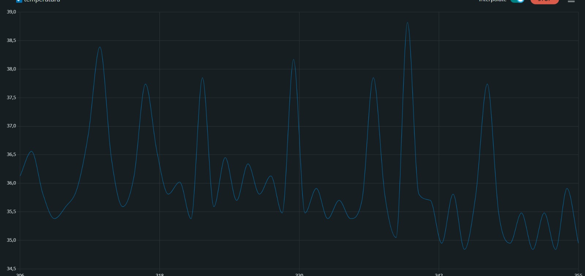
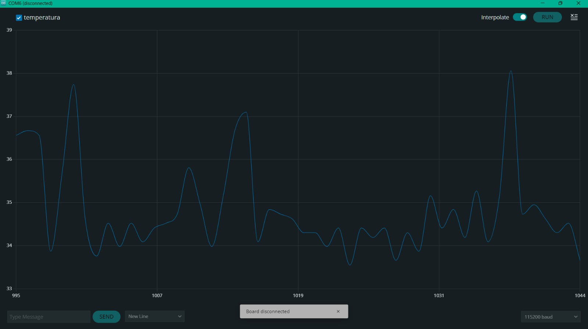
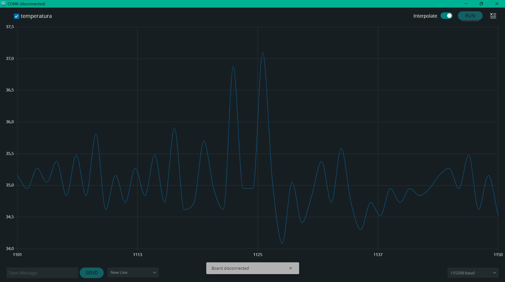
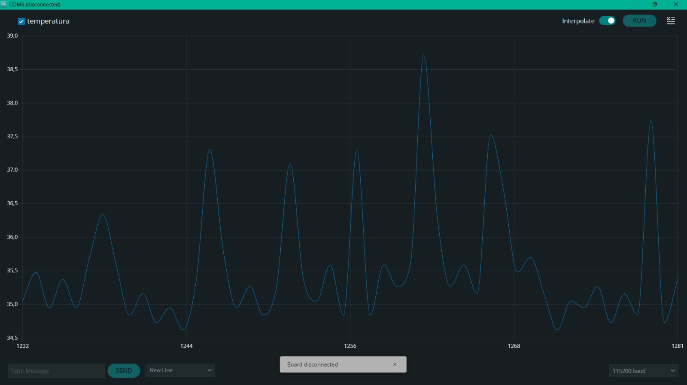

# Informe de Laboratorio — Sesión 7: Control Automático en Lazo Cerrado

---

**Universidad Nacional de Colombia**
**Electrónica Digital — 2016684 — 2026-1**
**Prof. Ricardo Amézquita Orozco**

---

| Campo | |
|-------|--|
| **Integrantes** | 1. Felipe Lizcano Quimbaya|
| | 2. Sergio Andres Poveda Perez|
| | 3. Sara Romero Chaves|
| | 4. Simon Gabriel Sandoval Palma|
| **Grupo** |3|
| **Fecha de la práctica** | Miércoles 08 de Abril, 2026 |
| **Fecha de entrega** | Viernes 25 de Abril, 2026 — 23:59 (Bloque 3: S7, S8, S9) |

---

## 1. Resultados

### Actividad 2 — Control ON/OFF

**Tabla 1 — Caracterización de la oscilación ON/OFF**

| Ciclo | T máxima (°C) | T mínima (°C) | Amplitud p-a-p (°C) | Período (s) |
|:-----:|:-------------:|:-------------:|:--------------------:|:-----------:|
| 1 |38.82 | 35.05| 3.77| 4|
| 2 |37.73 | 35.27| 2.46| 3|
| 3 |36.77| 35.05| 1.72| 4|

*Setpoint utilizado:* 35 °C

**Captura Act. 2:** Screenshot del Serial Plotter mostrando oscilación ON/OFF con al menos 3 ciclos completos visibles.



---

### Actividad 3 — Control Proporcional (P)

**Tabla 2 — Barrido de Kp (control P)**

*Setpoint utilizado:* 35 °C

| Kp | Error estacionario (°C) |
|:-----:|:-----------------------:|
|10 | 0.835|
|30| 0.373|
|100| 0.125|

*Error estacionario = promedio de |setpoint − temperatura| durante los últimos 60 s de la corrida.*

**Capturas Act. 3:** Al menos 3 screenshots del Serial Plotter, uno por cada valor de Kp, etiquetados con el valor correspondiente.


Kp=10


Kp=30


Kp=100

---

### Actividad 4 — Control Proporcional-Integral (PI)

**Tabla 3 — Barrido de Ki (Kp fijo del mejor valor de Actividad 3)**

*Kp utilizado:* ______
*Setpoint utilizado:* ______ °C

| Ki | Error residual (°C) |
|:-----:|:-------------------:|
| | |
| | |
| | |

*Error residual = promedio de |setpoint − temperatura| durante los últimos 60 s de la corrida.*

**Capturas Act. 4:**
- Screenshot mostrando wind-up (sin `constrain` sobre `errorSum`): se observa como un sobreimpulso severo seguido de una recuperación muy lenta o nula hacia el setpoint. El wind-up **no** es directamente visible en la curva de `errorSum` (que no se grafica); lo que se observa es el efecto en temperatura: la inercia acumulada en el integrador hace que el calentador siga a máxima potencia mucho después de haber cruzado el setpoint.
- Al menos 3 screenshots con diferentes valores de Ki (con `constrain` activo), etiquetados con Kp y Ki.


---

### Actividad 5 — Consolidación

**Tabla 4 — Comparación de estrategias de control**

| Estrategia | Kp | Ki | Error estacionario (°C) | Oscilación (°C p-a-p) |
|:------------------|:-----:|:-----:|:------------------------:|:---------------------:|
| ON/OFF | N/A | N/A | | (ver Tabla 1) |
| P (mejor Kp) | | 0 | | — |
| PI (mejor Kp/Ki) | | | | — |

*Datos tomados de Tabla 1 (ON/OFF), Tabla 2 (P) y Tabla 3 (PI).*
*N/A: el control ON/OFF es un controlador no lineal (bang-bang); no tiene parámetros Kp ni Ki equivalentes a un PID.*
*— : en régimen permanente el control P y PI no presentan oscilación sostenida medible (a diferencia del ON/OFF).*

---

## 2. Análisis Visual

La comparación visual de las tres estrategias se realiza a partir de los screenshots del Serial Plotter ya requeridos en las Actividades 2, 3 y 4. No se requiere imagen adicional.

**Interpretación comparativa:**

> [Describir cómo evoluciona el comportamiento de ON/OFF → P → PI a partir de los screenshots: qué limitación resuelve cada estrategia, cuándo se estabiliza cada una, y qué error estacionario queda en cada caso.]

---

## 3. Análisis

### Preguntas de Actividades

**Pregunta Act. 2:** ¿Por qué el sistema no puede estabilizarse exactamente en el setpoint con control ON/OFF, incluso si se elimina cualquier histéresis? Apoyar la respuesta con los datos de la Tabla 1.

> [El sistema no puede estabilizarse exactamente en el setpoint con control ON/OFF porque este tipo de control solo tiene dos estados posibles: encendido al máximo o apagado completo. Cuando la temperatura está por debajo del setpoint, el calefactor entrega toda la potencia; cuando la temperatura lo supera, el calefactor se apaga. Sin embargo, el bloque de aluminio y la resistencia tienen inercia térmica, por lo que el sistema sigue calentándose incluso después de apagar el calefactor. Esto provoca que la temperatura sobrepase el setpoint y luego empiece a descender hasta quedar nuevamente por debajo del valor deseado, repitiendo continuamente el ciclo de encendido y apagado. Los datos de la Tabla 1 muestran claramente este comportamiento oscilatorio. En el ciclo 1 la temperatura varió entre 35.05 °C y 38.82 °C, con una amplitud pico a pico de 3.77 °C. En el ciclo 2 la amplitud fue de 2.46 °C y en el ciclo 3 de 1.72 °C. Además, el período de oscilación se mantuvo entre 3 y 4 segundos, lo que indica que el sistema entra en un régimen periódico alrededor del setpoint en lugar de estabilizarse exactamente en él. Incluso si se elimina completamente la histéresis, el problema seguiría existiendo porque el controlador ON/OFF no puede aplicar una potencia intermedia. El actuador siempre entrega toda la potencia o ninguna, de modo que la temperatura inevitablemente sobrepasa el valor objetivo debido al retraso térmico del sistema. Por esta razón, el control ON/OFF siempre produce oscilaciones alrededor del setpoint y no una estabilización exacta.
]

---

**Pregunta Act. 3a:** ¿Por qué el controlador P no puede alcanzar exactamente el setpoint?

> [Respuesta del estudiante aquí]

---

**Pregunta Act. 3b:** A partir de la Tabla 2, ¿qué tendencia observa entre el valor de Kp y el error estacionario medido? Justificar.

> [Respuesta del estudiante aquí]

---

**Pregunta Act. 4:** ¿Qué efecto tiene doblar Ki sobre la velocidad de corrección del error estacionario y sobre el riesgo de wind-up? A medida que Ki aumenta, ¿observó algún deterioro en el comportamiento (mayor sobreimpulso, oscilaciones, tiempo de estabilización más largo)? Describir con referencia a los datos de la Tabla 3 y las capturas.

> [Respuesta del estudiante aquí]

---

### Preguntas de Análisis Transversal

**Pregunta T1:** A partir de la Tabla 4, comparar el error estacionario del mejor controlador P con el del mejor controlador PI. ¿Por qué el controlador PI puede reducir este error a valores cercanos a cero mientras que el P no puede? Justificar con referencia a las ecuaciones de ambos controladores.

> [Respuesta del estudiante aquí]

---

**Pregunta T2:** ¿Qué diferencia observó entre el comportamiento del sistema al aumentar Kp en el control P (Actividad 3) y al aumentar Ki en el control PI (Actividad 4)? ¿En qué condiciones podría ser preferible usar solo control P en lugar de PI?

> [Respuesta del estudiante aquí]

---

## 4. Código Documentado

Incluir únicamente las secciones del código que el grupo implementó o modificó durante la sesión. Comentar cada bloque funcional explicando la lógica.

### Actividad 2 — Parser serial y control ON/OFF

```cpp
// Pegar aquí:
// - La función procesarComando() con el comando SET xx
// - La lectura serial no bloqueante (byte a byte)
// - La lógica ON/OFF en loop()
```

### Actividad 3 — Implementación del controlador P

```cpp
// Pegar aquí:
// - La extensión de procesarComando() con el comando KP xx
// - El cálculo de salidaPWM = Kp * error con constrain()
```

### Actividad 4 — Implementación del controlador PI

```cpp
// Pegar aquí:
// - La extensión de procesarComando() con el comando KI xx
// - La acumulación errorSum += error * dt
// - El constrain(errorSum, -PWM_MAXIMO / Ki, PWM_MAXIMO / Ki)
//   IMPORTANTE: esta línea solo debe ejecutarse cuando Ki != 0.
//   Si Ki == 0 y se evalúa PWM_MAXIMO / Ki ocurre una división por cero
//   que puede causar un reinicio o cuelgue del Arduino.
//   Proteger con: if (Ki != 0) { errorSum = constrain(...); }
// - El cálculo salidaPWM = Kp * error + Ki * errorSum con constrain()
```

---

## 5. Dificultades Encontradas y Soluciones Aplicadas

### Dificultad 1: [Descripción breve del problema]

- **Síntoma observado:**
- **Causa identificada:**
- **Solución aplicada:**
- **Lección aprendida:**

### Dificultad 2 *(si aplica)*: [Descripción breve]

- **Síntoma observado:**
- **Causa identificada:**
- **Solución aplicada:**
- **Lección aprendida:**

---

## 6. Pregunta Abierta

> Esta sesión no incluye pregunta abierta. Este espacio se reserva para mantener la estructura estándar del informe.
