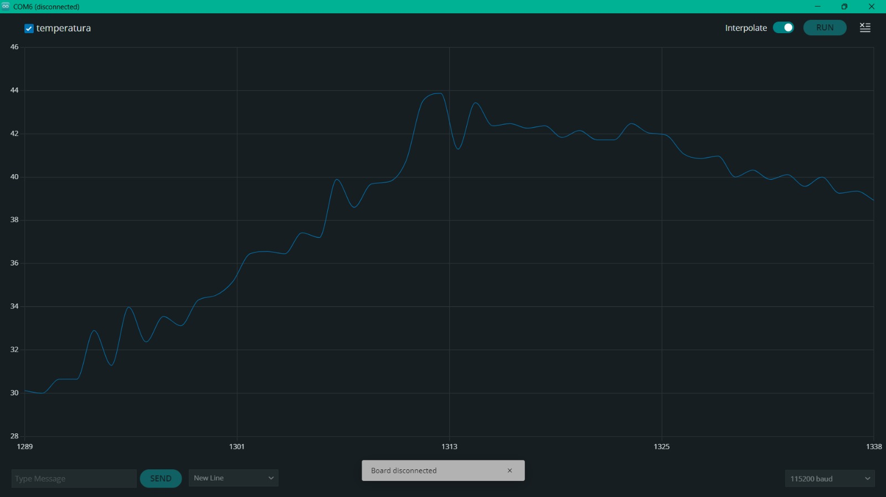
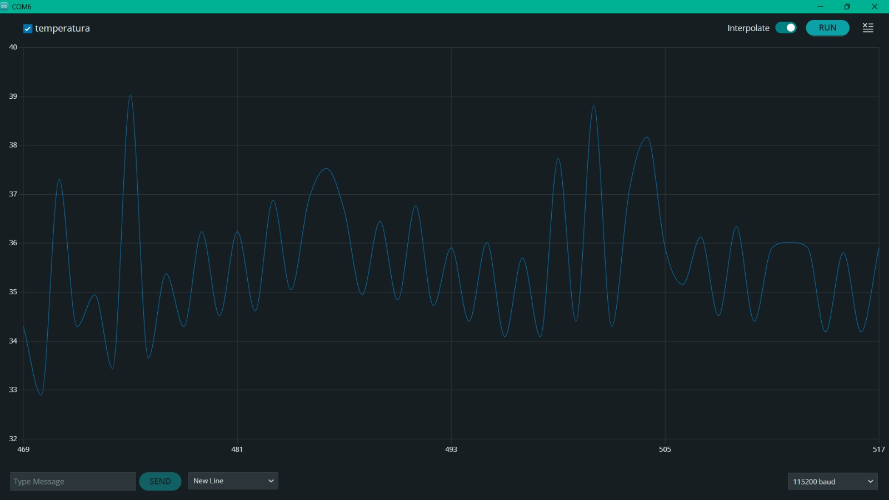
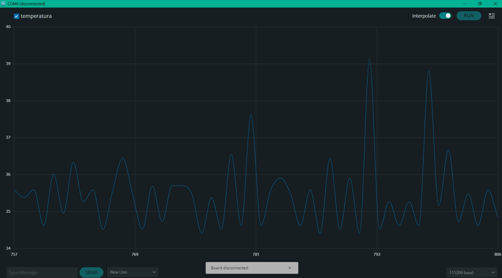
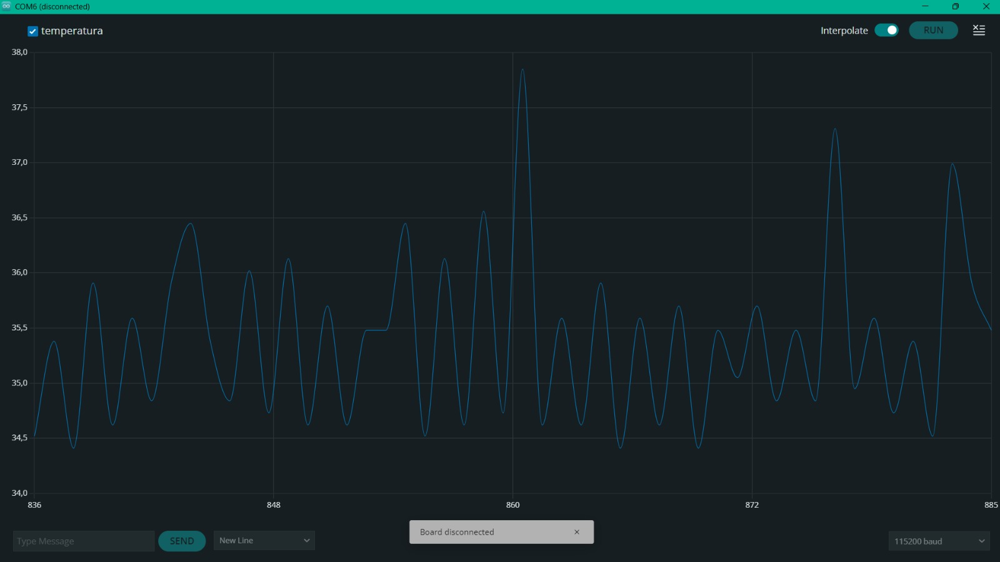

# Informe de Laboratorio — Sesión 7: Control Automático en Lazo Cerrado

---

**Universidad Nacional de Colombia**
**Electrónica Digital — 2016684 — 2026-1**
**Prof. Ricardo Amézquita Orozco**

---

| Campo | |
|-------|--|
| **Integrantes** | 1. Felipe Lizcano Quimbaya|
| | 2. Sergio Andres Poveda Perez|
| | 3. Sara Romero Chaves|
| | 4. Simon Gabriel Sandoval Palma|
| **Grupo** |3|
| **Fecha de la práctica** | Miércoles 08 de Abril, 2026 |
| **Fecha de entrega** | Viernes 25 de Abril, 2026 — 23:59 (Bloque 3: S7, S8, S9) |

---

## 1. Resultados

### Actividad 2 — Control ON/OFF

**Tabla 1 — Caracterización de la oscilación ON/OFF**

| Ciclo | T máxima (°C) | T mínima (°C) | Amplitud p-a-p (°C) | Período (s) |
|:-----:|:-------------:|:-------------:|:--------------------:|:-----------:|
| 1 |38.82 | 35.05| 3.77| 4|
| 2 |37.73 | 35.27| 2.46| 3|
| 3 |36.77| 35.05| 1.72| 4|

*Setpoint utilizado:* 35 °C

**Captura Act. 2:** Screenshot del Serial Plotter mostrando oscilación ON/OFF con al menos 3 ciclos completos visibles.


---

### Actividad 3 — Control Proporcional (P)

**Tabla 2 — Barrido de Kp (control P)**

*Setpoint utilizado:* 35 °C

| Kp | Error estacionario (°C) |
|:-----:|:-----------------------:|
|10 | 0.835|
|30| 0.373|
|100| 0.656|

*Error estacionario = promedio de |setpoint − temperatura| durante los últimos 60 s de la corrida.*

**Capturas Act. 3:** Al menos 3 screenshots del Serial Plotter, uno por cada valor de Kp, etiquetados con el valor correspondiente.


Kp=10


Kp=30


Kp=100

---

### Actividad 4 — Control Proporcional-Integral (PI)

**Tabla 3 — Barrido de Ki (Kp fijo del mejor valor de Actividad 3)**

*Kp utilizado:* 30
*Setpoint utilizado:* 35 °C

| Ki | Error residual (°C) |
|:-----:|:-------------------:|
| 0.1| 1.06|
| 0.01| 0.82|
| 0.005| 0.80|


*Error residual = promedio de |setpoint − temperatura| durante los últimos 60 s de la corrida.*

**Capturas Act. 4:**
- Screenshot mostrando wind-up (sin `constrain` sobre `errorSum`): se observa como un sobreimpulso severo seguido de una recuperación muy lenta o nula hacia el setpoint. El wind-up **no** es directamente visible en la curva de `errorSum` (que no se grafica); lo que se observa es el efecto en temperatura: la inercia acumulada en el integrador hace que el calentador siga a máxima potencia mucho después de haber cruzado el setpoint.
- Al menos 3 screenshots con diferentes valores de Ki (con `constrain` activo), etiquetados con Kp y Ki.


wind-up


Ki=0.1


Ki=0.01


Ki=0.005

---

### Actividad 5 — Consolidación

**Tabla 4 — Comparación de estrategias de control**

| Estrategia | Kp | Ki | Error estacionario (°C) | Oscilación (°C p-a-p) |
|:------------------|:-----:|:-----:|:------------------------:|:---------------------:|
| ON/OFF | N/A | N/A |1,448 | (ver Tabla 1) |
| P (mejor Kp) |30| 0 | 0.373| — |
| PI (mejor Kp/Ki) |30| 0.005| 0.80| — |

*Datos tomados de Tabla 1 (ON/OFF), Tabla 2 (P) y Tabla 3 (PI).*
*N/A: el control ON/OFF es un controlador no lineal (bang-bang); no tiene parámetros Kp ni Ki equivalentes a un PID.*
*— : en régimen permanente el control P y PI no presentan oscilación sostenida medible (a diferencia del ON/OFF).*

---

## 2. Análisis Visual

La comparación visual de las tres estrategias se realiza a partir de los screenshots del Serial Plotter ya requeridos en las Actividades 2, 3 y 4. No se requiere imagen adicional.

**Interpretación comparativa:**

> El protocolo ON/OFF reguló la cantidad de temperatura que emana el calefactor para lograr llegar al setpoint y luego no sobrepasarse; sin embargo, debido a la inercia térmica del sistema, alrededor del setpoint se produjó osilaciones con amplitud p-a-p de  varios grados generando un error estacionario de 1.448 °C. Luego, el controlador P permitió reducir como mínimo el error estacionario a 0,373 °C, pero al no tener un término integral que reduzca el factor de error que se encuentra entre el punto de estabilización y el setpoint, es imposible que logre reducir el error a cero. Finalmente, arrojó un error estacionario mínimo de 0.80 °C, a pesar de que se esperaba este fuera menor que el error obtenido con l protocolo P; sin embargo este comportamiento puede explicarse al ruido en los datos que se atribuye a las fallas con el montaje de calefacción lo que puede además haber creado sobrecorreciones aunque se estuviera aplicando el constrain (). 

---

## 3. Análisis

### Preguntas de Actividades

**Pregunta Act. 2:** ¿Por qué el sistema no puede estabilizarse exactamente en el setpoint con control ON/OFF, incluso si se elimina cualquier histéresis? Apoyar la respuesta con los datos de la Tabla 1.

> [El sistema no puede estabilizarse exactamente en el setpoint con control ON/OFF porque este tipo de control solo tiene dos estados posibles: encendido al máximo o apagado completo. Cuando la temperatura está por debajo del setpoint, el calefactor entrega toda la potencia; cuando la temperatura lo supera, el calefactor se apaga. Sin embargo, el bloque de aluminio y la resistencia tienen inercia térmica, por lo que el sistema sigue calentándose incluso después de apagar el calefactor. Esto provoca que la temperatura sobrepase el setpoint y luego empiece a descender hasta quedar nuevamente por debajo del valor deseado, repitiendo continuamente el ciclo de encendido y apagado. Los datos de la Tabla 1 muestran claramente este comportamiento oscilatorio. En el ciclo 1 la temperatura varió entre 35.05 °C y 38.82 °C, con una amplitud pico a pico de 3.77 °C. En el ciclo 2 la amplitud fue de 2.46 °C y en el ciclo 3 de 1.72 °C. Además, el período de oscilación se mantuvo entre 3 y 4 segundos, lo que indica que el sistema entra en un régimen periódico alrededor del setpoint en lugar de estabilizarse exactamente en él. Incluso si se elimina completamente la histéresis, el problema seguiría existiendo porque el controlador ON/OFF no puede aplicar una potencia intermedia. El actuador siempre entrega toda la potencia o ninguna, de modo que la temperatura inevitablemente sobrepasa el valor objetivo debido al retraso térmico del sistema. Por esta razón, el control ON/OFF siempre produce oscilaciones alrededor del setpoint y no una estabilización exacta.
]

---

**Pregunta Act. 3a:** ¿Por qué el controlador P no puede alcanzar exactamente el setpoint?

> [El controlador proporcional (P) no puede alcanzar exactamente el setpoint porque la salida del controlador depende directamente del error. A medida que la temperatura se acerca al setpoint, el error disminuye y, por lo tanto, también disminuye la potencia entregada al calefactor. Cuando el error llega a cero, la salida PWM también se vuelve cero, por lo que el sistema deja de suministrar energía térmica. Sin embargo, el bloque de aluminio sigue perdiendo calor hacia el ambiente, así que se necesita una cierta potencia constante para mantener estable la temperatura. Por esta razón, el sistema necesita conservar un pequeño error estacionario para que el controlador siga entregando potencia al calefactor.]

---

**Pregunta Act. 3b:** A partir de la Tabla 2, ¿qué tendencia observa entre el valor de Kp y el error estacionario medido? Justificar.

> [A partir de los datos de la Tabla 2 se observa que al aumentar el valor de Kp el error estacionario disminuye. Con Kp = 10 el error fue de 0.835 °C, con Kp = 30 disminuyó a 0.373 °C y con Kp = 100 volvio a incrementarse hasta 0.6564°C. Esto sucede porque un valor mayor de Kp hace que el controlador responda más fuertemente ante un mismo error, aumentando la potencia aplicada al calefactor y acercando más la temperatura al setpoint. Sin embargo, el error en el caso del Kp =100 se debe a que durante la practica no fue posible usar la resistencia calefactora por lo que se uso el disipador del L298N lo cual podria explicar este resultado.]

---

**Pregunta Act. 4:** ¿Qué efecto tiene doblar Ki sobre la velocidad de corrección del error estacionario y sobre el riesgo de wind-up? A medida que Ki aumenta, ¿observó algún deterioro en el comportamiento (mayor sobreimpulso, oscilaciones, tiempo de estabilización más largo)? Describir con referencia a los datos de la Tabla 3 y las capturas.

> [Al doblar el valor de $K_i$, el término integral acumula el error más rápidamente, por lo que el controlador corrige el error estacionario en menos tiempo. Esto se observa en la Tabla 3: al pasar de $K_i$ = 0.1 a $K_i$ = 0.01 y luego a $K_i$ =0.005, el error residual disminuye de 1.06 °C a 0.82 °C y finalmente a 0.80 °C. Esto indica que la acción integral efectivamente ayuda a reducir la diferencia entre la temperatura y el setpoint de 35 °C. Sin embargo, la mejora deja de ser tan significativa cuando $K_i$ sigue cambiando, lo que sugiere que existe un límite práctico donde aumentar demasiado la acción integral ya no produce grandes beneficios.El problema es que un $K_i$ más alto también incrementa el riesgo de wind-up. Como el término integral acumula continuamente el error, si el actuador permanece saturado durante mucho tiempo, la variable errorSum puede crecer excesivamente. En el sistema térmico esto se refleja en un sobreimpulso mayor, es decir, la temperatura supera el setpoint antes de estabilizarse. En las capturas del Serial Plotter se observa que, para valores altos de $K_i$, la respuesta se vuelve más agresiva: la temperatura sube más rápido pero también aparecen oscilaciones más pronunciadas y un tiempo de estabilización más largo.En particular, al aumentar $K_i$ se observó un deterioro progresivo del comportamiento dinámico. Aunque el error estacionario disminuyó, el sistema presentó mayor tendencia al sobreimpulso y a pequeñas oscilaciones alrededor del setpoint. Esto es consistente con la teoría del control PI: una acción integral demasiado fuerte elimina el error residual más rápido, pero reduce el amortiguamiento del sistema. Por eso, existe un compromiso entre precisión y estabilidad. En este montaje, los valores pequeños de $K_i$ produjeron respuestas más suaves y estables, mientras que valores mayores aceleraron la corrección pero acercaron al sistema a condiciones de inestabilidad y wind-up.]

---

### Preguntas de Análisis Transversal

**Pregunta T1:** A partir de la Tabla 4, comparar el error estacionario del mejor controlador P con el del mejor controlador PI. ¿Por qué el controlador PI puede reducir este error a valores cercanos a cero mientras que el P no puede? Justificar con referencia a las ecuaciones de ambos controladores.

> A pesar que al realizar la práctica del controlador PI no se obtuvo errores menores pues no se pudo usar un valor de Ki menor a 0.005, este controlador debería arrojar un error menor pues su ecuación incluye un término de sumatoria que funciona como una integral. De manera que puede superar la pequeña franja de error que se encuentra al usarel controlador P, pues sumará el error a lo largo del tiempo mandando así una potencia adicional cada vez que no se cumpla con el valor esperado. 
---

**Pregunta T2:** ¿Qué diferencia observó entre el comportamiento del sistema al aumentar Kp en el control P (Actividad 3) y al aumentar Ki en el control PI (Actividad 4)? ¿En qué condiciones podría ser preferible usar solo control P en lugar de PI?

> En general, al aumentar Kp se observaron menores valores en el error estacionario, pues la franja anteriormente mencionada se reduce. Por otro lado, el Ki es más delicado de ajustar, dependiendo de el valor inicial puede aumentar o disminuir el error estacionario. Es necesarios tener en cuenta que cambia dependiendo del Kp usado, pues el término integral empieza a acumulcar error en el momento que se estanca alrededor del valor mínimo de error que puede alcanzar el controlador P. En el caso de esta práctica, el barrido Ki se empezó en 0.1, sin embargo, a partir de ahí, se disminuyó el valor de Ki tanto como se pudo; esto pues al intentar aumentar, como se sugería en la guía, se evidenció un comportamiento errático en el sketch y errores cada vez mayores (señalando un posible wind-up, a pesar de usar la funcion constrain()).

---

## 4. Código Documentado

Incluir únicamente las secciones del código que el grupo implementó o modificó durante la sesión. Comentar cada bloque funcional explicando la lógica.

### Actividad 2 — Parser serial y control ON/OFF

```cpp
// 
========================================================
LAB 07 — ACTIVIDAD 2
CONTROL ON/OFF DE TEMPERATURA
Universidad Nacional de Colombia
========================================================
// Librería para comunicación I2C
#include <Wire.h>
// Librería gráfica base del OLED
#include <Adafruit_GFX.h>
// Librería específica para pantallas SSD1306
#include <Adafruit_SSD1306.h>

// ---------- CONFIGURACIÓN DEL OLED ----------

// Resolución horizontal del OLED
#define SCREEN_WIDTH 128
// Resolución vertical del OLED
#define SCREEN_HEIGHT 32
// Creación del objeto display OLED
Adafruit_SSD1306 display(
  SCREEN_WIDTH,
  SCREEN_HEIGHT,
  &Wire,
  -1
);

// ---------- DEFINICIÓN DE PINES ----------

// Pin analógico conectado al LM35
const int PIN_LM35 = A3;
// Pines del módulo L298N
const int PIN_IN1 = 7;
const int PIN_IN2 = 8;
const int PIN_ENA = 9;

// LED integrado del Arduino
const int LED_PIN = 13;

// ---------- VARIABLES GLOBALES ----------

// PWM máximo permitido
const int PWM_MAXIMO = 255;
// Variable donde se almacena la temperatura medida
float temperatura = 0.0;
// Temperatura objetivo definida por el usuario
float setpoint = 0.0;
// Buffer para almacenar caracteres recibidos por serial
String bufferSerial = "";

// ---------- VARIABLES DE TIEMPO ----------

// Guarda el instante del último ciclo ejecutado
unsigned long tiempoAnterior = 0;
// Intervalo entre mediciones (500 ms)
const unsigned long intervalo = 500;

// ---------- FUNCIÓN DE CONFIGURACIÓN ----------

void setup() {

  // Inicia comunicación serial a 115200 baudios
  Serial.begin(115200);
  // Usa referencia ADC interna de 1.1V
  analogReference(INTERNAL);
  // Configuracion de pines del L298N como salidas
  pinMode(PIN_IN1, OUTPUT);
  pinMode(PIN_IN2, OUTPUT);
  pinMode(PIN_ENA, OUTPUT);
  // Define dirección fija del calefactor
  digitalWrite(PIN_IN1, LOW);
  digitalWrite(PIN_IN2, HIGH);
  // Inicia calefactor apagado
  analogWrite(PIN_ENA, 0);
  // Configura LED watchdog como salida
  pinMode(LED_PIN, OUTPUT);
  // Inicializa el OLED
  if (!display.begin(SSD1306_SWITCHCAPVCC, 0x3C)) {

    // Si falla el OLED se detiene el programa
    while (true);
  }

  // Limpia el display
  display.clearDisplay();
  // Actualiza físicamente el OLED
  display.display();

  // Mensajes iniciales en monitor serial
  Serial.println("====================================");
  Serial.println(" LAB 07 - CONTROL ON/OFF ");
  Serial.println("====================================");
  Serial.println();

  // Instrucción para enviar comando
  Serial.println("Enviar comando:");
  Serial.println("SET xx");
  Serial.println();
}

// ---------- BUCLE PRINCIPAL ----------

void loop() {

  // ====================================================
  // PARSER SERIAL NO BLOQUEANTE
  // ====================================================

  // Revisa constantemente si llegaron datos seriales
  while (Serial.available()) {
    // Lee un carácter recibido
    char c = Serial.read();
    // Si llega ENTER el comando terminó
    if (c == '\n') {
      // Procesa el comando completo
      procesarComando(bufferSerial);
      // Limpia el buffer
      bufferSerial = "";
    } else {
      // Si aún no llega ENTER se siguen acumulando caracteres
      bufferSerial += c;
    }
  }

  // ====================================================
  // CONTROL TEMPORAL CON millis()
  // ====================================================

  // Obtiene el tiempo actual en milisegundos
  unsigned long tiempoActual = millis();
  // Verifica si ya pasaron 500 ms
  if ((tiempoActual - tiempoAnterior) >= intervalo) {
    // Actualiza la referencia temporal
    tiempoAnterior = tiempoActual;

    // ----- LECTURA DEL LM35 -----

    // Lee el valor ADC del sensor
    int raw = analogRead(PIN_LM35);
    // Convierte el valor ADC a temperatura
    temperatura = raw * 110.0 / 1023.0;

    // ----- CONTROL ON/OFF -----

    // Calcula el error del sistema
    float error = setpoint - temperatura;
    // Si la temperatura es menor al setpoint
    if (error > 0) {
      // Enciende el calefactor al máximo PWM
      analogWrite(PIN_ENA, PWM_MAXIMO);
    } else {
      // Si alcanzó el setpoint se apaga el calefactor
      analogWrite(PIN_ENA, 0);
    }

    // ----- ENVÍO AL SERIAL PLOTTER -----

    // Envía temperatura en formato compatible con Serial Plotter
    Serial.print("temperatura:");
    Serial.println(temperatura);

    // ----- ACTUALIZACIÓN DEL OLED -----
    // Limpia la pantalla
    display.clearDisplay();
    // Configura tamaño del texto
    display.setTextSize(1);
    // Configura color del texto
    display.setTextColor(SSD1306_WHITE);

    // ----- MOSTRAR TEMPERATURA -----

    // Posiciona cursor
    display.setCursor(0, 0);
    // Muestra temperatura actual
    display.print("Temp: ");
    display.print(temperatura, 1);
    display.println(" C");

    // ----- MOSTRAR SETPOINT -----

    // Posiciona cursor
    display.setCursor(0, 12);
    // Muestra setpoint actual
    display.print("SET: ");
    display.print(setpoint, 1);
    display.println(" C");

    // ----- MOSTRAR ESTADO DEL CALEFACTOR -----

    // Posiciona cursor
    display.setCursor(0, 24);
    // Si el error es positivo el calefactor está encendido
    if (error > 0) {
      display.print("Heater: ON");
    } else {
      // Si no, el calefactor está apagado
      display.print("Heater: OFF");
    }
    // Actualiza físicamente el OLED
    display.display();

    // ----- LED WATCHDOG -----

    // Cambia el estado del LED D13 cada ciclo
    digitalWrite(
      LED_PIN,
      !digitalRead(LED_PIN)
    );
  }
}

// ---------- FUNCIÓN PARA PROCESAR COMANDOS ----------

void procesarComando(String linea) {

  // Elimina espacios extra
  linea.trim();
  // Verifica si el comando comienza con "SET"
  if (linea.startsWith("SET")) {
    // Extrae el valor numérico del comando
    setpoint = linea.substring(4).toFloat();
    // Limita el setpoint entre 0 °C y 50 °C
    setpoint = constrain(
      setpoint,
      0.0,
      50.0
    );
    // Muestra confirmación en monitor serial
    Serial.print("Nuevo setpoint: ");
    Serial.println(setpoint);
  }
  // Si el comando no es válido
  else {
    // Muestra mensaje de error
    Serial.println("Comando invalido");
  }
}
```

### Actividad 3 — Implementación del controlador P

```cpp

========================================================
LAB 07 - ACTIVIDAD 3
CONTROL PROPORCIONAL (P)
Universidad Nacional de Colombia
========================================================
//Funcionamiento:
//1. El LM35 mide la temperatura
//2. El usuario define:
      - Setpoint
      - Ganancia proporcional Kp
//3. El sistema calcula el error:
      error = setpoint - temperatura
//4. La salida PWM se calcula como:
      salidaPWM = Kp * error
//5. Mientras mayor sea el error,
   mayor será la potencia aplicada

=======================================================

// ---------- LIBRERÍAS ----------

// Librería para comunicación I2C
#include <Wire.h>
// Librería gráfica base del OLED
#include <Adafruit_GFX.h>
// Librería específica para pantallas SSD1306
#include <Adafruit_SSD1306.h>

// ---------- CONFIGURACIÓN DEL OLED ----------
// Resolución horizontal del OLED
#define SCREEN_WIDTH 128
// Resolución vertical del OLED
#define SCREEN_HEIGHT 32
// Creación del objeto display OLED
Adafruit_SSD1306 display(
  SCREEN_WIDTH,
  SCREEN_HEIGHT,
  &Wire,
  -1
);

// ---------- DEFINICIÓN DE PINES ----------

// Pin analógico conectado al LM35
const int PIN_LM35 = A3;
// Pines del módulo L298N
const int PIN_IN1 = 7;
const int PIN_IN2 = 8;
const int PIN_ENA = 9;
// LED integrado del Arduino
const int LED_PIN = 13;

// ---------- VARIABLES DE CONTROL ----------
// PWM máximo permitido
const int PWM_MAXIMO = 255;
// Variable donde se almacena la temperatura
float temperatura = 0.0;
// Temperatura objetivo
float setpoint = 0.0;

// ----- CONTROL P -----
// Ganancia proporcional
float Kp = 0.0;
// Variable donde se almacena la salida PWM
float salidaPWM = 0.0;

// ---------- VARIABLES SERIAL ----------
// Buffer para almacenar caracteres seriales
String bufferSerial = "";

// ---------- VARIABLES DE TIEMPO ----------
// Intervalo entre ciclos de control
const unsigned long intervalo = 2000;
// Guarda el instante del último ciclo
unsigned long tiempoAnterior = 0;

// ---------- FUNCIÓN DE CONFIGURACIÓN ----------
void setup() {
  // Inicia comunicación serial a 115200 baudios
  Serial.begin(115200);
  // Usa referencia ADC interna de 1.1V
  analogReference(INTERNAL);

  // ----- CONFIGURACIÓN DEL L298N -----
  // Configura pines como salida
  pinMode(PIN_IN1, OUTPUT);
  pinMode(PIN_IN2, OUTPUT);
  pinMode(PIN_ENA, OUTPUT);
  // Dirección fija del calefactor
  digitalWrite(PIN_IN1, LOW);
  digitalWrite(PIN_IN2, HIGH);
  // Inicia calefactor apagado
  analogWrite(PIN_ENA, 0);

  // ----- CONFIGURACIÓN DEL LED -----

  // Configura LED watchdog como salida
  pinMode(LED_PIN, OUTPUT);
  // ----- INICIALIZACIÓN DEL OLED -----
  // Inicializa el display OLED
  if (!display.begin(SSD1306_SWITCHCAPVCC, 0x3C)) {
    // Si falla el OLED se detiene el programa
    while (true);
  }
  // Limpia la pantalla
  display.clearDisplay();
  // Actualiza físicamente el OLED
  display.display();

  // ----- MENSAJES INICIALES -----
  Serial.println("=================================");
  Serial.println(" LAB 07 - CONTROL PROPORCIONAL ");
  Serial.println("=================================");
  Serial.println();
  // Muestra comandos disponibles
  Serial.println("Comandos:");
  Serial.println("SET xx");
  Serial.println("KP xx");
}

// ---------- BUCLE PRINCIPAL ----------

void loop() {

  // ====================================================
  // PARSER SERIAL NO BLOQUEANTE
  // ====================================================

  // Revisa continuamente si llegaron datos seriales
  while (Serial.available()) {
    // Lee un carácter del puerto serial
    char c = Serial.read();
    // Si llega ENTER el comando terminó
    if (c == '\n' || c == '\r') {
      // Verifica que el buffer no esté vacío
      if (bufferSerial.length() > 0) {
        // Procesa el comando recibido
        procesarComando(bufferSerial);
        // Limpia el buffer
        bufferSerial = "";
      }

    } else {
      // Si aún no llega ENTER se siguen acumulando caracteres
      bufferSerial += c;
    }
  }

  // ====================================================
  // CICLO DE CONTROL
  // ====================================================

  // Obtiene el tiempo actual
  unsigned long tiempoActual = millis();
  // Verifica si ya pasó el intervalo definido
  if (tiempoActual - tiempoAnterior >= intervalo) {
    // Actualiza referencia temporal
    tiempoAnterior = tiempoActual;

    // ==================================================
    // LECTURA DEL LM35
    // ==================================================

    // Lee el valor ADC del sensor
    int raw = analogRead(PIN_LM35);
    // Convierte el valor ADC a temperatura
    temperatura = raw * 110.0 / 1023.0;

    // ==================================================
    // CONTROL PROPORCIONAL (P)
    // ==================================================

    // Calcula el error del sistema
    float error = setpoint - temperatura;
    /*
      Control proporcional:
      salidaPWM = Kp * error
      Mientras más grande sea el error,
      mayor será la potencia aplicada.
    */
    salidaPWM = Kp * error;
    // Limita el PWM entre 0 y 255
    salidaPWM = constrain(
      salidaPWM,
      0,
      PWM_MAXIMO
    );
    // Aplica la salida PWM al calefactor
    analogWrite(
      PIN_ENA,
      (int)salidaPWM
    );

    // ==================================================
    // SERIAL PLOTTER
    // ==================================================

    // Envía temperatura al Serial Plotter
    Serial.print("temperatura:");
    Serial.println(temperatura);

    // ==================================================
    // ACTUALIZACIÓN DEL OLED
    // ==================================================

    // Limpia la pantalla
    display.clearDisplay();
    // Configuración del texto
    display.setTextSize(1);
    display.setTextColor(SSD1306_WHITE);

    // ----- TEMPERATURA -----

    // Posiciona cursor
    display.setCursor(0, 0);
    // Muestra temperatura actual
    display.print("Temp:");
    display.print(temperatura, 1);

    // ----- SETPOINT -----
    // Posiciona cursor
    display.setCursor(0, 10);
    // Muestra setpoint
    display.print("SET:");
    display.print(setpoint, 1);

    // ----- Kp -----
    // Posiciona cursor
    display.setCursor(0, 20);
    // Muestra valor de Kp
    display.print("Kp:");
    display.print(Kp, 1);

    // ----- PWM -----

    // Posiciona cursor
    display.setCursor(70, 20);
    // Muestra PWM aplicado
    display.print("PWM:");
    display.print((int)salidaPWM);
    // Actualiza físicamente el OLED
    display.display();

    // ==================================================
    // LED WATCHDOG
    // ==================================================

    // Cambia el estado del LED D13 cada ciclo
    digitalWrite(
      LED_PIN,
      !digitalRead(LED_PIN)
    );
  }
}

// ---------- FUNCIÓN PARA PROCESAR COMANDOS ----------
void procesarComando(String linea) {
  // Elimina espacios extra
  linea.trim();

  // ====================================================
  // COMANDO SET
  // ====================================================

  // Verifica si el comando comienza con "SET"
  if (linea.startsWith("SET")) {
    // Extrae el valor numérico
    setpoint = constrain(
      linea.substring(4).toFloat(),
      0.0,
      50.0
    );
    // Muestra confirmación
    Serial.print("Nuevo setpoint: ");
    Serial.println(setpoint);
  }

  // ====================================================
  // COMANDO KP
  // ====================================================

  // Verifica si el comando comienza con "KP"
  else if (linea.startsWith("KP")) {
    // Extrae el valor de Kp
    Kp = linea.substring(3).toFloat();
    // Muestra confirmación
    Serial.print("Nuevo Kp: ");
    Serial.println(Kp);
  }

  // ====================================================
  // COMANDO INVÁLIDO
  // ====================================================

  else {
    // Muestra mensaje de error
    Serial.println("Comando invalido");
  }
}
```

### Actividad 4 — Implementación del controlador PI

```cpp

// ========================================================
// LAB 07 - ACTIVIDAD 4
// CONTROL PI
// Universidad Nacional de Colombia
//========================================================

// 1. El LM35 mide la temperatura
// 2. El usuario define:
      - Setpoint
      - Ganancia proporcional Kp
      - Ganancia integral Ki
// 3. El sistema calcula el error:
      error = setpoint - temperatura
// 4. El controlador PI calcula:
      salidaPWM = Kp * error + Ki * error acumulado
// 5. El término integral ayuda a eliminar el error estacionario

========================================================

// ---------- LIBRERÍAS ----------
// Librería para comunicación I2C
#include <Wire.h>
// Librería gráfica base del OLED
#include <Adafruit_GFX.h>
// Librería específica para pantallas SSD1306
#include <Adafruit_SSD1306.h>

// ---------- CONFIGURACIÓN DEL OLED ----------
// Resolución horizontal del OLED
#define SCREEN_WIDTH 128
// Resolución vertical del OLED
#define SCREEN_HEIGHT 32
// Creación del objeto display OLED
Adafruit_SSD1306 display(
  SCREEN_WIDTH,
  SCREEN_HEIGHT,
  &Wire,
  -1
);

// ---------- DEFINICIÓN DE PINES ----------

// Pin analógico conectado al LM35
const int PIN_LM35 = A3;
// Pines del módulo L298N
const int PIN_IN1 = 7;
const int PIN_IN2 = 8;
const int PIN_ENA = 9;
// LED integrado del Arduino
const int LED_PIN = 13;

// ---------- VARIABLES DE CONTROL ----------

// PWM máximo permitido
const int PWM_MAXIMO = 255;
// Variable donde se almacena la temperatura medida
float temperatura = 0.0;
// Temperatura objetivo definida por el usuario
float setpoint = 0.0;

// ---------- VARIABLES DEL CONTROL PI ----------

// Ganancia proporcional
float Kp = 0.0;
// Ganancia integral
float Ki = 0.0;
// Error actual del sistema
float error = 0.0;
// Acumulador del error integral
float errorSum = 0.0;
// Variable donde se almacena la salida PWM
float salidaPWM = 0.0;
// Tiempo de muestreo en segundos
float dt = 2.0;

// ---------- VARIABLES SERIAL ----------

// Buffer para almacenar caracteres seriales
String bufferSerial = "";

// ---------- VARIABLES DE TIEMPO ----------

// Intervalo entre ciclos de control
const unsigned long intervalo = 2000;
// Guarda el instante del último ciclo
unsigned long tiempoAnterior = 0;

// ---------- FUNCIÓN DE CONFIGURACIÓN ----------

void setup() {
  // Inicia comunicación serial a 115200 baudios
  Serial.begin(115200);
  // Usa referencia ADC interna de 1.1V
  analogReference(INTERNAL);

  // ----- CONFIGURACIÓN DEL L298N -----

  // Configura pines del puente H como salidas
  pinMode(PIN_IN1, OUTPUT);
  pinMode(PIN_IN2, OUTPUT);
  pinMode(PIN_ENA, OUTPUT);
  // Define dirección fija del calefactor
  digitalWrite(PIN_IN1, LOW);
  digitalWrite(PIN_IN2, HIGH);
  // Inicia calefactor apagado
  analogWrite(PIN_ENA, 0);

  // ----- CONFIGURACIÓN DEL LED -----

  // Configura LED watchdog como salida
  pinMode(LED_PIN, OUTPUT);

  // ----- INICIALIZACIÓN DEL OLED -----

  // Inicializa el display OLED
  if (!display.begin(SSD1306_SWITCHCAPVCC, 0x3C)) {
    // Si falla el OLED se detiene el programa
    while (true);
  }
  // Limpia el display
  display.clearDisplay();
  // Actualiza físicamente el OLED
  display.display();

  // ----- MENSAJES INICIALES -----

  Serial.println("=================================");
  Serial.println(" LAB 07 - CONTROL PI ");
  Serial.println("=================================");
  Serial.println();

  // Muestra comandos disponibles
  Serial.println("Comandos:");
  Serial.println("SET xx");
  Serial.println("KP xx");
  Serial.println("KI xx");
}

// ---------- BUCLE PRINCIPAL ----------

void loop() {
  // ====================================================
  // PARSER SERIAL NO BLOQUEANTE
  // ====================================================
  // Revisa continuamente si llegaron datos seriales
  while (Serial.available()) {
    // Lee un carácter recibido
    char c = Serial.read();
    // Si llega ENTER el comando terminó
    if (c == '\n' || c == '\r') {
      // Verifica que el buffer no esté vacío
      if (bufferSerial.length() > 0) {
        // Procesa el comando recibido
        procesarComando(bufferSerial);
        // Limpia el buffer
        bufferSerial = "";
      }
    } else {
      // Si aún no llega ENTER se siguen acumulando caracteres
      bufferSerial += c;
    }
  }

  // ====================================================
  // CICLO DE CONTROL
  // ====================================================

  // Obtiene el tiempo actual en milisegundos
  unsigned long tiempoActual = millis();
  // Verifica si ya transcurrió el intervalo definido
  if (tiempoActual - tiempoAnterior >= intervalo) {
    // Actualiza referencia temporal
    tiempoAnterior = tiempoActual;

    // ==================================================
    // LECTURA DEL LM35
    // ==================================================

    // Lee el valor ADC del sensor
    int raw = analogRead(PIN_LM35);
    // Convierte el valor ADC a temperatura
    temperatura = raw * 110.0 / 1023.0;

    // ==================================================
    // CÁLCULO DEL ERROR
    // ==================================================

    // Calcula el error del sistema
    error = setpoint - temperatura;

    // ==================================================
    // TÉRMINO INTEGRAL
    // ==================================================

    /*
      Acumula el error en el tiempo.

      errorSum representa:

      ∫ error dt
    */
    errorSum += error * dt;

    // ==================================================
    // ANTI WIND-UP
    // ==================================================

    /*
      Evita crecimiento excesivo del término integral.
      Si errorSum crece demasiado, el controlador puede saturarse y responder lentamente.
      constrain() limita el valor máximo, permitido para errorSum.
    */
    if (Ki > 0) {
      errorSum = constrain(
        errorSum,
        -PWM_MAXIMO / Ki,
        PWM_MAXIMO / Ki
      );
    }

    // ==================================================
    // CONTROL PI
    // ==================================================

    /*
      Ecuación del controlador PI:
      salidaPWM =  Kp * error +  Ki * errorSum
    */
    salidaPWM =
      Kp * error
      +
      Ki * errorSum;
    // Limita el PWM entre 0 y 255
    salidaPWM = constrain(
      salidaPWM,
      0,
      PWM_MAXIMO
    )
    // Aplica PWM al calefactor
    analogWrite(
      PIN_ENA,
      (int)salidaPWM
    );

    // ==================================================
    // SERIAL PLOTTER
    // ==================================================

    // Envía temperatura al Serial Plotter
    Serial.print("temperatura:");
    Serial.println(temperatura);

    // ==================================================
    // ACTUALIZACIÓN DEL OLED
    // ==================================================

    // Limpia la pantalla
    display.clearDisplay();
    // Configura tamaño del texto
    display.setTextSize(1);
    // Configura color del texto
    display.setTextColor(SSD1306_WHITE);

    // ----- TEMPERATURA -----

    // Posiciona cursor
    display.setCursor(0, 0);
    // Muestra temperatura actual
    display.print("T:");
    display.print(temperatura, 1);

    // ----- SETPOINT -----

    // Posiciona cursor
    display.setCursor(64, 0);
    // Muestra setpoint
    display.print("S:");
    display.print(setpoint, 1);

    // ----- KP -----

    // Posiciona cursor
    display.setCursor(0, 12);
    // Muestra Kp
    display.print("Kp:");
    display.print(Kp, 1);

    // ----- KI -----

    // Posiciona cursor
    display.setCursor(64, 12);
    // Muestra Ki
    display.print("Ki:");
    display.print(Ki, 2);

    // ----- PWM -----

    // Posiciona cursor
    display.setCursor(0, 24);
    // Muestra PWM aplicado
    display.print("PWM:");
    display.print((int)salidaPWM);
    // Actualiza físicamente el OLED
    display.display();

    // ==================================================
    // LED WATCHDOG
    // ==================================================

    // Cambia el estado del LED D13 cada ciclo
    digitalWrite(
      LED_PIN,
      !digitalRead(LED_PIN)
    );
  }
}

// ---------- FUNCIÓN PARA PROCESAR COMANDOS ----------

void procesarComando(String linea) {
  // Elimina espacios extra
  linea.trim();

  // ====================================================
  // COMANDO SET
  // ====================================================

  // Verifica si el comando comienza con "SET"
  if (linea.startsWith("SET")) {
    // Extrae el valor del setpoint
    setpoint = constrain(
      linea.substring(4).toFloat(),
      0.0,
      50.0
    );
    // Muestra confirmación
    Serial.print("Nuevo setpoint: ");
    Serial.println(setpoint);
  }

  // ====================================================
  // COMANDO KP
  // ====================================================

  // Verifica si el comando comienza con "KP"
  else if (linea.startsWith("KP")) {
    // Extrae el valor de Kp
    Kp = linea.substring(3).toFloat();
    // Muestra confirmación
    Serial.print("Nuevo Kp: ");
    Serial.println(Kp);
  }

  // ====================================================
  // COMANDO KI
  // ====================================================

  // Verifica si el comando comienza con "KI"
  else if (linea.startsWith("KI")) {
    // Extrae el valor de Ki
    Ki = linea.substring(3).toFloat();
    // Muestra confirmación
    Serial.print("Nuevo Ki: ");
    Serial.println(Ki);
  }

  // ====================================================
  // COMANDO INVÁLIDO
  // ====================================================

  else {
    // Muestra mensaje de error
    Serial.println("Comando invalido");
  }
}
```

---

## 5. Dificultades Encontradas y Soluciones Aplicadas

### Dificultad 1: La resistencia calefactora no funcionó correctamente, lo que impidió una realización normal de las actividades. 

- **Síntoma observado:** Durante la realización de la actividad 1, no se evidenció el calentamiento esperado de la resistencia auqnue estuviera entrando voltaje en el L298N. 
- **Causa identificada:**Al medir el valor de la resistencia con el multímetro, se encontró que el valor era de aproximadamente 1Ω.
- **Solución aplicada:**Se decidió usar el disipador del L298N, que sí se calentaba al aplicar el voltaje, como la calefacción del sistema. Esto permitió continuar con las actividades aunque con un comportamiento térmico diferente al esperado.
- **Lección aprendida:** Es importante verificar el estado de los componentes antes de iniciar la práctica para evitar contratiempos. Además, es fundamental ser creativos y adaptarse a las circunstancias imprevistas.

### Dificultad 2 *(si aplica)*: No se logró un error estacionario menor con el controlador PI, a pesar de ajustar el Ki.

- **Síntoma observado:** A pesar de probar varios valores de Ki, inclusive el dígito más bajo permitido por el serial plotter, el error estacionario no logró ser menor que el mejor error obtenido con el controlador P
- **Causa identificada:** Se cree que es causado por el ruido de los datos, que se atribuye a la falta de un buen montaje de calefacción. A su vez, es posible que se presentara inercia térmica acumulada en el integrador (wind-up) a pesar de usar la función `constrain()`, lo que podría haber generado sobrecorrecciones y dificultado la reducción del error estacionario.
- **Solución aplicada:** Se intentó ajustar al valor de Ki lo más bajo posible y a pesar de haber obtenido mejores valores que con el Ki más alto, no se logró acercarse al 0.
- **Lección aprendida:** El ajuste de un controlador PI puede ser más delicado que el de un controlador P, especialmente en sistemas con ruido o inestabilidad. Es importante considerar la interacción entre Kp y Ki, y estar atentos a posibles efectos de wind-up incluso cuando se implementan medidas para mitigarlo.

---

## 6. Pregunta Abierta

> Esta sesión no incluye pregunta abierta. Este espacio se reserva para mantener la estructura estándar del informe.
