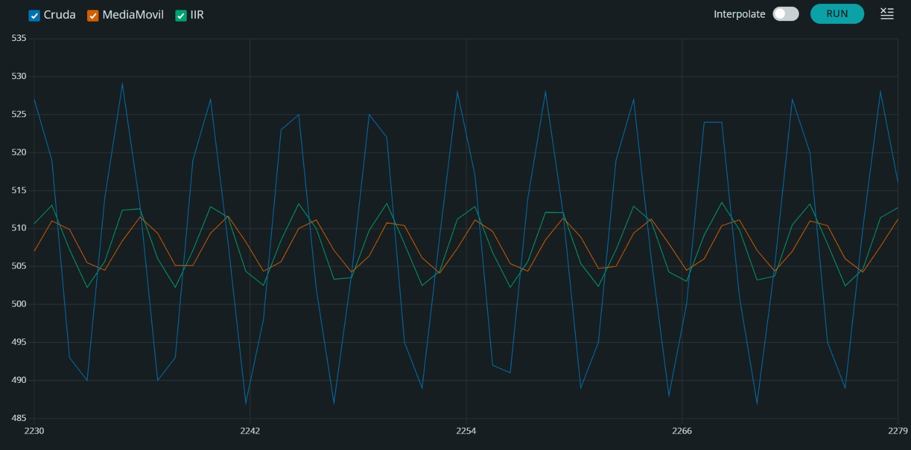
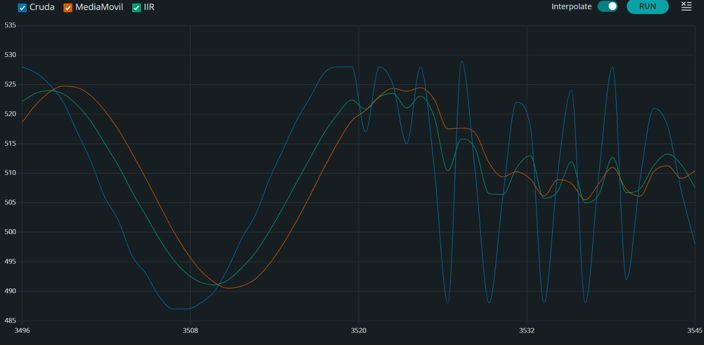
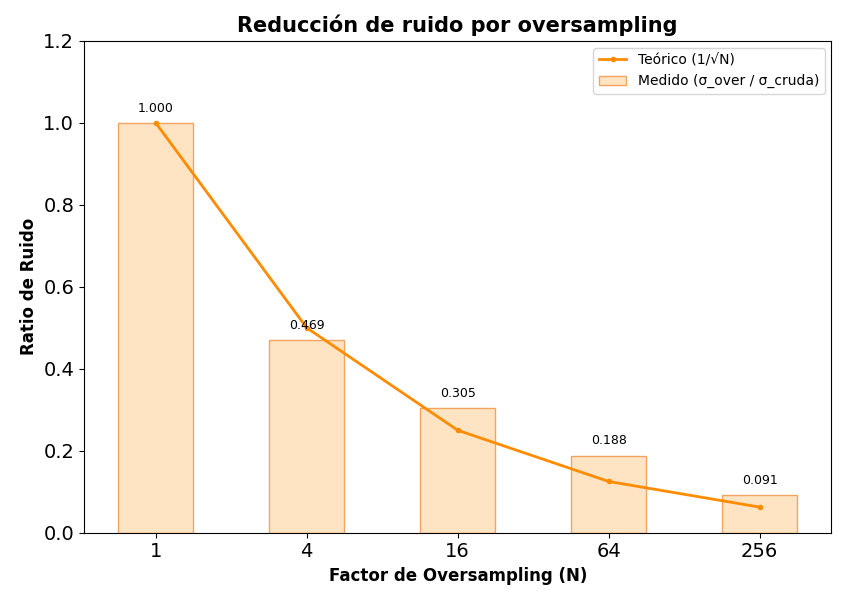

# Informe de Laboratorio — Sesión 8: Procesamiento de Señales para Mediciones

---

**Universidad Nacional de Colombia**
**Electrónica Digital — 2016684 — 2026-1**
**Prof. Ricardo Amézquita Orozco**

---

| Campo | |
|-------|--|
| **Integrantes** | 1.Felipe Lizcano Quimbaya |
| | 2. Sergio Andres Poveda Perez|
| | 3.Sara Romero Chaves |
| | 4. Simon Sandoval Palma |
| **Grupo** |3|
| **Fecha de la práctica** |20 de mayo  |
| **Fecha de entrega** | Viernes 25 de Abril, 2026 — 23:59 (Informe Bloque 3) |

---

## 1. Resultados

### Actividad 1 — Filtrado Digital: Media Móvil y Filtro IIR

**Tabla 1A — Media móvil: efecto de N (f = 5 Hz)**

| N | Amplitud p-p cruda | Amplitud p-p (MM) | Atenuación (p-p_MM / p-p_cruda) |
|:--:|:------------------:|:-----------------:|:-------------------------------:|
| 4 |40| 19.75| 0.494|
| 8 | 39| 5.25|0.135 |
| 16 | 40| 5.19| 0.130|

*f_s ≈ 50 Hz. El retardo teórico de la media móvil es (N−1)/2 muestras; para N = 16 (~7.5 muestras, 150 ms) debería apreciarse visualmente en el Serial Plotter.*

**Tabla 1B — Media móvil: efecto de la frecuencia (N = 8)**

| f (Hz) | Amplitud p-p cruda | Amplitud p-p (MM) | Atenuación | f / f_c |
|:------:|:------------------:|:-----------------:|:----------:|:-------:|
| 1.0 |41 | 37| 0.902| 0.361|
| 2.5 | 41| 20.38| 0.500 | 0.920|
| 5.0 |40 | 6.5| 0.163| 1.805|
| 7.5 | 40| 3.88| 0.097| 2.708|
| 10.0 | 38| 5.63| 0.148| 3.610|

*N = 8 | f_s ≈ 50 Hz | f_c ≈ 2.77 Hz.*

**Tabla 1C — Comparación IIR vs. Media Móvil (α = 0.29, f_c ≈ 2.75 Hz)**

| f (Hz) | Amplitud p-p (IIR) | Atenuación IIR | Atenuación MM (de Tabla 1B) |
|:------:|:------------------:|:--------------:|:---------------------------:|
| 1.0 | 32.71|0.798 | 0.902|
| 2.5 | 18.93|0.473 | 0.500|
| 5.0 | 10.48|0.262 | 0.163|
| 7.5 | 7.72|0.203 | 0.097|
| 10.0 | 6.71|0.172 | 0.148|

*α = 0.29 | f_s ≈ 50 Hz | f_c ≈ 2.75 Hz (fórmula exacta).*

---

### Actividad 2 — Oversampling del LM35

**Tabla 2A — Efecto de N sobre la reducción de ruido**

| N | √N | 1/√N (teórico) | σ_over / σ_cruda (medido) |
|:--:|:--:|:--------------:|:-------------------------:|
| 1 | 1 | 1.00 | ≈ 1.00|
| 4 | 2 | 0.50 | 0.469|
| 16 | 4 | 0.25 |0.305 |
| 64 | 8 | 0.125 | 0.188|
| 256 | 16 | 0.0625 | 0.091|

*σ_cruda se midió en el Paso 3 (N = 1, línea base). Para N = 1, σ_over = σ_cruda por definición. Para N > 1, ratio = σ_over / σ_cruda.*

---

## 2. Visualización

### Captura 1 — Serial Plotter: Filtrado digital en tiempo real

**Tipo:** Captura de pantalla del Serial Plotter del Arduino IDE

**Trazas:** `Cruda`, `MediaMovil`, `IIR` — simultáneas, etiquetadas
**Eje X:** tiempo (muestras)
**Eje Y:** valor ADC (unidades ADC, 0–1023)

**Condiciones requeridas en la captura:** señal senoidal a 5 Hz (200 mVpp, DC 2.5 V) y el momento del barrido de frecuencia (1 → 10 Hz).
**Lo que debe demostrarse:** a mayor frecuencia, mayor atenuación de ambos filtros; a igual f_c (~2.75 Hz), el IIR logra el mismo suavizado que la media móvil usando solo 1 variable.


5Hz

Barrido (1 → 10 Hz)

**Interpretación:** *(Describir qué muestra la captura. ¿Cómo cambia la amplitud de MediaMovil e IIR al aumentar la frecuencia? ¿Son similares las atenuaciones de ambos filtros a 5 Hz? ¿Se observa el retardo de la media móvil respecto a la señal cruda?)*

> la amplitud empezóa disminuir a medida que se aumenta la frecuencia, sinembargo no es necesariamente lineal.  El IIR se desfasó meno que el MM, sin embargo el MM presentó a lo largp del barrido una aplitud mayor qur el IIR.Por otro lado, a 5Hz las atenuaciones son similares, aunque, como se ve el la primera captura, el IIR tiene menos atenuación pues abarca una amplitud mayor. De la misma forma, el MM presenta mayor retardo con respecto a la señal cruda que el IIR, lo cual se evidencia en la primera captura.

---

### Gráfica 2 — Reducción de ruido por oversampling

**Tipo:** Gráfica de barras construida por el grupo (herramienta libre: Excel, Python, Google Sheets, etc.)

**Eje X:** N (1, 4, 16, 64, 256)
**Eje Y:** σ_over / σ_cruda
**Series:** Datos experimentales (barras) + curva teórica 1/√N (línea superpuesta)

**Lo que debe demostrarse:** el ratio medido decrece siguiendo la tendencia 1/√N. Para N = 16: ratio ≈ 0.25; para N = 256: ratio ≈ 0.0625.



**Interpretación:** *(A partir de la gráfica: ¿el ratio medido sigue la curva 1/√N? Si hay discrepancia, ¿en qué valores de N es mayor? ¿Qué podría explicarlo?)*

> En general, el ratio medido sigue la curva teórica. Sin embargo, se observa discrepancias en todos los N diferentes a 1. Para N=4 la diferencia 0.031, para N=16 la diferencia es de 0.055, para N=64 la diferencia es de 0.063 y para N=256 la diferencia es de 0.028. Estas discrepancias podrían explicarse, principalmente, por el redondeo que realiza el código durante los cálculos de σ_over y σ_cruda, y que al aumentar N el valor debe hacerse tan pequeño que el redondeo tiene un impacto mayor. Otra posible causa es que el ruido del LM35 no sea completamente aleatorio, lo que podría afectar la reducción de ruido ideal esperada con el oversampling.

---

## 3. Análisis

### Preguntas de Análisis

**Pregunta 1:**
*(Referencia: Tablas 1A y 1B)*

El filtro de media móvil con N = 16 suaviza más que con N = 4, pero también introduce mayor retardo. Durante la Actividad 1, al barrer la frecuencia del generador de 1 a 10 Hz, ¿cómo cambió la atenuación observada? A partir de f_c ≈ 0.443 × f_s / N, calcule la frecuencia de corte para N = 8 y N = 16 con f_s ≈ 50 Hz. ¿Concuerdan los valores calculados con lo observado en el Serial Plotter?

> [Respuesta del estudiante aquí]

---

**Pregunta 2:**
*(Referencia: Tabla 1C)*

El filtro IIR de primer orden usa la ecuación y = α·x + (1−α)·y_prev y solo necesita almacenar una variable. La media móvil requiere un buffer de N elementos. Compare ambos filtros a partir de la Tabla 1C: ¿son similares sus atenuaciones a cada frecuencia? ¿En qué situaciones del proyecto final preferiría uno sobre el otro? Considere la memoria disponible, la capacidad de cómputo y la respuesta en frecuencia de cada filtro.

> [Respuesta del estudiante aquí]

---

**Pregunta 3:**
*(Referencia: Tabla 2A y Gráfica 2)*

A partir de la Tabla 2A y la gráfica, ¿el ratio σ_over/σ_cruda sigue la curva teórica 1/√N? Si hay discrepancia, proponga al menos dos causas que la expliquen (considere la naturaleza del ruido del LM35 y las limitaciones del ADC). Para N grande (ej. 256), ¿el beneficio marginal justifica el costo en tiempo de muestreo?

> [Respuesta del estudiante aquí]

---

**Pregunta 4:**
*(Referencia: Actividades 1 y 2)*

Tanto la media móvil de la Actividad 1 como el oversampling de la Actividad 2 promedian N muestras para reducir ruido. ¿En qué se diferencian? Considere: ¿las muestras que promedia la media móvil son consecutivas o solapadas? ¿Qué implicaciones tiene esto sobre el retardo de la señal filtrada?

> [Respuesta del estudiante aquí]

---

## 4. Código Documentado

> **Nota:** En esta sesión no se suministró código base. Todo el código fue escrito desde cero por el grupo a partir de la teoría y los patrones de referencia de la guía. Incluir el código final de cada actividad con comentarios que expliquen la lógica implementada.

### Actividad 1 — Filtrado Digital (Generador de señales en A0)

```cpp
// Pegar aquí el código comentado de la Actividad de Filtrado Digital.
// Incluir: buffer circular, filtro de media móvil, filtro IIR,
// y los barridos de frecuencia con impresión etiquetada para Serial Plotter.
```

---

### Actividad 2 — Oversampling del LM35 (LM35 en A1)

```cpp
// Pegar aquí el código comentado de la Actividad de Oversampling.
// Incluir: acumulación de N lecturas con float, estadísticas periódicas
// (σ cruda y σ_over) con millis(), y barrido de N = 1, 4, 16, 64, 256.
```

---

## 5. Dificultades Encontradas y Soluciones Aplicadas

### Dificultad 1: Al conectar el osciloscopio en el canal 1 y colocar las especificaciones del generador soolicitadas, lo que se generaba no coincidia.

- **Síntoma observado:** Al conectar el osciloscopio al canal 1 y configurar el generador de señales con las especificaciones solicitadas, la señal generada no coincidía con lo esperado. La amplitud y la frecuencia de la señal no correspondían a los valores configurados en el generador.
- **Causa identificada:** El canal del osciloscopio parecía tener una interferencia o un problema de calibración que afectaba la lectura de la señal.
- **Solución aplicada:** Se cambió al canal 2 del osciloscopio, lo que permitió obtener una señal que coincidía con las especificaciones del generador. Además, se verificó la calibración del osciloscopio para asegurar lecturas precisas.
- **Lección aprendida:**No siempre el error está en la configuración del aparato. Es importante verificar que el hardware esté funcionando correctamente y considerar la posibilidad de fallas en los instrumentos de medición.

---

### Dificultad 2: [Descripción breve] *(si aplica)*

- **Síntoma observado:**
- **Causa identificada:**
- **Solución aplicada:**
- **Lección aprendida:**

---

## 6. Pregunta Abierta

**Pregunta:** En el proyecto final del curso, su grupo medirá una o más variables físicas con sensores analógicos. Seleccione una de las técnicas estudiadas en esta sesión (filtrado u oversampling) e indique: (a) a qué variable de su experimento la aplicaría, (b) qué parámetros elegiría (N del filtro o N del oversampleo) y por qué, y (c) qué evidencia cuantitativa recopilaría para demostrar que la técnica mejoró la calidad de la medición.

> [Respuesta del estudiante aquí]
